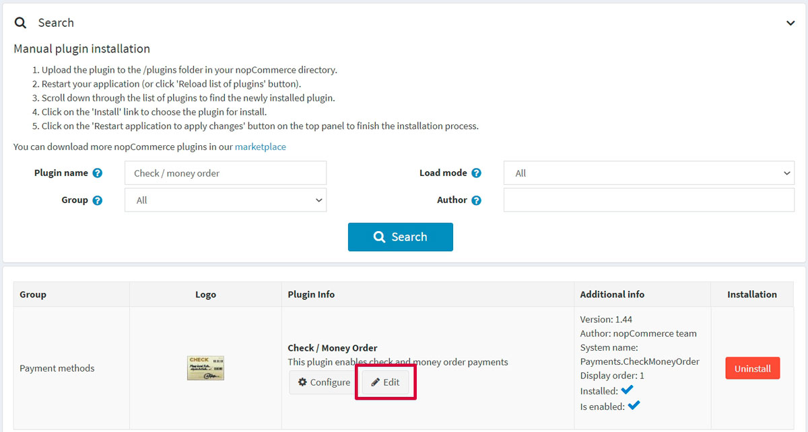

---
title: Check/money order
uid: en/getting-started/configure-payments/payment-methods/check-money-order
author: git.AndreiMaz
contributors: git.DmitriyKulagin, git.exileDev, git.ivkadp, git.mariannk
---

# Check/money order

Check/money orders are often used by government agencies or large businesses. Rather than paying directly through your site, shoppers will request that you send them a **Purchase order (PO)**, and they will send the payment back. Most of the order processing is handled outside of the software.

To configure this payment method, go to **Configuration → Payment methods**. Find the **Check/money order (Payments.CheckMoneyOrder)** payment method list:

## Activate the method, edit its name, and display order

You can edit the payment method name, which will be displayed for customers in the public store, or its display order. To do this, click the **Edit** button in the plugin row on the payment method list page. You will be able to enter **Friendly name** and **Display order**. In this row, you can also activate the plugin or make it inactive using the **Is active** field. Click the **Update** button. Your changes will be saved.

## Configure the payment method

On the **Configuration → Payment methods** page, find the **Check/money order (Payments.CheckMoneyOrder)** payment method and click the **Configure** button. The *Configure - Check/money order* window will be displayed as follows:

Set up the payment method as follows:

* In the **Description** field, enter the info that will be shown to customers during checkout.
* Define the **Additional fee** for using this method.
* In the **Additional fee. Use percentage** field, define whether to apply an additional percentage fee to the order total. If not enabled, a fixed value is used.
* The **Shippable product is required** field indicates whether shippable products are required in order to display this payment method during checkout.

Click **Save**.

## Limit to stores and customer roles

You can limit any payment method to store and customer role. This means that the method will be available to certain stores or customer roles only. You can do this from the *plugin list* page.

1. Go to **Configuration → Local plugins**. Find the plugin you want to limit. In our case, it's **Check/money order**. To find it faster, use the *Search* panel at the top of the page and search by **Plugin name** or **Group** using the *Payment methods* option.

   

1. Click the **Edit** button, and the *Edit plugin details* window will be displayed as follows:

   

1. You can set up the following limits:

   * In the **Limited to customer roles** field, choose one or several customer roles, that is, administrators, vendors, guests, who will be able to use this plugin. If you don't need this option just leave this field empty.

      > [!Important]
      > In order to use this functionality, you have to disable the following setting: **Catalog settings → Ignore ACL rules (sitewide)**. Read more about the access control list [here](xref:en/running-your-store/customer-management/access-control-list).

   * Use the **Limited to stores** option to limit this plugin to a certain store. If you have multiple stores, choose one or several from the list. If you don't use this option, just leave this field empty.

      > [!Important]
      > In order to use this functionality, you have to disable the following setting: **Catalog settings → Ignore "limit per store" rules (sitewide)**. Read more about multi-store functionality [here](xref:en/getting-started/advanced-configuration/multi-store).

 Click **Save**.
