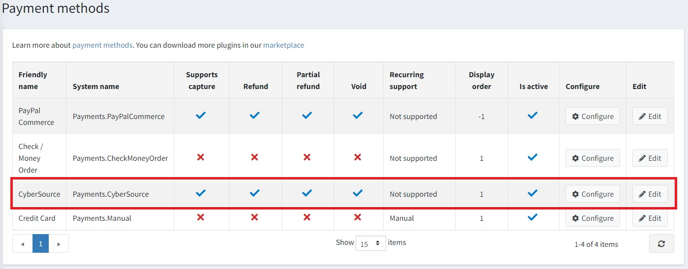

# CyberSource

> [!Important]
>
> This plugin is available out-of-the-box in nopCommerce starting version 4.60.

Cybersource Plugin can quickly help you reach your digital commerce goals. Our global, modular payment management platform can support you to enhance customer experience, grow revenues and mitigate risk.

## Configure the payment method

To configure the `CyberSource` plugin, go to **Configuration → Payment methods**. Then find the **CyberSource** payment method in the payment method list:

## Activate the method, edit its name, and display order

You can edit the payment method name, which will be displayed for customers in the public store, or its display order. To do this, click the **Edit** button in the plugin row on the payment method list page. You will be able to enter **Friendly name** and **Display order**. In this row, you can also activate the plugin or make it inactive using the **Is active** field. Click the **Update** button. Your changes will be saved.

## Configure CyberSource plugin

To use the **CyberSource** plugin as a payment method, please follow these steps:

1. Sign-up for [CyberSource account](https://ebc2.cybersource.com/ebc2/registration/external)
1. Go to **Payment Configuration → Key Management**

1. Generate key with type **REST - Shared Secret**

1. Copy your *KeyID* and *Shared Secret Key* values

1. Fill in your account details below

### Payment Tokenization with Secure Acceptance

Plugin uses *Secure Acceptance* to securely collect sensitive card data from the consumer’s browser. *Secure Acceptance* prevents sensitive payment data from ever touching your systems to reduce your overall PCI scope.

**Enable Tokenization**. The plugin also incorporates *CyberSource Tokenization*, which replaces sensitive payment transaction data with a unique identifier that cannot be reverse-engineered.

### Credit Card Services

**Transaction type**. Plugin includes the following credit card services:

- Authorization
- Sale (Authorization and Capture)

### Decision Manager

**Enable Decision Manager**. *Decision Manager* is a fraud management platform that prevents fraud losses and gives you the flexibility to control business practices and policies in real time. With Decision Manager, you can accurately
identify and review potentially risky transactions while minimizing the rejection of valid orders.

**Enable On-Demand Conversion Detail Report**. The CyberSource plugin includes *On-Demand Conversion Detail Report* for changes in order status.

### Payer Authentication (3-D Secure)

**Enable Payer Authentication**. *CyberSource Payer Authentication* services enable you to add support to your web store for card authentication services offered by *Visa*, *MasterCard*, and other card brands. These programs verify the cardholder’s identity directly with the card issuing bank in real-time to increase payment security and reduce the risk of fraud; however, Payer Authentication is not a fraud management service, and CyberSource recommends that you implement a comprehensive fraud management program such as **Decision Manager** in addition to Payer Authentication services.

## Limit to stores and customer roles

You can limit any payment method to store and customer role. This means that the method will be available to certain stores or customer roles only. You can do this from the *plugin list* page.

1. Go to **Configuration → Local plugins**. Find the plugin you want to limit. In our case, it's **CyberSource**. To find it faster, use the *Search* panel in the top of the page and search by **Plugin name** or **Group** using the *Payment methods* option.

    

1. Click the **Edit** button, and the *Edit plugin details* window will be displayed as follows:

    

1. You can set up the following limits:

    - In the **Limited to customer roles** field, choose one or several customer roles, that is, administrators, vendors, guests, who will be able to use this plugin. If you don't need this option just leave this field empty.

        > [!Important]
        > In order to use this functionality, you have to disable the following setting: **Catalog settings → Ignore ACL rules (sitewide)**. Read more about the access control list [here](xref:en/running-your-store/customer-management/access-control-list).

    - Use the **Limited to stores** option to limit this plugin to a certain store. If you have multiple stores, choose one or several from the list. If you don't use this option, just leave this field empty.

        > [!Important]
        > In order to use this functionality, you have to disable the following setting: **Catalog settings → Ignore "limit per store" rules (sitewide)**. Read more about multi-store functionality [here](xref:en/getting-started/advanced-configuration/multi-store).

    Click **Save**.
