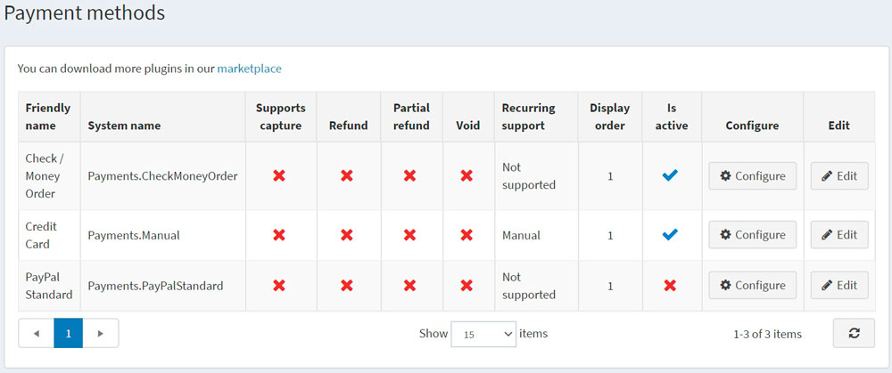

# Payment methods

A payment method is how a customer pays for the order. nopCommerce supports both *online* and *offline transactions*. For the online methods, nopCommerce integrates with third-party payment gateways so that customer's credit card information is automatically sent through the gateway (as either an authorization or authorization and charge) upon completion of an order. You can have multiple payment methods active at the same time. A customer can select how they want to pay at the checkout.

To define payment methods, go to **Configuration →  Payment methods**.

> [!TIP]
>
> By default, there are several payment methods available in nopCommerce, but you can find more payment plugins in the nopCommerce [marketplace](https://www.nopcommerce.com/marketplace).

For the payment method development details, refer to the [document](xref:en/developer/plugins/payment-method).

To activate a payment method, click **Edit** beside the required method, select the **Is active** checkbox and click **Update**. The **Is active** option changes from *false* to *true*.

 Different payment methods support different options. There are **4 payment options** that a payment method might or might not support:

* **Supports capture** indicates whether this method allows processing money transfer after the amount was charged.
* **Refund** indicates this method allows making a money refund after the amount was charged and captured.
* **Partial refund** indicates whether this method allows making a partial money refund after the amount was charged and captured.
* **Void** indicates whether this method allows making a money refund before the amount was charged (when the payment status is pending).
* **Recurring support** indicates whether this method allows recurring payments.

Click **Configure** beside a payment method to set it up.

## See also

* [Check/money order](xref:en/getting-started/configure-payments/payment-methods/check-money-order)
* [Credit card (manual processing)](xref:en/getting-started/configure-payments/payment-methods/credit-card-manual-processing)
* [PayPal Standard](xref:en/getting-started/configure-payments/payment-methods/paypal-standard)
* [PayPal Smart Payment Buttons](xref:en/getting-started/configure-payments/payment-methods/paypal-smart-payment-buttons)
* [PayPal Commerce](xref:en/getting-started/configure-payments/payment-methods/paypal-commerce)
* [PayPal Zettle](xref:en/getting-started/configure-payments/payment-methods/paypal-zettle)
* [CyberSource](xref:en/getting-started/configure-payments/payment-methods/cybersource)
