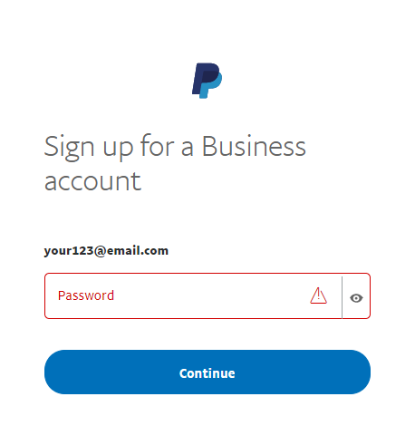
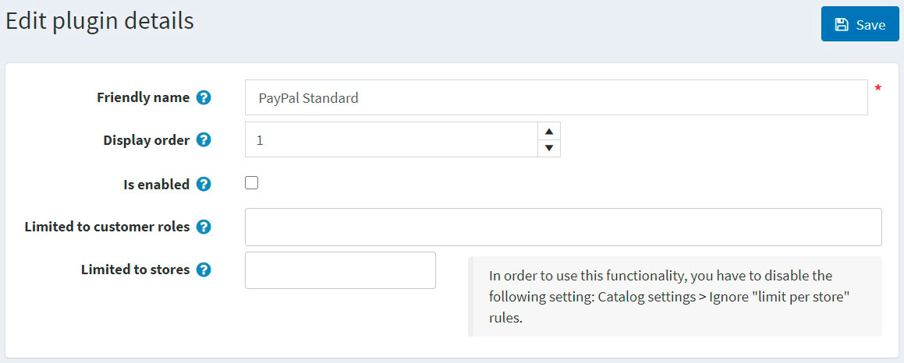

# PayPal Standard

> [!Important]
>
> This plugin is currently deprecated and, starting from version 4.60, has been replaced by the [**PayPal Zettle**](xref:en/getting-started/configure-payments/payment-methods/paypal-zettle) plugin.

PayPal Standard is the easiest way to securely accept credit card and PayPal payments online.

To configure the PayPal Standard plugin, go to **Configuration → Payment methods**. Then find the **PayPal Standard** payment method in the payment method list:

## Activate the method, edit its name, and display order

You can edit the payment method name, which will be displayed for customers in the public store, or its display order. To do this, click the **Edit** button in the plugin row on the payment method list page. You will be able to enter **Friendly name** and **Display order**. In this row, you can also activate the plugin or make it inactive using the **Is active** field. Click the **Update** button. Your changes will be saved.

## Configure the payment method

To use the **PayPal Standard** plugin as a payment method, please follow these steps:

1. Register a Business account on www.paypal.com. Follow the link [https://www.paypal.com/bizsignup/](https://www.paypal.com/bizsignup/). Then fill in the information about yourself and your business:

    

    > [!NOTE]
    >
    > If you already have an account, you will be redirected to the authorization.

    

    

    

    

1. In the top navigation bar, click the **Settings** icon 

1. Select **Website payments** in the left panel and click **Update** in the **Website preferences** line.

    
1. In the **Auto return for website payments** section, set the switch to **On.** As the **Return URL**, enter the URL of your site, which will receive ID transactions sent by PayPal after customer payment. In our case, it's `http://localhost:15536/Plugins/PaymentPayPalStandard/PDTHandler` but don't forget to replace localhost with your site URL.

    
1. In the **Payment data transfer** section, set the switch to **On** and copy **Identity Token.**

    
1. To configure the plugin in the admin panel of nopCommerce, go to **Configuration  → Payment methods**. In the **PayPal Standard** line, click **Configure**.

   

1. In the **Business Email** field, enter the email specified when registering a Business account on paypal.com.

1. In the **PDT Identity Token** field, enter the copied **Identity Token** from clause #5.

1. Click **Save**.

For the **IPN** (Instant Payment Notification) activation:

1. Select **Notifications** in the left panel and click the **Update in the Instant payment notifications** line.

   

1. Familiarize yourself with the information regarding **IPN** and click **Choose IPN Settings**.

   

1. Select **Receive IPN messages (Enabled)**. As **Notification URL**, enter the URL of your IPN handler.

   

1. Click **Save.** You should get a message that you have successfully activated IPN.

> [!NOTE]
>
> Instant Payment Notification (IPN) is a PayPal message service that sends a notification when a transaction is affected. Once IPN is integrated, sellers can automate their back office so that they don't have to wait for payments to come in to trigger the order fulfillment.

## Limit to stores and customer roles

You can limit any payment method to store and customer role. This means that the method will be available to certain stores or customer roles only. You can do this from the *plugin list* page.

1. Go to **Configuration → Local plugins**. Find the plugin you want to limit. In our case, it's **PayPal Standard**. To find it faster, use the *Search* panel at the top of the page and search by **Plugin name** or **Group** using the *Payment methods* option.

   

1. Click the **Edit** button, and the *Edit plugin details* window will be displayed as follows:

   

1. You can set up the following limits:

   - In the **Limited to customer roles** field, choose one or several customer roles, that is, administrators, vendors, guests, who will be able to use this plugin. If you don't need this option just leave this field empty.

     > [!IMPORTANT]
     >
     > In order to use this functionality, you have to disable the following setting: **Catalog settings → Ignore ACL rules (sitewide)**. Read more about the access control list [here](xref:en/running-your-store/customer-management/access-control-list).

   - Use the **Limited to stores** option to limit this plugin to a certain store. If you have multiple stores, choose one or several from the list. If you don't use this option, just leave this field empty.

     > [!IMPORTANT]
     >
     > In order to use this functionality, you have to disable the following setting: **Catalog settings → Ignore "limit per store" rules (sitewide)**. Read more about multi-store functionality [here](xref:en/getting-started/advanced-configuration/multi-store).

   - Click **Save**.

## Known Issues

### Error: Things don't appear to be working at the moment (PayPal)

If you see the error "Things don't appear to be working at the moment. Please try again later"

The error is caused by a setting within your PayPal Account.

**Step 1**: On the left sidebar, under "Products & Services," click "Website Payments"

**Step 2**: Click "Update" next to the "Website Preferences" section

**Step 3**: Scroll down to the "Encrypted Website Payments" section, select "Off" on the right, and then save your changes.

After saving the change, you can go back to your site and try the button/forms again, and they should work.
