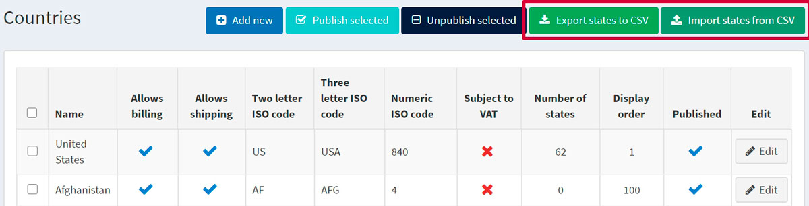

---
title: Countries, states
uid: en/getting-started/configure-shipping/advanced-configuration/countries-states
author: git.AndreiMaz
contributors: git.rajupaladiya, git.DmitriyKulagin, git.exileDev, git.ivkadp, git.mariannk
---

# Countries, states

This section describes how to manage countries (where your customers are located) and states.

To define the countries and states go to **Configuration → Countries**.

> [!TIP]
> 
> By default, all the countries are uploaded. You can *publish* and *unpublish* countries by selecting them and clicking the corresponding buttons in the top of the page.

## Add a new country

To add a new country click **Add new**.

In the *country info* panel define the following country settings:

* The **Name** of the country.
* **Allows billing** to customers located in this country.
* **Allows shipping** to customers located in this country.
* Enter **Two letter ISO** code of this country.
* Enter **Three letter ISO** code of this country.
* Enter **Numeric ISO code** code of this country.
* Select the **Subject to VAT** checkbox, to indicate whether customers in this country are charged EU VAT (the European Union Value Added Tax).

> [!NOTE]
> 
> This field is used only when the EU VAT option is enabled on the tax settings page (Configuration → Settings → Tax settings).

* To tie a certain store to a country select the required stores in the **Limited to stores** field, as follows:

> [!NOTE]
> 
> This list is used only when you have several stores configured. For further details refer to [Multi-store](xref:en/getting-started/advanced-configuration/multi-store).

* Tick the **Published** checkbox, to enable this country to be visible for new account registrations and for the creation of shipping and billing addresses.
* Enter the **Display order** of this country. A value of 1 represents the top of the list.

Click **Save**.

## Adding new states and provinces

In the *State and provinces* panel, you can add states and provinces of the country.

> [!TIP]
> 
> By default, the states of the USA are added.

Click the **Add a new state/province** button in the bottom of the panel to add a new state or province.

Define the following state/province details:

* **Name** of a state or a province.
* **Abbreviation** for the province or state.
* Tick the **Published** checkbox, to publish the state or province on the website.
* In the **Display order** field, enter the display order of this province or state. A value of 1 represents the top of the list.

Click **Save**

## Export/import states

You can export a list of states of all the countries, which were added to the system, or import the additional ones using the corresponding buttons in the top of the **Configuration → Countries** page.

> [!NOTE]
> 
> The format of your file to be imported should be the same as of the exported one.