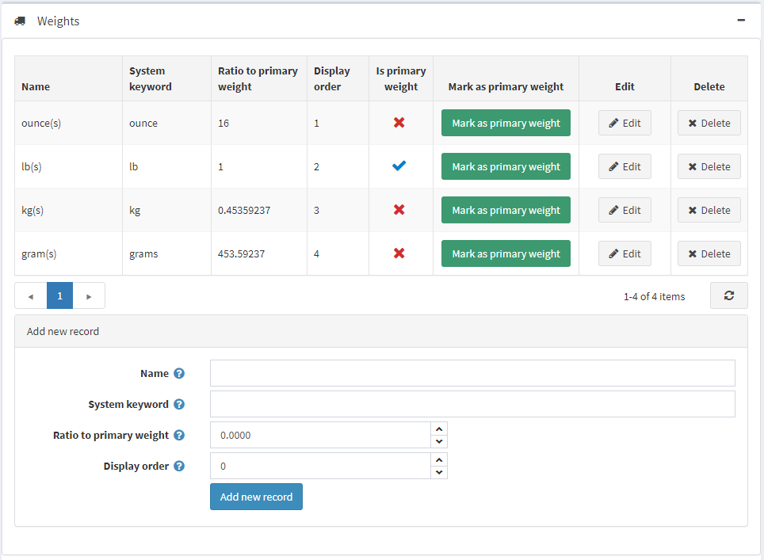

# Measures

This section describes how to add new units of weights and dimensions.

To add new dimension or weight units:

Go to **Configuration → Shipping → Measures**. The *Dimensions* and *Weight* sections will be expanded as follows:

At the bottom of the section, define the following new unit details:

* **Name** of the new dimension (weight) unit.
* **System keyword** for this unit.
* **Ratio to primary dimension (weight)** unit.
* **Display order** of the measure in the list. A value of 1 represents the top of the list.

Then click **Add new record**.

The new dimension (weight) unit will be added to the *Dimensions* (*Weights*) table.

> [!NOTE]
>
> You can set the primary dimension (weight) unit by clicking **Mark as primary dimension (weight)**.

Click **Edit** beside the measure to edit its details as described above.
