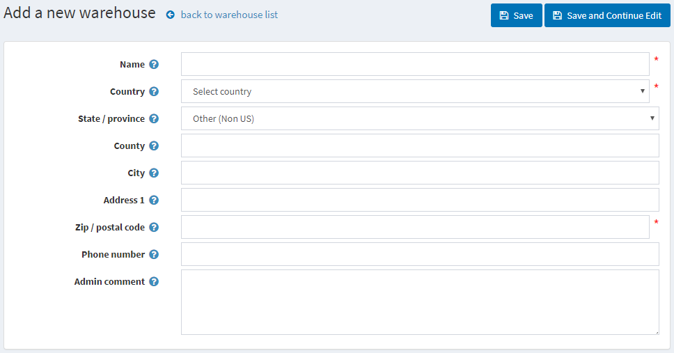

# Warehouses

nopCommerce supports multiple warehouses. This tool allows a store owner to keep track of inventory in different warehouses and improve logistics.

The following section describes how to add warehouses. This includes warehouse details, such as name, country, address, and more. To add new warehouses:

1. Go to **Configuration → Shipping → Warehouses**. The *Warehouses* window will be displayed:
    

1. Click **Add new**. The *Add a new warehouse* window will be displayed:
    

1. Define the following warehouse details:
    * **Name**.
    * **Country** of the warehouse.
    * **State/province** of the warehouse.
    * **County/region** of the warehouse.
    * **City** of the warehouse.
    * **Address 1** of the warehouse.
    * **Zip/postal code** of the warehouse.
    * **Phone number** of the warehouse.
    * In the **Admin comment** field, enter an optional comment or information for internal use.

Then, you will be able to choose a warehouse for you products or even use multiple warehouses functionality on the product edit page:

