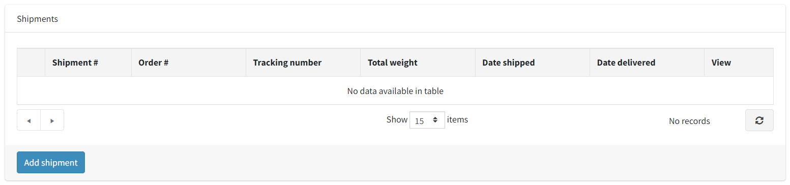

# EasyPost shipping provider

## Configuration

After installing the plugin of EasyPost shipping provider you need to configure the integration.
But first, ensure that the plugin is enabled (**Configuration → Shipping → Shipping providers**). To do so click **Edit** and check **Is active** checkbox.
Also, for more accurate work of the plugin, it's recommended to disable all other shipping providers if they are not used.

To configure EasyPost shipping provider's plugin click **Configure** beside the EasyPost option in the list.

Follow the instructions on top of the **Configure** page to [create an account](https://www.easypost.com/signup).
Enter your carrier specific credentials on the [Carrier Account Dashboard](https://www.easypost.com/account/carriers).
Then configure the plugin. Each field's function is annotated when "?" is hovered on.

1. Configure your EasyPost credentials:

    
    
    * **Test mode** is enabled to use test mode for testing purposes.
    * **API key**: (Test or Production) is required for the plugin to work. You can manage your API Keys from [your EasyPost account](https://www.easypost.com/account/api-keys).

1. Select carriers:

    > [!NOTE]
    > 
    > These settings are only available in production mode.
    
    

    * **Use all available carriers** is enabled to use all available carriers for your account.
    * **Carrier accounts** allows selecting specific carriers.
    
1. Configure address verification settings:
    
    
    
    * **Address verification** is enabled to activate address verification feature. It automatically makes minor corrections to spelling/format if applicable.
    * **Strict address verification** is enabled to activate strict address verification. In this case, any mistakes in a typed address cause the whole request to fail and the customer needs to correct and specify the address again.

1. **Save** the plugin's configuration.

Also, make sure that weight measure (ounce), dimension measure (inches) and currency (USD) are created and the ratio is set correctly in your store. It is required for the plugin to work correctly.
You can learn more about measures from [here](xref:en/getting-started/configure-shipping/advanced-configuration/measures) and about currencies from [here](xref:en/user-guide/configuring/setting-up/payments/currencies).

## Additional product details

You can specify additional product info to be used in EasyPost requests.

Navigate to product details and find this section.

1. Predefined package

    There are common carrier-specific packaging that you can use as predefined constants. If you use this for your packaging, you don’t need to specify dimensions, just weight.
    [Here](https://www.easypost.com/service-levels-and-parcels) is the full list of predefined packages supported.
    
    > [!NOTE]
    > 
    > Predefined packages are only used for a single item in the cart with a quantity of 1, otherwise, dimensions of all items shipped must be specified.

    * **Predefined package** is the name of predefined package.

1. Customs Info

    When shipping internationally, carriers require that you add information about the contents of your package.
    This information is used by the customs process for the country to which you are shipping.

    * **Harmonized Tariff Schedule** is the six digit code for your product as specified by harmonized system for tariffs.
    * **Origin country** is where the product was manufactured or assembled.

    > [!TIP]
    > 
    > To get the Harmonized Tariff Schedule number, you need to look up the harmonization code associated with whatever product you are shipping. You can search for them on [hts.usitc.gov](https://hts.usitc.gov/).

## Shipments

This plugin allows you to buy labels for your shipments (if this plugin is used as a shipping method for an order) and schedule the pickup of parcels to the carrier directly from the admin area of your store.

1. Go to order details and create a shipment. 

    

    

1. Find the EasyPost section on a shipment details page.

1. Here you can set many options for your shipment. See the hints for a detailed description. Then press **Update** button.

    

    
    
    > [!NOTE]
    > 
    > If you add options or customs form, rates may adjust, because during the checkout the customer selects shipping rate without including these parameters.

1. When shipping internationally, you need to add customs information to your shipment. EasyPost uses this information to automatically generate necessary customs' forms for your shipment. You need to pass customs information whenever you are shipping between two countries.
   Specify customs info and press **Update** button. 

    

1. When all details are set, or shipment update is not required, you can buy a label.

    
    
    * **Rate** is the rate to purchase this shipment. By default, the rate selected by the customer during checkout is displayed, but you can choose any other available delivery rate.
    * **Display Smart Rates** is enabled to display Smart Rates. The SmartRate feature provides shippers predicted transit days across a variety of percentiles for each carrier service being evaluated for the shipment. Using the Smart Rates, you can make better data-driven decisions about which rate to select when purchasing a label.
    * **Insurance** is an amount to insure the shipment. EasyPost charges 0.5% of the value, with a 50 cent minimum, and handle all the claims. All claims are paid out within 10 days.
    
    
    
    Select a rate (and insurance amount if needed), then press "Buy label" button.
    
    

    After the purchase, the tracking code is set automatically, you can track shipment events on EasyPost site, or below on the shipment page.
    
    
    
    

1. Now you can download the label.
    
    

1. Creating a pickup allows you to schedule a pickup from your carrier, from your customer's residence or place of business.
   Specify instructions, address and date to pick up. Then press **Create pickup** button.
   
    
   
    

    After a successfully created pickup, it automatically fetches rates for each carrier that supports scheduled pickups. Then a rate must be selected and purchased before the pickup can be successfully scheduled.

## Batches

Batch allows you to perform operations on multiple shipments at once. This includes scheduling a pickup, creating a manifest file and consolidating labels.

Go to **Sales → EasyPost Batches**.
   

1. New batch

    Press **Add new** button, then add shipments for this batch and save it.

    

    After you create a batch, you can still add shipments to it. 
    Also, there may be times when you need to remove a shipment from a batch. You can do that too. For example, a particular shipment may have an invalid address but you may still want to continue on with the rest of shipments.
    Change a collection of shipments as you wish, and then save a batch again.

1. Once all associated shipments have been purchased, you can generate labels. All labels for a batch will be in a single file that you download. 

    

    > [!NOTE]
    > 
    > It takes a little time to create all labels. The button for downloading the file will appear automatically when a batch status is **Label generated**.
    
    
    
    > [!TIP]
    > 
    > You can also press **Save** button to check a batch status if it is not updated automatically.
    
1. A manifest file can be created to speed up and simplify a carrier pickup process. The manifest is one document that can be scanned to mark all included tracking codes as "Accepted for Shipment" by a carrier.

    
