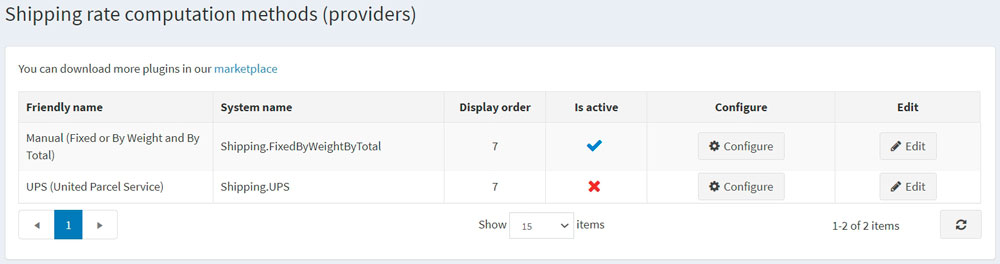
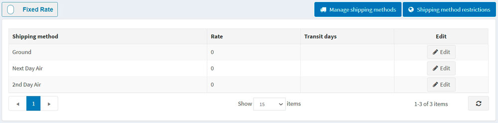
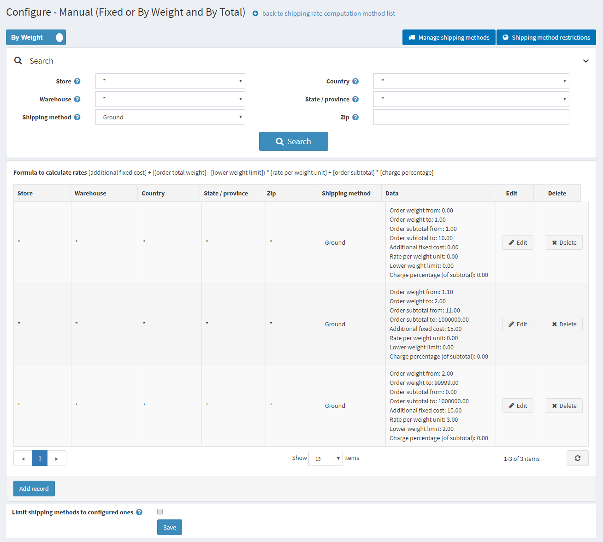
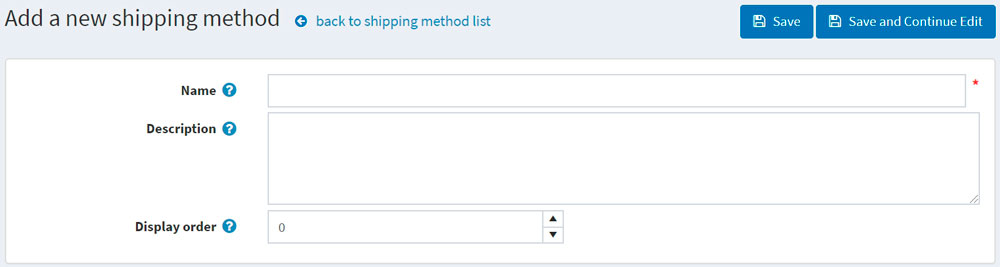

---
title: Manual (fixed or by weight and by total)
uid: en/getting-started/configure-shipping/shipping-providers/manual
author: git.AndreiMaz
contributors: git.rajupaladiya, git.DmitriyKulagin, git.exileDev
---

# Manual (fixed or by weight and by total) provider

Manual (fixed or by weight and by total) shipping allows setting fixed fees or calculating fees by weight and by total to all predefined shipping methods.

## Define the manual shipping provider

Go to **Configuration → Shipping → Shipping providers**. The shipping providers window is displayed:

Enable the manual shipping rate computation method, as follows:

* In the **Manual (fixed or by weight and by total)** row, click the **Edit** button.
* In the **Is active** column, check the checkbox.
* Click the **Update** button. The *false* option becomes *true*.

Click the **Configure** button beside the Manual (fixed or by weight and by total) option in the list.

You can switch *Fixed rate* shipping fee calculation to shipping *By weight/total* calculation by clicking button at the top of the page.

## Configure fixed rate

Click the **Edit** button beside a shipping method and enter the **Rate** and **Transit days** (if needed) for it.

Click **Update**.

> [!NOTE]
> 
> You can add/remove shipping methods in the *Shipping methods window*, accessed by clicking  and restrict some methods for chosen countries by clicking  on the top.

## Configure rate by weight/total

The **shipping by weight and by total** option allows setting different shipping fees based on a shipment weight and total. The ability to charge different fees depending on the weight and total of the shipment helps to keep the company's shipping costs down when heavy items are shipped, yet offer reasonable shipping costs to customers who purchase light products.

Use formula **[additional fixed cost] + ([order total weight] - [lower weight limit]) &times; [rate per weight unit] + [order subtotal] &times; [charge percentage]** to calculate the fees, where:

* **additional fixed cost** - is the cost of the shipment in case the weight is under a certain level (lower weight limit).
* **rate per weight unit** - is the cost of each weight unit above the lower weight limit.
* **order subtotal and charge percentage** - are parameters for calculating the extra cost based on the order subtotal.

For example, if you have the following shipping conditions:

* from weight 0 to 1 pounds and order subtotal from 1$ and order subtotal to 10$ the cost is 10$. You should create the **following shipping rules**:
  * Order weight from: **0**
  * Order weight to: **1**
  * Order subtotal from: **1**
  * Order subtotal to: **10**
  * Additional fixed cost: **10**
  * Lower weight limit: **0**
  * Rate per weight unit: **0**
* from weight 1.1 pounds to 2 pounds and order subtotal from 11$ and order subtotal to 1000000$ the cost is 15$. You should create the **following shipping rules**:
  * Order weight from: **1.000**
  * Order weight to: **2**
  * Order subtotal from: **11**
  * Order subtotal to: **1000000**
  * Additional fixed cost: **15**
  * Lower weight limit: **0**
  * Rate per weight unit: **0**
* over 2 pounds the cost is 3$ per each additional 0.5 pounds.You should create the **following shipping rules**:
  * If your fixed cost is $15 and $6 per pounds over 2 pounds.
  * Order weight from: **2.0001**
  * Order weight to: **99999**
  * Additional fixed cost: **15**
  * Lower weight limit: **2**
  * Rate per weight unit: **3**
  
	> [!NOTE] 
	> 
	> It will charge proportionally for additional weight; 
	> example for 2.1 pounds it will charge $15 + (0.1 * 6)= $15.6

To add a new shipping rule, click **Add record**. The *Add new record* window is displayed:

Define the following information:

* **Store** in which the calculated fees will be applied. Choose * to apply the rules to all stores.
* **Warehouse** from which the shipping will be done. Choose * to apply the rules to all warehouses.
* **Country, State/province, Zip** of a shipment destination.
* Select a **Shipping method** from the list of precreated options. Use **Manage shipping methods** on the top to add/remove shipping methods.
* Create your weight configuration by filling **Order weight from** and **Order weight to** fields. If the customer's shipment weight falls into this range, the additional cost will be fixed and will be calculated according to this record.
* Configure the pricing rules for this record using fields **Order subtotal from, Order subtotal to, Additional fixed cost, Lower weight limit, Rate per weight unit, Charge percentage (of subtotal)** fields.
* Define the **Transit days** field which defines the number of days of delivery.

> [!NOTE]
> 
> Make sure that the setting **Configuration → Settings → Shipping settings → Consider associated products dimensions and weight** is true.

Click **Save**.

> [!NOTE]
> 
> If you wish to limit your customers only to methods configured on that screen tick the **Limit shipping methods to configured ones** checkbox on the bottom of the page.

## Configure shipping methods

A store owner can define required shipping method list used in *Manual (fixed or by weight and by total)* provider. To manage shipping methods:

Go to **Configuration → Shipping → Shipping providers**. Then click the **Configure** button beside the *Manual (fixed or by weight and by total)* provider. The configuration window is displayed:

Click **Manage shipping methods**, the *Shipping methods window* is displayed:

Click **Add new** button, the *Add a new shipping method* window is displayed, as follows:

Define the following fields for a new record:

* **Name** of the shipping method viewed by a customer.
* **Description** for the shipping method viewed by a customer.
* **Display order** of the shipping method. A value of 1 represents the top of the list.

Click **Save**.

> [!NOTE]
> 
> You can click **Edit** in the *Shipping methods* window to edit existing shipping methods, as described above.

## Shipping method restrictions

A store owner can define restrictions for certain shipping methods in certain countries. To do so, go to **Configuration → Shipping → Shipping providers**. Click the **Configure** button beside the *Manual (fixed or by weight and by total)* provider. The configuration window is displayed:

Click **Shipping method restrictions**, the *Shipping method restrictions* window is displayed:

Select one or more of your shipping methods, that you want to disable in certain countries.

If required, you can select the entire restriction column for all countries.

Click **Save**.

## Tutorials

* [Configuring manual shipping method](https://www.youtube.com/watch?v=1nYj0NqVUWw&t=8s)