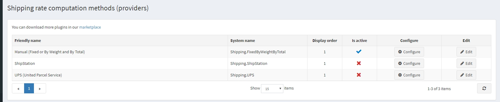
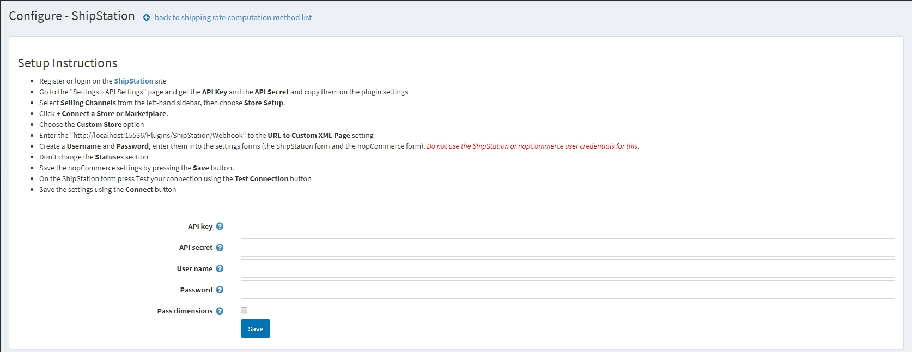
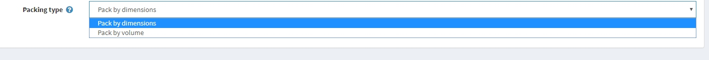

# ShipStation

To use the **ShipStation** integration plugin, please follow these steps:

1. Register or log in to the [ShipStation](https://www.shipstation.com/?ref=partner-nopcommerce&utm_campaign=partner-referrals&utm_source=nopcommerce&utm_medium=partner-referral) site.
1. In the nopCommerce admin area, go to **Configuration → Shipping → Shipping providers**. 

    * Enable this method as follows:
        * In the ShipStation row, click the **Edit** button.
        * In the **Is active** column, select the checkbox.
        * Click the **Update** button. The false option becomes **true**.
    * Click the **Configure** button beside the ShipStation option in the list. The *Configure - ShipStation* window is displayed as follows: 
1. Enter the following information obtained from the ShipStation provider:
    * The **API Key** and the **API Secret**: these data are used to get a list of available carriers. You may get them on the *Settings - API Settings* page on the ShipStation site.
    > [!Note]
    > If you do not plan to use the automatic determination of the shipping cost, then entering these data is not necessary.
    > But in this case, the plugin will stop working as a provider of shipping methods, and you will need to make sure that there is another active plugin of the same type.

    * Create a **Username** and **Password**, enter them into the settings form (the ShipStation form and the nopCommerce form). These data are necessary for safe data transfer between your server and the ShipStation server. Always keep them secret.

    > [!Important] 
    > Do not use the ShipStation or nopCommerce user credentials for these fields.

    * Select the **Pass dimensions** checkbox if sending dimensions to the ShipStation server is needed. When this parameter is activated, the additional parameter **Packing type** appears. This parameter is responsible for the type of data sent. 
