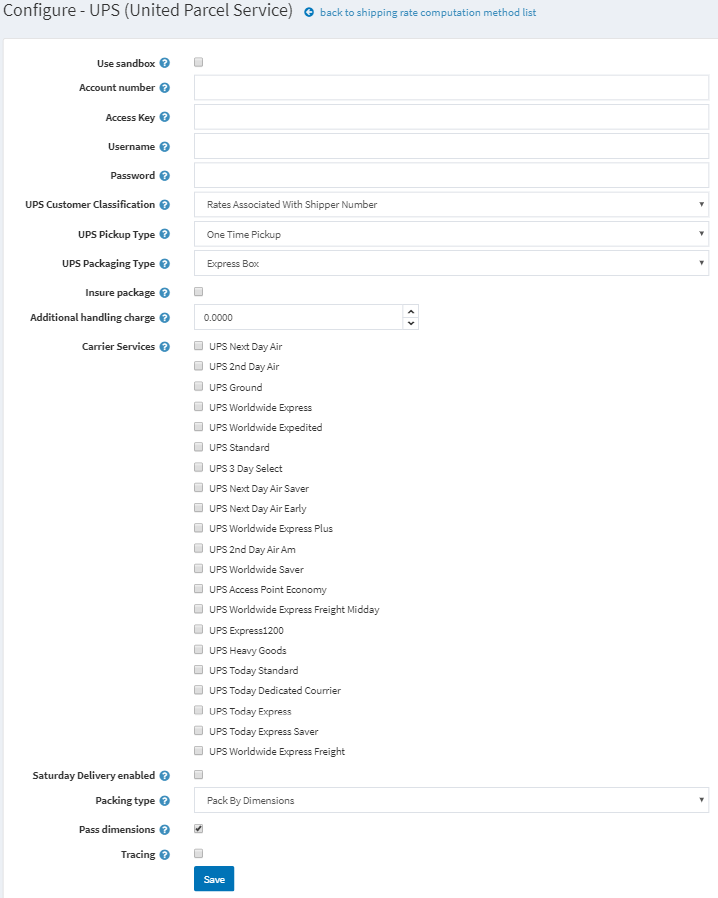

# UPS

To access your account at UPS use a username, a password, and an **XML license number**, which you will be provided with after the registration process.

## Define the UPS Real Time Shipping Calculations

1. Create a UPS account by going to [https://www.ups.com/upsdeveloperkit?loc=en_USto](https://www.ups.com/upsdeveloperkit?loc=en_USto) receive the following:
    * Username ID
    * Password
    * XML access license number
1. In nopCommerce admin area go to **Configuration → Shipping → Shipping Providers**. 
1. Enable this method, as follows:
    * In the UPS (United Postal Service) row, click the **Edit** button.
    * In the Is **active** column, check the checkmark.
    * Click **Update**. The false option becomes **true**.
1. Click **Configure** beside the UPS (United Parcel Service) option in the list. The Configure – UPS (United Parcel Service) window is displayed, as follows: 
1. Enter the following information obtained from the UPS provider:
    * Tick the **Use sandbox**checkbox for use testing environment
    * **Account number** of the UPS provider
    * **Access Key** obtained from the provider
    * **Username** obtained from the provider
    * **Password** obtained from the provider
    * Select your required **UPS Customer Classification**, as follows:
        * Rates Associated With Shipper Number
        * Daily Rates
        * Retail Rates
        * Regional Rates
        * General List Rates
        * Standard List Rates
    * Select the required **UPS Pickup Type**, as follows:
        * Daily Pickup
        * Customer Counter
        * One Time Pickup
        * On Call Air
        * Letter Center
        * Air Service Center
    * Select the required UPS Packaging Type, as follows:
        * Unknown
        * Letter
        * Customer Supplied Package
        * Tube
        * P A K
        * Express Box
        * 10 kg Box
        * 25 kg Box
        * Pallet
        * Small Express Box
        * Medium Express Box
        * Large Express Box
    * Tick the **Insure package** checkbox, to indicate the package will be insured
    * Enter **Additional handling charge** -  an additional fee to charge your customers
    * Select the **Carrier Services** you want to offer to your customers
    * Check to get rates for **Saturday Delivery enabled**
    * Select the **Packing type**, as follows:
        * Pack by dimensions
        * Pack by one item per package
        * Pack by volume
    * Tick the **Pass dimensions** checkbox, to pass package dimension when requesting for rates.
    * Tick the **Tracing** checkbox, to record system tracing in the system log. The entire request and response XML will be logged (including AccessKey/Username, Password). Do not leave this enabled in a production environment.
