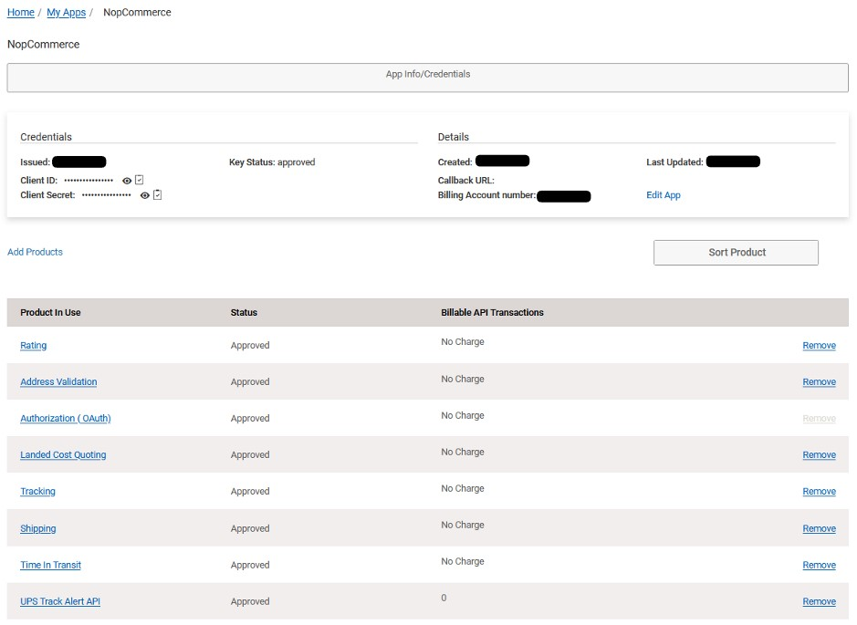
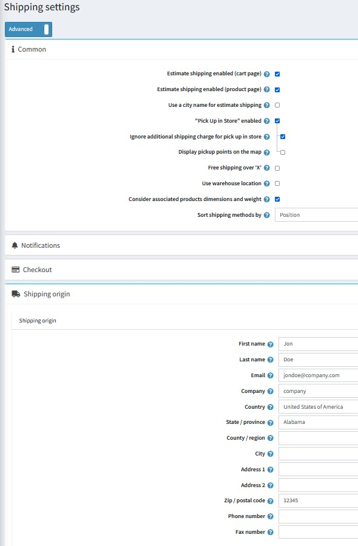

# UPS

To access your account at UPS, use a username, a password, and an **XML license number**, which you will be provided with after the registration process.

## Define the UPS Real Time Shipping Calculations

1. Create a UPS user account via [UPS.com](UPS.com "UPS.com"), then go to [developer.ups.com](developer.ups.com), and create an app to receive the following:

   * Client ID
   * Client Secret
     *note, this is to use UPS OAuth, which is required for all new accounts after June 2023, and all accounts after June 2024*

     
2. Add UPS Products to enable shipment tracking, rate calculations, etc. Recommended products are:

   * Rating
   * Address Validation
   * Landed Cost Quoting
   * Tracking
   * Shipping
   * Time In Transit
3. In the nopCommerce admin area, go to **Configuration → Settings → Shipping Settings**. Configure the shipping point location. The default option is to configure a single **Shipping Origin**, which is configured lower on the page. However you may also choose  **Use Warehouse Location**, if you wish to use the settings configured in **Configuration → Shipping → Warehouse**. The **Use Warehouse Location** checkbox is revealed by choosing **Advanced** from the page configuration selector under the **Shipping settings** header.

   
4. In the nopCommerce admin area, go to **Configuration → Shipping → Shipping providers**.
   
5. Enable this method as follows:

   * In the UPS (United Postal Service) row, click the **Edit** button.
   * In the Is **active** column, select the check mark.
   * Click **Update**. The *false* option will becomes *true*.
6. Click **Configure** beside the UPS (United Parcel Service) option in the list.
   The *Configure – UPS (United Parcel Service)* window will be displayed as follows: 
7. Enter the following information obtained from the UPS provider, and choose the options that are relevant to your store:

   * Select the **Use sandbox** checkbox to use the testing environment.
   * Enter  the **Client ID** of the UPS provider.
   * Enter  the **Client Secret** obtained from the provider.
   * Enter  your **UPS Account Number** obtained from the provider.
   * Select your required **UPS Customer Classification** as follows:
     * Rates Associated With Shipper Number
     * Daily Rates
     * Retail Rates
     * Regional Rates
     * General List Rates
     * Standard List Rates
   * Select the required **UPS Pickup Type** as follows:
     * Daily Pickup
     * Customer Counter
     * One Time Pickup
     * On Call Air
     * Letter Center
     * Air Service Center
   * Select the required **UPS Packaging Type** as follows:
     * Unknown
     * Letter
     * Customer Supplied Package
     * Tube
     * P A K
     * Express Box
     * 10 kg Box
     * 25 kg Box
     * Pallet
     * Small Express Box
     * Medium Express Box
     * Large Express Box
   * Select the **Insure package** checkbox, to indicate the package will be insured.
   * Enter **Additional handling charge**. It is an additional fee to charge your customers.
   * Select the **Carrier Services** you want to offer to your customers.
   * Select to get rates for **Saturday Delivery enabled**.
   * Select the **Packing type**, as follows:
     * Pack by dimensions
     * Pack by one item per package
     * Pack by volume
   * Tick the **Pass dimensions** checkbox to pass package dimensions when requesting for rates.
   * Select the **Weight type** – pounds or kilograms.
   * Select the **Dimensions type** – inches or centimeters.
   * Tick the **Tracing** checkbox to record system tracing in the system log. The entire request and response XML will be logged (including AccessKey/Username, Password). Do not leave this enabled in a production environment.

   Click **Save**.
