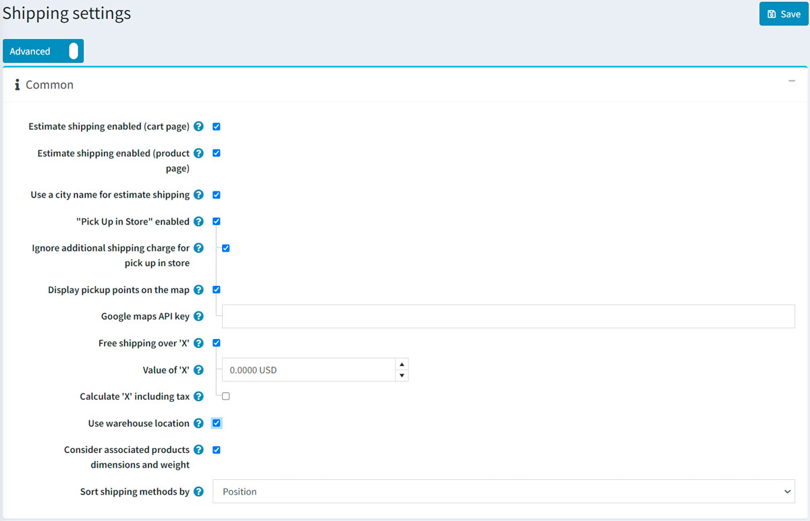
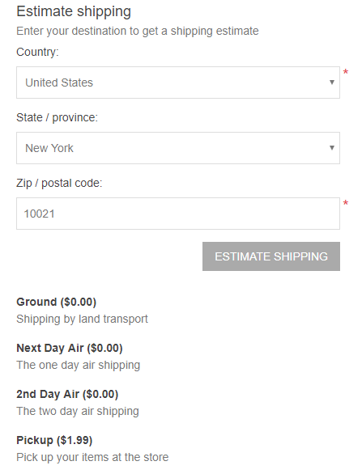
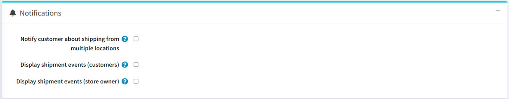
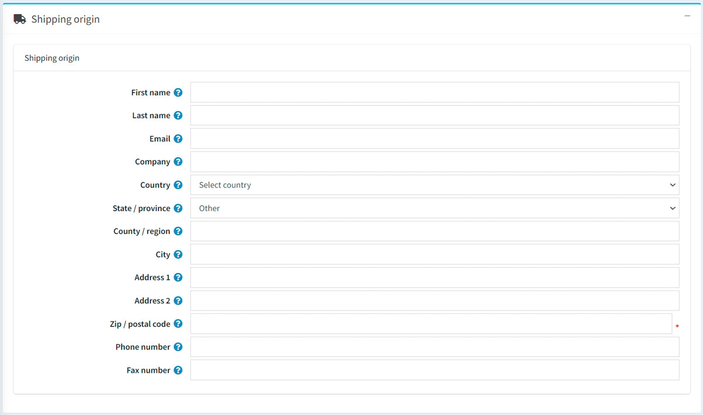

# Shipping settings

This chapter describes how to set up the shipping details of a store. Besides the location and warehouse set, other things make good logistics as well.

To manage shipping settings, go to **Configuration → Settings → Shipping settings**.

Define your shipping settings in the *Common* panel as follows:

* Select **Estimate shipping enabled (cart page)** to display estimated shipping information based on the customer's shipping address on the shopping cart page. See the screenshot below to understand what it looks like.
* Select **Estimate shipping enabled (product page)** to display estimate shipping information based on the customer's shipping address on the product details page. See the screenshot below to understand what it looks like.

* Select the **Use a city name for estimate shipping** checkbox to allow customers to enter a city name instead of a ZIP or postal code.
* Select the **"Pick up in store" enabled** to display the pickup in store option during checkout at the shipping address step. Users will see the following screen:

 

* Tick the **Ignore additional shipping charge for pick up in store** checkbox if needed.
* Choose to **Display pickup points on the map** if you want to display them on Google Maps. Customers should not enter a shipping address and choose a shipping method when this option is selected.
* **Google maps API key**. If the previous setting is turned on specify the Google maps API key here.

> [!Note]
>
> You can also specify a fee for the 'Pick up in store' option. To do this, go to **Configuration → Shipping → Pickup points** and configure the appropriate pickup point provider. Learn more here: [Pickup points](xref:en/getting-started/configure-shipping/advanced-configuration/pickup-points).

* Select **Free shipping over 'x'** to enable free shipping for orders over a certain total amount. The following field is then displayed, enabling you to define the value of 'x'.
* In the **Value of 'x'** field, enter the value over which all orders with a total greater than this will qualify for free shipping.
* **Calculate 'x' including tax**. If it is not selected the value is calculated excluding tax.
* Select **Use warehouse location** to use it when requesting shipping rates. This is useful when you ship from multiple warehouses.
* Select **Consider associated products dimensions and weight** to consider associated products dimensions and weight on shipping; clear, for example, if the main product already includes them.
* In the **Sort shipping methods by** dropdown, select the field to sort shipping methods by.

Define your shipping settings in the *Notifications* panel as follows:

* Tick **Notify customer about shipping from multiple locations** if required. This is useful when you ship from multiple warehouses.
* Select **Display shipment events (customers)** to enable customers to view shipment events on their shipment details page.

    > [!NOTE]
    >
    >   Note: to be enabled, this feature must be supported by the shipment computation method.

* Tick **Display shipment events (store owners)**, to enable store owners to view shipment events on their shipment details page.
    > [!NOTE]
    >
    >   Note: to be enabled, this feature must be supported by the shipment computation method as well.

Then define the *checkout* settings:

* Select the **Hide shipping total if shipping not required** checkbox if you want to hide the *Shipping total* label if shipping is not required.
* Select the **Ship to the same address** checkbox to display the "ship to the same address" option during checkout ("billing address" step). In this case "shipping address" with appropriate options (for example, pick up in store) will be skipped.

    > [!NOTE]
    >
    > When using this setting make sure that all billing countries (**Configuration → Countries**) support shipping (**Allows shipping** checkbox selected).

* Select **Bypass shipping method page** if there's only one shipping method available. This page will not be displayed during the checkout process.

Define the *shipping origin details*:

It includes address fields such as:

* Select the **Country**.
* Select the **State/province**.
* Define the **County/region**.
* Enter the required **City**.
* Enter the required **Address 1**.
* Enter the required **Zip/postal code**.

and other fields.

Click **Save**.
