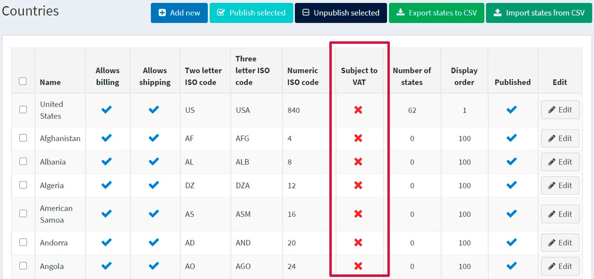
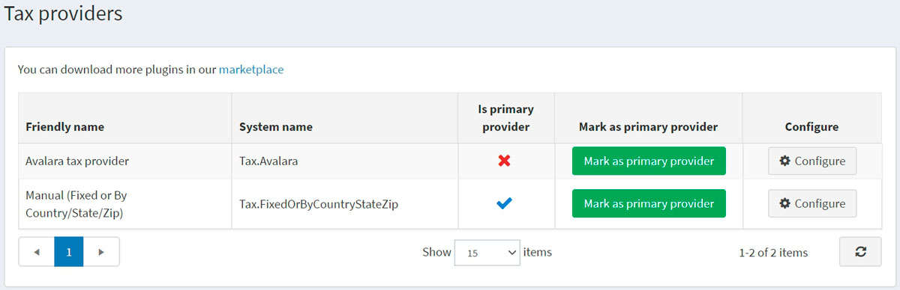
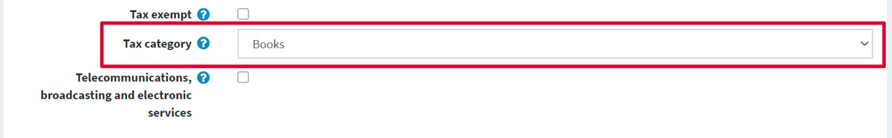

---
title: Configure taxes
uid: en/getting-started/configure-taxes/index
author: git.AndreiMaz
contributors: git.DmitriyKulagin, git.exileDev, git.mariannk
---

# Configure taxes

This chapter covers the settings of nopCommerce tax tools.

> [!NOTE]
> 
> This chapter includes nopCommerce in-built tax instruments, not third-party tax services.

nopCommerce supports external services as well, but they require plugins from a [marketplace](http://www.nopcommerce.com/marketplace) to be installed. The process of installation of such modules is described in the chapter [Plugins](xref:en/developer/plugins/index).

## EU VAT configuration guide

To set up nopCommerce VAT support for shops in the EU go to **Configuration → Settings → Tax settings**.

In the *Common* panel:
* Set **Tax based on** to **Shipping address**.

In the *VAT* panel:
* Tick **EU VAT enabled**. This will ensure that tax is charged only for shipments within the EU.
* Select the **Country** your shop is in.
* If applicable, tick *Allow VAT exemption*. This will ensure that your VAT registered customers who are shipping within the EU but outside the country in which the store is located will not be charged VAT.
* Tick the **Assume VAT always valid** checkbox to skip VAT validation. Entered VAT numbers will always be valid. It will be a client's responsibility to provide the correct VAT number. 
* If you checked **Allow VAT exemption**, then you might want to tick the "**Use web service**" and "**Notify admin when a new VAT number is submitted**" checkboxes too.

Click the **Save** button.

Go to **Configuration → Countries**. Make sure that all the countries which are in the scope of the VAT have **Subject to VAT** set to *true*.

> [!NOTE]
> 
> Jersey, Guernsey, and the other Channel Islands are not a part of the UK and are not within the scope of VAT. If you sell to those places you may need to change that.

Go to **Configuration → Tax categories**. 

Set up a tax category for each VAT rate in your country. For example, "Standard Rate", "Zero rate", "Discounted rate". Delete default classes that are already there and are not applicable.

Go to **Configuration → Tax providers**. Make the **Manual (fixed or by country/state/zip)** the default one using the **Mark as primary provider** button.

Click **Configure** in the **Manual (fixed or by country/state/zip)** provider line to edit tax rates. In the top of the page you will see the switch. Choose **Fixed rate** there. 

On this page you can see your VAT rate categories. Click **Edit** beside each category and enter the percentage rates. Then click the **Update** button.

Make sure that all products have a tax category assigned to them on their [product pages](xref:en/running-your-store/catalog/products/add-products).

# See also

* [Tax settings](xref:en/getting-started/configure-taxes/tax-settings)
* [Tax providers](xref:en/getting-started/configure-taxes/tax-providers/index)

