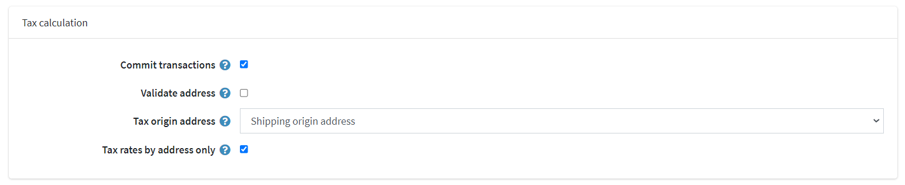

# Avalara tax provider

## Connect to AvaTax

After installing the Avalara tax provider you need to configure the integration.

> [!NOTE]
> 
> Be sure that the plugin is installed and checked as "Enabled" (**Configuration → Local plugins**). To enable the plugin click **Edit** and check **Is enabled** checkbox.

To configure Avalara tax provider go to **Configuration → Tax providers**.

Click **Mark as primary provider**.

Click **Configure** beside the Avalara tax provider option in the list.

Follow the instructions on top of the page to create an account.
Then configure the plugin, each field's function is annotated when "?" is hovered on.

1. Configure your AvaTax credentials:

    

    * **Account ID**: provided during your AvaTax account activation process.
    * **License key**: provided during your AvaTax account activation process.
    * **Company**: company profile identifier in the AvaTax admin console.
    * **Use sandbox** is enabled to commit test transaction.
    * **Enable logging** enables logging of all requests to Avalara services.

2. Configure tax calculation settings:
    
    

    * **Commit transactions** is enabled to commit transactions right after they are saved.
    * **Validate address** is enabled to validate address entered.
    * **Tax origin address** is used for tax requests to Avalara services.
    * **Tax rates by address only** is enabled to get tax rates by the address only (reduces the number of API calls, but may lead to not entirely accurate results).
    
3. Configure tax exemption settings:
    
    
    
    * **Enable exemption certificates** is enabled to activate tax exemption certificates.
    * **Limited to customer roles** is used to restrict customers who have access to this functionality.
    * **Auto validate certificates** is enabled to automatically validate new uploaded/created certificates.
    * **Allow edit info** is enabled to allow customers to edit their info (name, phone, address, etc) when managing certificates.
    * **Display 'No valid certificates' message** is enabled to display a message that there are no valid certificates for the customer on the order confirmation page.
    
    

    > [!TIP]
    > 
    > This message text can be edited in the language resources.

4. **Save** and click the **Test connection** button to perform test connection.
5. To perform the *test tax calculation* fill the address form on the bottom of the page (please note, that nopCommerce Avalara tax plugin commits transactions to US addresses only) and click **Test tax transaction**.

    

## Assign AvaTax code

Navigate to **Configuration → Tax categories**.

At the top right of the page you will see the branded **Avalara tax codes** button. Clicking it the drop-down menu will show the following menu:

* **Export tax codes to Avalara** – exports all codes from your store to your AvaTax backend.
* **Import Avalara system tax codes** – imports all AvaTax tax codes from Avalara.
* **Delete Avalara system tax codes** – deletes all codes exported from Avalara.

## Assign an AvaTax system tax code to an item

1. Go to **Catalog → Products**.
1. Select a product to open the product details screen and click **Edit**.
1. On the product details screen, in **Price** panel assign appropriate code from drop-down list in **Tax category** field.

    
1. **IMPORTANT:** Ensure that **SKU** is entered, for better navigation in AvaTax backend.
1. Click **Save**.
1. To see a listing of all available AvaTax system tax codes, visit [http://taxcode.avatax.avalara.com](http://taxcode.avatax.avalara.com).

## Validate a customer address

1. Ensure **Validate address** checkbox is on, in that case the address will be validated automatically.
1. User will see the following screen:

    

## Tax exemption

There are two ways to enable the tax exemption using this plugin:

1. Assign an AvaTax tax exempt category to a specific customer or an entire customer role in the admin area:

    * Click **Customers → Customers → Edit customer**
    * Find the highlighted **Entity use code** field and select the field, select the appropriate customer type code.

        
    * Click **Save**

    > [!NOTE]
    > 
    > It is not necessary to check **Tax exempt** checkbox: assigning **Entity use code** is enough.

2. Activate the exemption certificates feature: 

    > [!IMPORTANT]
    > 
    > You will need a [CertCapture account](https://avlr.co/3bA1P1X) for this feature to work correctly.

    * Ensure **Enable exemption certificates** checkbox is on, in that case customers can manage their tax exemption certificates before making a purchase.
    * A new page will be added in the account section

        
