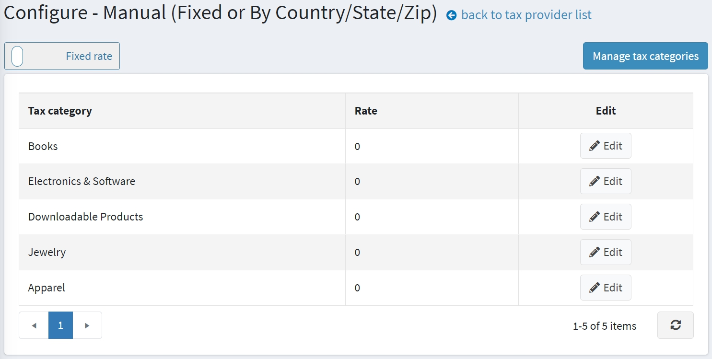

# Manual (fixed or by country/state/zip)

To configure the Manual (fixed or by country/state/zip) tax provider, go to **Configuration → Tax providers**.

Click **Configure** in the **Manual (fixed or by country/state/zip)** provider line to edit tax rates.
You can switch *Fixed rate* tax calculation to *Country/state/zip* tax calculation by clicking the appropriate button at the top left.
To manage tax categories, click the **Manage tax categories** button at the top right.

## Fixed rate

Choose **Fixed rate** configuration using the switcher at the top of the page.

On this page, you can see the precreated tax categories. Click **Edit** beside each category and enter the percentage rates. Then click the **Update** button.

Make sure your products have a tax category assigned to them on their [product pages](xref:en/running-your-store/catalog/products/add-products).

> [!NOTE]
>
> This section only shows precreated tax categories. Click the **Manage tax categories** button to edit tax categories or read how to manage tax categories here: [configure tax categories](#configure-tax-categories).

## By country

Choose the **By country** configuration using the switcher at the top of the page.

Define the new tax rate as follows:

* Select the **Store** for which the rate is defined. Select an * to apply this rate to all stores.
* Select the **Country** for which the tax rate is defined.
* Select the **State/province** for which the tax rate is defined. If an asterisk (*) is selected, this tax rate will apply to all customers from the selected country regardless of the state.
* Enter **Zip** Code of an area for which the tax rate is defined. If this field is empty, then this tax rate will apply to all customers from the selected country or state regardless of the ZIP Code.
* Select the **Tax category** for which to apply the tax rate.
* In the **Percentage** field, enter the required percentage.

Click **Add tax rate**. The new tax rate will be displayed as follows:

> [!NOTE]
>
> This section only shows precreated tax categories. Click the **Manage tax categories** button to edit tax categories or read how to manage tax categories here: [configure tax categories](#configure-tax-categories).

## Configure tax categories

To define tax categories, go to **Configuration → Tax categories**. The *Tax categories* window will be displayed:

To add a new tax category, enter the category **Name**, and the **Display order** of this tax classification at the bottom of the panel. In the **Display order** field, the value of 1 represents the top of the list. Then click **Add new record** to save the new tax category.
