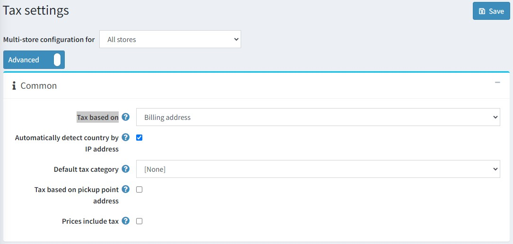

# Tax settings

This section describes your store's tax settings, for example, defining prices including or excluding tax, defining the tax display type, and more.

To manage your tax settings, go to **Configuration → Settings → Tax settings**.

First of all define **common** tax settings:

* From the **Tax based on** dropdown list, select the required option on which the tax is based, as follows:
  * **Billing address**. When this option is selected, the tax is based on the customer's billing address. If the billing address is unknown, the default address is used (entered below).
  * **Shipping address**. When this option is selected, the tax is based on the customer's shipping address. If the shipping address is unknown, the default address is used (entered below).
  * **Default address**. When this option is selected, the tax is based on the default address that is entered below.
* Choose the **Default tax category** for products. It will be pre-selected on the *Add new product* page.
* **Tax based on pickup point address** checkbox defines if a pickup point address should be used for tax calculation when the pickup point is chosen.
* Select the **Prices include tax** checkbox to indicate whether entered prices include tax.

Then define the **default tax address (used for tax calculation)** as follows:

* Select the **Country**.
* Select the **State/province**.
* Define the **County/region**.
* Define the **City**.
* Define the **Address 1**.
* Enter **Zip/postal code**.

In the **Tax displaying** panel you can set up how tax will be displayed for customers:

* Select the **Allow customers to select tax display type** checkbox to indicate whether customers are allowed to select the tax display type. When cleared the **Tax display type** dropdown list is displayed:
  * **Excluding tax**: select to enforce excluding tax.
  * **Including tax**: select to enforce including tax.
* Select the **Display tax suffix** checkbox to display the tax suffix (incl. tax\excl. tax).
* Select the **Display all applied tax rates** checkbox to display all applied tax rates on a separate line in the shopping cart page.
* Select the **Hide zero tax** checkbox to hide the zero tax value in the order summary.
* Select the **Hide tax in order summary** checkbox to hide the tax value in the order summary when prices are shown as tax inclusive.
* Select the **Force tax exclusion from order subtotal** checkbox to always exclude tax from the order subtotal (irrelevant to the selected tax display type). This checkbox affects only pages where the order totals are displayed.

In the *Shipping* panel, select the **Shipping is taxable** checkbox to indicate that the shipping is taxable. The following fields are then displayed:

* **Shipping price includes tax**: select to indicate the shipping price includes tax.
* **Shipping tax category**: select the required tax category used for the shipping tax calculation.

In the *Payment* panel, select the **Payment method additional fee is taxable** checkbox to indicate the payment method additional fee is taxable. The following options will be displayed:

* **Payment method additional fee includes tax**: select to indicate that the payment method additional fee is taxable.
* **Payment method additional fee tax category**: from the dropdown list, select the required tax category used for the payment method additional fee tax calculation.

Then set up the VAT in the *VAT* panel:

* Select the **EU VAT enabled** checkbox to indicate that European Union Value Added Tax is enabled. When this option is selected, customers will be requested for the *Company VAT number* during registration or on the customer account details page. This VAT number can be automatically validated through a web service, if the **Use web service** checkbox is ticked, or manually on the customer details page in the administration area by the store owner.
* **Your shop country**: from the dropdown list, select the country where your store is located.
* **Allow VAT exemption**: select this checkbox to exempt eligible VAT registered customers from VAT.
* **Assume VAT always valid**: select this checkbox to skip VAT validation. Entered VAT numbers will always be valid. It is the client's responsibility to provide the current VAT number.
* **Use web service**: select this checkbox to use the web service to validate VAT numbers.
* **Notify admin when a new VAT number is submitted**: select this checkbox to receive a notification by email when a new VAT number is submitted.

> [!NOTE]
>
> If VAT is enabled, then it charges 0% tax to shipping outside the EU and 0% to those who have supplied a validated and approved VAT number and are shipping within the EU but outside the shop country. Refer to the article for further information on the EU VAT.
>
> [!TIP]
>
> Read how to set up the EU VAT here: [EU VAT configuration guide](xref:en/getting-started/configure-taxes/index#eu-vat-configuration-guide).

Click **Save**.

## Tutorials

* [Managing tax settings](https://www.youtube.com/watch?v=8iF5nQvIoLs&feature=youtu.be)
