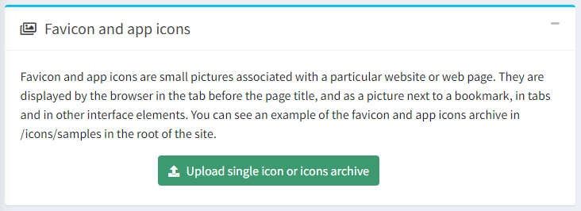
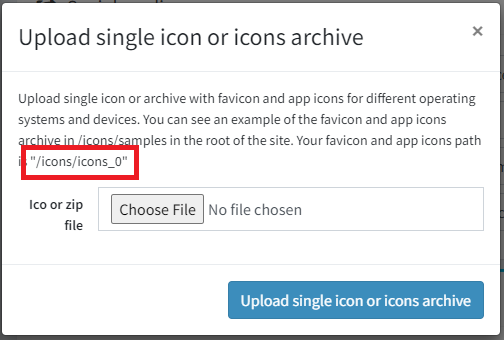
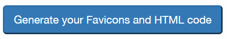
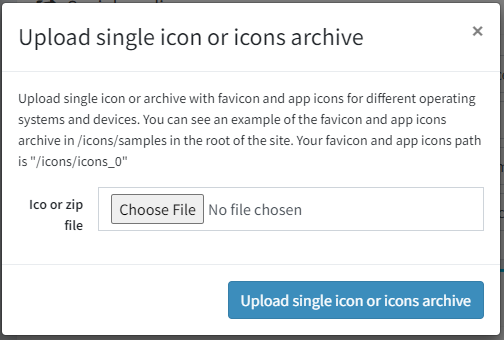

---
title: Adding a favicon
uid: en/getting-started/design-your-store/adding-a-favicon
author: git.RomanovM
contributors: git.rajupaladiya, git.DmitriyKulagin, git.mariannk
---

# Uploading favicons

Starting from version 4.20, you can automatically upload favicons through the admin area.

> [!NOTE]
>
> For a multi-store case, you need to repeat this uploading procedure for each store.

1. To upload favicons, go to **Configuration → Settings → General settings.** The *Favicon and app icons* panel will be displayed:

1. Click the green **Upload single icon or icons archive** button; the file selection dialog will be opened:

   Here, you need to copy the path to your icons (it varies depending on the store and virtual directory). For example, `/icons/icons_0`.

1. There are several options for what to upload, depending on how friendly your site favicons should be for various devices:

   - The most complete option is to use one of the favicon generators. In this manual, we will show an example of using a [RealFaviconGenerator](https://realfavicongenerator.net/). Thanks to this service, the full favicon package will be uploaded in a few clicks.

      - Go to this generator main page where you will be invited to choose a picture for the favicon
      

      - After selecting a picture and clicking **Continue with this picture**, you will be redirected to the next page. Here you can adjust the display settings of favicons for specific devices and applications - iOS Web Clip, Android Chrome, Windows Metro, macOS Safari, and others. The service will automatically show display examples. You can customize them to your needs or leave the default ones.

      - At the bottom of the same page, you can find the **Favicon Generator Options** panel.
      

         - In this section, you must set certain settings. In the **Path** tab, select the option `I cannot or I do not want to place favicon files at the root of my web site. Instead I will place them here` and specify the path from step 2. 

         - In the **Version/Refresh** tab, select the option depending on whether your site is already in production. The setting description will help you with this. 

         - In the **Additional files** tab it is necessary to select the option to generate an html file in the package. 

      - Now that all settings are set, click the button to generate. 

      - Get your favicon package. 

   - The simplest option is to only use the **favicon.ico** file, which has been successfully used on many sites for a long time, until devices with different screen resolutions appeared.

      - Find a sample favicon package that is located in `wwwroot/icons/samples/` directory and copy it.

      - In the new package, delete all files except for **favicon.ico** and **html_code.html**.

      - Replace the file **favicon.ico** in this package with your new favicon.

      - Edit the **html_code.html** file. Leave the only line there: `<link rel="shortcut icon" href="/icons/icons_0/favicon.ico">`, assuming that `/icons/icons_0` is the path from the step 2.

      - Save these two files into a package. Your favicon package is ready.

   - An intermediate option is using the full favicon package without a generator.

      1. Find a sample favicon package that is located in `wwwroot/icons/samples/` directory and copy it.

      1. Replace the pictures in the new package with your own ones considering the original sizes.

      1. Edit the **html_code.html** file, replace all entries of the `/icons/icons_0` with the path saved in step 2.

      1. Save this package. Your favicon package is ready.

1. Return to the admin area with a prepared favicon package to upload. Select the desired file and click **Upload single icon or icons archive**. 

1. Ensure your package is successfully uploaded. 

1. To see the new favicon on the site, you should clear the cache in the admin area and browser, then reload the page.

> [!TIP]
>
> To create a favicon package, you can use any generators, third-party services or do it manually. The only requirement is the existence of the **html_code.html** file with the html code, which will be placed in the `<head>` element of the site pages.
