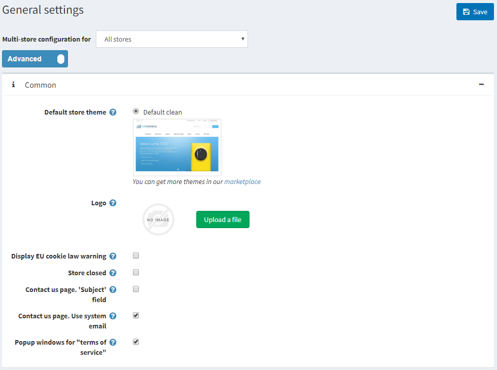

# Choose and install a theme

After downloading a new theme, which is in a zip file, extract the contents of your zip file and copy them to the **Themes** folder as shown in the picture below:

1. Go to **admin panel → Configuration → Settings → General settings**.

    

1. Select your new theme in the **Default store theme** field and click **Save**.
1. Go to the public store. You should be able to see the new theme applied to your store.
