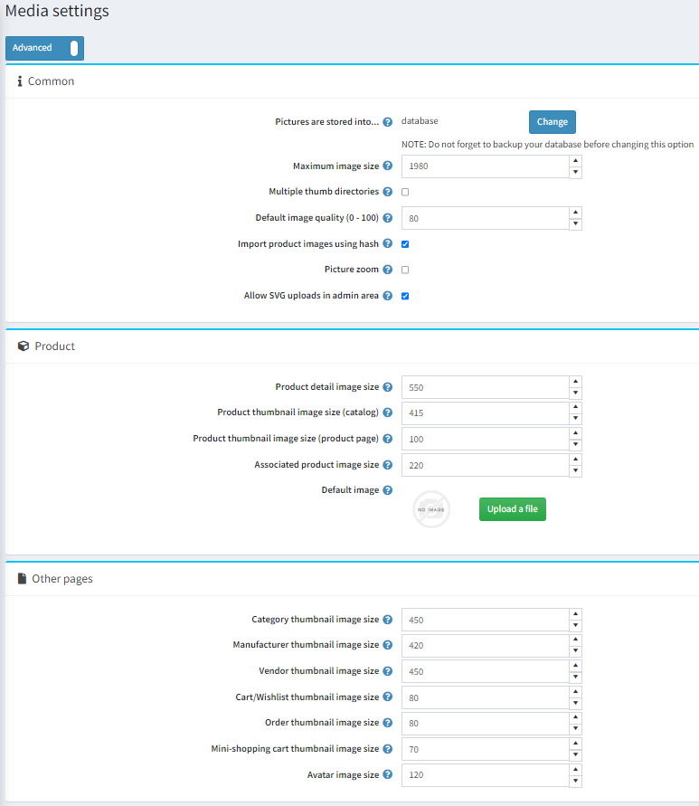

# Media Settings

This section describes how to set the media details of your store. This includes defining products, variants and avatar image sizes, and more.

To define the media settings, go to **Configuration → Settings → Media settings**. The *Media settings* window will be displayed:

In the *Common* panel, define the settings as follows:

- Click the **Change** button above the **Pictures are stored into** option to choose between database or file system.

  > [!NOTE]
  >
  > It is recommended to make a backup of the database before clicking the **Change** button.
- In the **Maximum image size** field, enter the maximum image size (meaning, the longest side) allowed for image upload (in pixels).
- Select **Multiple thumb directories** to have multiple thumb directories. It is useful when your hosting company has limitations on the amount of files per directory.
- In the **Default image quality (0 - 100)** enter the quality of uploaded images. Once changed you have to manually delete all already generated thumbs.
- Select **Import product images using hash** to use HASHBYTES to compare pictures with uploaded products. Please note that this functionality is not supported by some databases.
- Select **Picture zoom** to enable picture zoom on the product details page.
- **Allow SVG uploads in admin area** - Since the *svg* format is a vector drawing and is described in the form of XML, to increase security, you can disable the addition of images of this format in the admin panel.

In the *Product* panel, define the settings as follows:

- In the **Product detail image size** field, enter the default size for the product detail images in pixels.
- In the **Product thumbnail image size (catalog)** field, enter the default size for the product thumbnail images  displayed on the category or manufacturer pages in pixels.
- In the **Product thumbnail image size (product page)** field, enter the default size for the product thumbnail images (in pixels) displayed on the product details page (used when you have more than one product image).
- In the **Associated product image size** field, enter the default size for the associated product images in pixels. Associated products are a part of grouped products.
- **Default image** - You can select a default image that will be shown in the public store for products that do not have images.

In the *Other pages* panel, define the settings as follows:

- In the **Category thumbnail image size** field, enter the default size for the product thumbnail images on the category pages in pixels.
- In the **Manufacturer thumbnail image size** field, enter the default size for the product thumbnail images on the manufacturer pages in pixels.
- In the **Vendor thumbnail image size** field, enter the default size for the product thumbnail images on the vendor pages in pixels.
- In the **Cart/wishlist thumbnail image size** field, enter the default size for product thumbnail images in the shopping cart and wishlist in pixels.
- In the **Mini-shopping cart thumbnail image** size field, enter the default size (in pixels) of the product thumbnail images displayed in the mini-shopping cart block.
- In the **Avatar image size** field, enter the default size for the avatar images.

This page enables **multi-store configuration**, it means that the same settings can be defined for all stores, or differ from store to store. If you want to manage settings for a certain store, choose its name from the *Multi-store configuration drop-down* list and select all needed checkboxes at the left side to set custom value for them.

## Tutorials

- [Managing media settings](https://www.youtube.com/watch?v=3JS4Zj4TBwQ)
