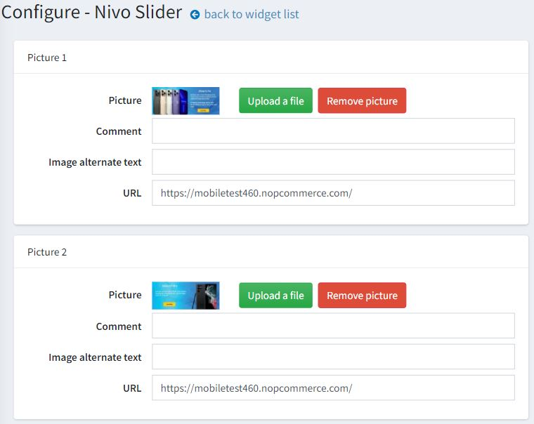
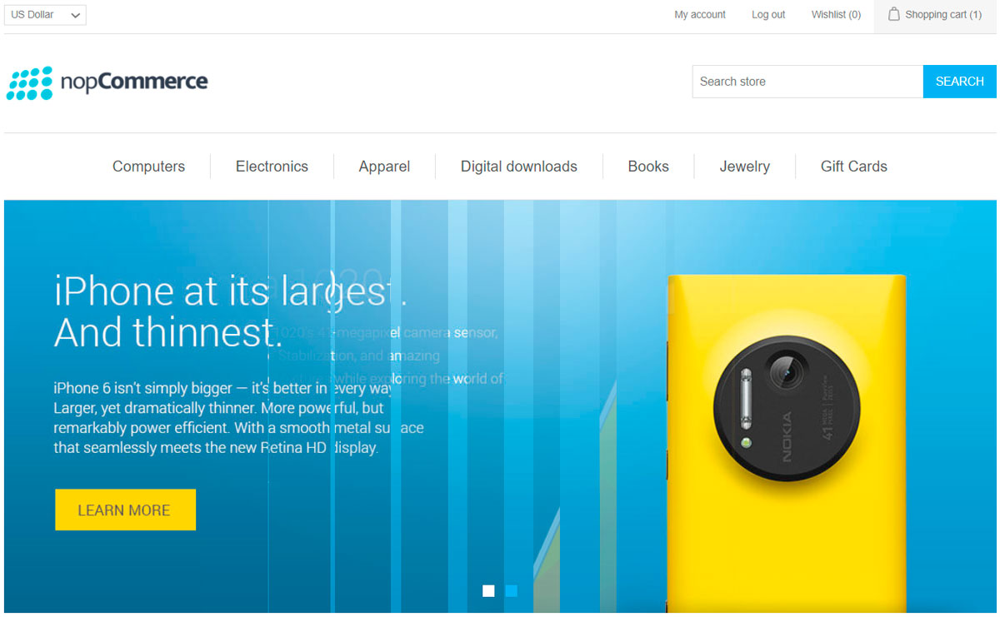

---
title: Nivo slider
uid: en/getting-started/design-your-store/nivo-slider
author: git.AndreiMaz
contributors: git.exileDev, git.DmitriyKulagin
---

# Nivo slider plugin

Nivo slider widget plugin allows you to display a slider on the home page of your store.

## Configure the Nivo slider plugin

Go to **Configuration → Widgets**. The *Widgets* window will be displayed:

Click **Edit** beside the Nivo slider plugin. The window will be expanded as follows:

Select the **Is active** checkbox to enable the plugin.

Click **Configure**. The *Configure – Nivo slider* window will be displayed as follows:

Perform the following for each slide you would like to upload:

* In the **Picture** field, click **Upload a file** to upload the required picture. Click **Remove picture** to remove the existing one.
* In the **Comment** field, enter a comment for the picture or leave it empty to display no text.
* In the **Image alternate text** field, enter the alternate text that will be added to the image.
* In the **URL** field, enter the required URL or leave it empty if you do not want the picture to be clickable.

Click **Save**.

Now you can go to the home page of your public store and the updated image slider:

