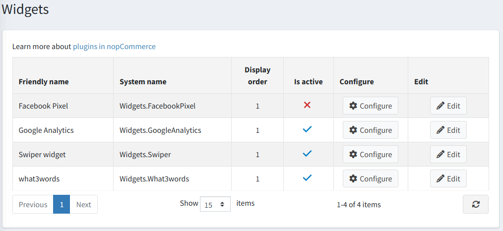
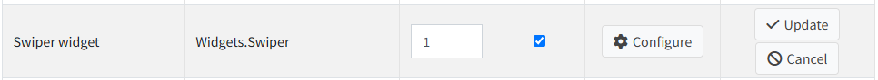
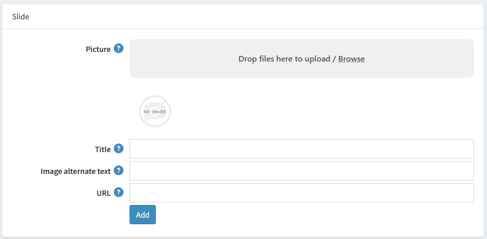

---
title: Swiper
uid: en/getting-started/design-your-store/swiper
author: git.DmitriyKulagin
contributors: git.DmitriyKulagin
---

# Swiper widget

Swiper widget allows you to display a slider on the home page of your store.

## Configure the Swiper plugin

Go to **Configuration → Widgets**. The *Widgets* window will be displayed:

Click **Edit** beside the Swiper widget. The window will be expanded as follows:

Select the **Is active** checkbox to enable the plugin.

Click **Configure**. The *Configure – Swiper* window will be displayed as follows:

Perform the following for each slide you would like to upload:

* In the **Picture** field, click *Browse* to upload the required picture.
* In the **Title** field, enter title for picture. Leave empty if you don't want to display any text.
* In the **Image alternate text** field, enter the alternate text that will be added to the image.
* In the **URL** field, enter the required URL or leave it empty if you do not want the picture to be clickable.

Click **Add**.

Now you can go to the home page of your public store and the updated image slider:

