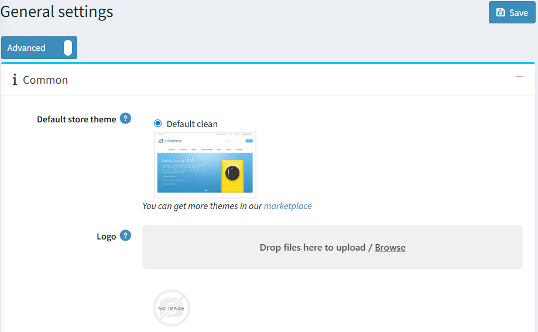
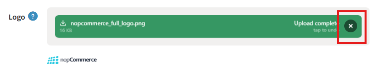

---
title: Uploading your logo
uid: en/getting-started/design-your-store/uploading-your-logo
author: git.mariannk
contributors: git.DmitriyKulagin
---

# Uploading your logo

The logo of your site is usually displayed on each site page in the page header. Your logo will look perfect in most nopCommerce themes regardless of which one you choose and how often you change it. Follow these steps to upload a new logo to your site:

1. Go to **Configuration → Settings → General settings**. The *General settings* window will be displayed:

1. Find the **Logo** field, then click the **Browse** button beside it and choose an image file. The chosen image will be uploaded. You can remove the uploaded image by clicking the **tap to undo** button.

1. Click the **Save** button in the top right to activate the logo on your site.

1. Visit the public site to make sure the logo looks nice.
