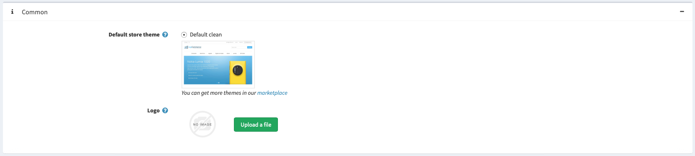
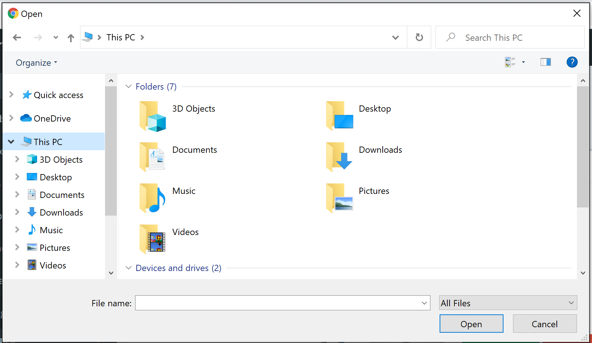
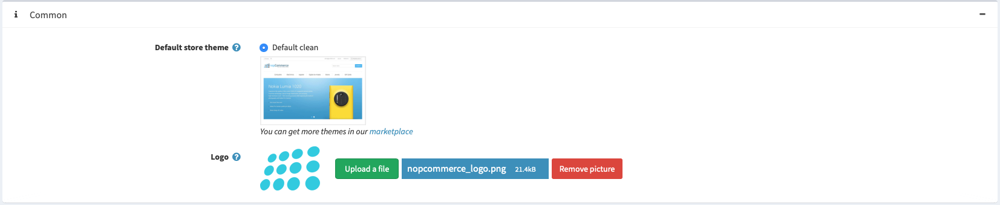
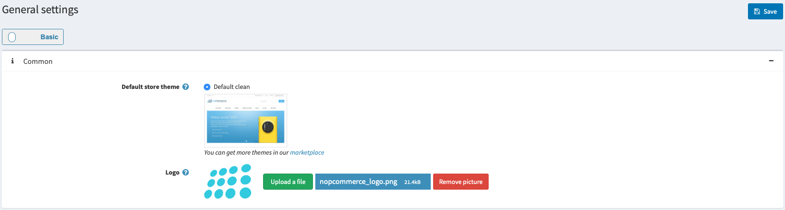

# Uploading your logo

This section describes how to a add your store logo to your nopCommerce store.

1. Go to **Configuration → Settings → General settings.** Look for the **Common** section :

1. Click the **Upload a file** button, this will open the file selection dialog showing a list of files on your local computer to choose from : After selecting the image you can see the name and thumbnail  of the uploaded file, from here you can choose to upload a different image or delete the just uploaded image before saving the changes.

1. Click the **Save** button located in the top right part of the screen.

