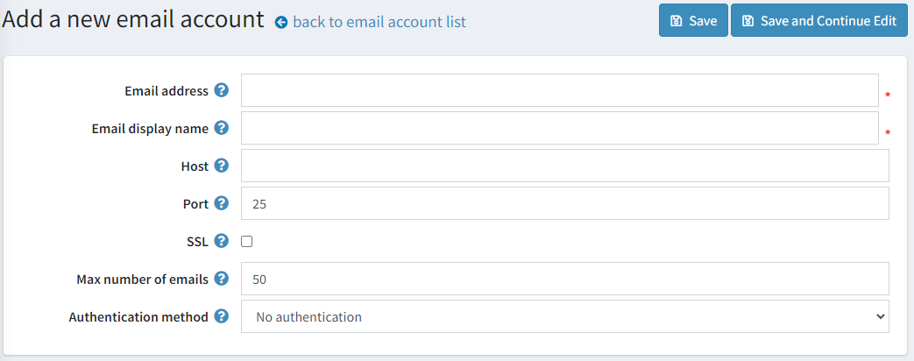
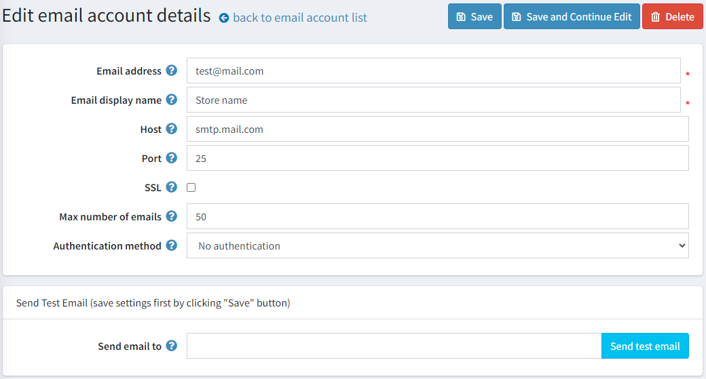

# Email accounts

This chapter describes how to set up email accounts associated with your store: a general contact email, a sales representative email, a customer support email and more.

To manage **Email Accounts**, go to **Configuration → Email Accounts**. The Email Accounts window displays the email accounts of the store owner, as shown below. After the email accounts are configured, the store owner can then select the required email account on the message template details page, as described in the [Message Templates](xref:en/user-guide/marketing/content/message-templates) chapter.

## Add a new email account

Go to **Configuration → Email Accounts**. The Email Accounts window is displayed:

Click **Add new**. The Add Email Account window is displayed:

Define the following email account information:

* In the **Email Address** field enter the from email address for all outgoing emails of your store. Example, `sales@yourstore.com`.
* In the **Email Display** Name field, enter the displayed name for outgoing emails of your store. Example, Your Store Sales Department.
* In the **Host** field, enter the host name of IP address of your email server.
* In the **Port** field, enter the SMTP port of your email server.
* In the **User** field, enter the user name of your email server.
* In the **Password** field, enter the password of your email server.
* Select the **Enable SLL** checkbox, to use Security Sockets Layer to encrypt the SMTP connection.
* Select the **Use default credentials** checkbox, to use default credentials for the connection.

Click **Save**. The window is expanded, as follows:

In the **Send email to** field, enter the email address for the test email and click Send Test Email.
