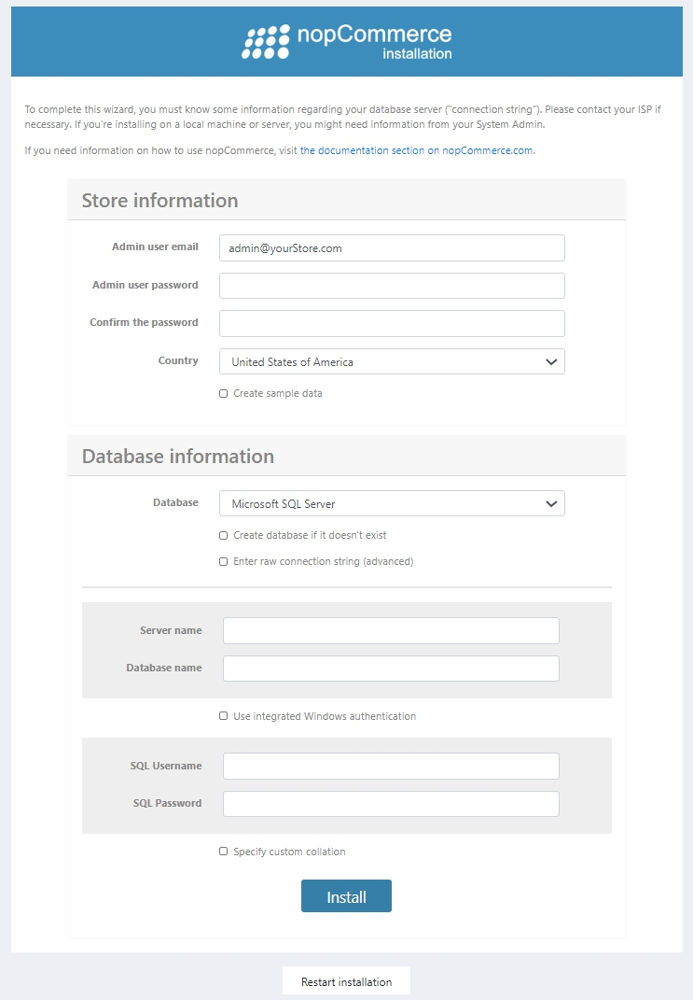

# Installing local

This chapter describes how to download nopCommerce software, upload it to your server, define the file permissions, and install it on your system. You may also watch the screencast about nopCommerce installation on our [YouTube channel](https://www.youtube.com/watch?v=L7NGodeB9sQ).

Before you begin the install, ensure that your web host have the [minimum requirements to run nopCommerce](xref:en/installation-and-upgrading/technology-and-system-requirements).

> [!NOTE]
> For more information on hosting selection guidelines, visit [this page](xref:en/installation-and-upgrading/installing-nopcommerce/choose-a-hosting-company).

There are several options available when downloading nopCommerce. In order to determine which option to download, you need to decide how you will use it. The following options are available:
1. **Web (no source)**. This option is available for users who do not wish/need to develop any custom code. This is a pre-compiled version of nopCommerce that can simply be uploaded to your hosting provider and used immediately. With this option, users can still modify the look and feel or user interface (UI) of their site to suit their needs, but they do not have to worry about development.
1. **Source code**. This option contains a full Visual Studio solution. It is for users who wish to customize the code within nopCommerce. It contains all the source code used to develop nopCommerce and must be opened in Visual Studio. It also includes scripts to build and compile the solution to upload to your hosting provider.
1. **Upgrade script**. The upgrade script option is for users who have a nopCommerce installation already in place. The script will upgrade your current installation to the latest version.

With each of these options, excluding the upgrade script, you can deploy nopCommerce to your development environment and your hosting provider. Choose the option that you would like to [download](https://www.nopcommerce.com/en/download-nopcommerce) and click on the appropriate download link to begin your download. It is recommended that you create a new folder on your desktop to store your downloaded files for easy access.

## Running the site using IIS (package without source code)

To use IIS, copy the contents of the extracted nopCommerce folder to an IIS virtual directory (or site root), and then view the site using a browser.

If you are're using nopCommerce 3.90 and below, then configure it to run in integrated mode, and configure the application pool to run the .NET Framework version 4. Please note that it's not required for nopCommerce 4.00 and above.

## Running the site using Visual Studio (package with source code)

This step describes how to launch a site in Visual Studio. To run the site in Visual Studio, extract the full source code archive to a local folder. Launch Visual Studio and select **File → Open → Project/Solution**. Navigate to the folder where you extracted the archive and open `NopCommerce.sln` solution file. Run `Nop.Web` project.

## Getting the "ready to deploy" package (without source code) from a package with source code

If you're using nopCommerce **3.20 (or above)**, then please follow the next steps:
* Open the solution in Visual Studio.
* Rebuild the entire solution.
* Publish the **Nop.Web** project from Visual Studio. When publishing ensure that configuration is set to *Release*.

## Installation process ##

nopCommerce requires write permissions for the directories and files described below:

- **For nopCommerce versions 4.00 and above:**
  - `\App_Data\`
  - `\bin\`
  - `\log\`
  - `\Plugins\`
  - `\Plugins\bin\`
  - `\wwwroot\bin\`
  - `\wwwroot\bundles\`
  - `\wwwroot\db_backups\`
  - `\wwwroot\files\exportimport\`
  - `\wwwroot\images\`
  - `\wwwroot\images\thumbs\`
  - `\wwwroot\images\uploaded`
  - `\App_Data\Plugins.json` (after installation)
  - `\App_Data\dataSettings.json` (after installation)

- **For nopCommerce versions 2.00-3.90:**
  - `\App_Data\`
  - `\bin\`
  - `\Content\`
  - `\Content\Images\`
  - `\Content\Images\Thumbs\`
  - `\Content\Images\Uploaded\`
  - `\Content\files\ExportImport\`
  - `\Plugins\`
  - `\Plugins\bin\`
  - `\Global.asax`
  - `\web.config`

These permissions are validated during the installation process. If you do not have write permissions, a warning message is displayed, requesting you to configure permissions.
Before installing nopCommerce, ensure you have database server installed on your system.

You can use any of the following authentication methods to connect to the server:
* **SQL server account**: When connecting using this method, logins are created in the SQL server that is not based on the Windows user accounts. Both the user name and the password are created using the SQL server and are stored in the SQL server. When using this method you must enter your login and password.
* **Integrated Windows authentication**: When connecting using this method, the SQL Server validates the account name and password using the Windows principal token in the operating system. This means the user identity is confirmed by Windows. The SQL Server does not request a password and does not perform the identity validation. Windows authentication is the default authentication mode and is much more secure than SQL server authentication. Windows authentication uses Kerberos security protocol, provides password policy enforcement with regard to complexity validation for strong passwords, provides support for account lockout, and supports password expiration. A connection made using Windows authentication is sometimes called a trusted connection, because SQL server trusts the credentials provided by Windows.

Once you open the site for the first time, you will be redirected to the installation page, as follows:

In the *Store information* panel fill the following details:
* **Admin user email**: this is the email address for the first admin of the site.
* **Admin user password**: you will need to supply a password for the admin account.
* **Confirm the password**: confirm the admin user password.
* **Create sample data**: check this checkbox if you would like sample products to be created. This is recommended so you can start working with your site before adding any of your own products. You can always delete these items later, or unpublish them so they no longer appear on your site.

In the *Database information* panel you need to enter the following info:
* **Database**: here you can select either Microsoft SQL Server or MySQL.
* **Create database if it doesn't exist**: it is recommended that you create your database and database user beforehand to ensure a successful installation. Simply create a database instance and add the database user to it. The installation process will create all the tables, stored procedures, and so on.
* **Enter raw connection string (advanced)**: check this checkbox if you want to enter a **Connection string** instead of filling the connection fields.
* **Server name**: this is the IP, URL, or server name of your database. Get your server name from the database management system or from the hosting control panel.
* **Database name**: this is the name of the database used by nopCommerce. If you opted to create your database ahead of time, use the name you gave your database here.
* **Use integrated Windows authentication**: if you are installing at a hosting provider, you can use your SQL Server account and supply the credentials you created with your database. In this case don't chack this option. If you are using a development environment, you can select Windows authentication. In this case tick this checkbox. If you are using Windows authentication, the account hosting the application pool in IIS must be a user in the database.
* **SQL Username**: enter your database user login.
* **SQL Password**: ener your database user password.
* **Specify custom collation**: this is an advanced setting and should be left unchecked.

Click **Install** in order to start the installation process. When the setup process is complete, your new site's home page is displayed.

> [!NOTE]
> The **Restart installation** button at the bottom of the installation page enables you to restart the installation process in case anything goes wrong.

> [!NOTE]
> If you are're using nopCommerce 3.90 and below ensure that your application pool is set to *Integrated* mode.

> [!NOTE]
> If you want to completely reset a nopCommerce site to its default settings, you can delete the `dataSettings.json` file from `App_Data` directory. When using IIS you might want to read this article.

