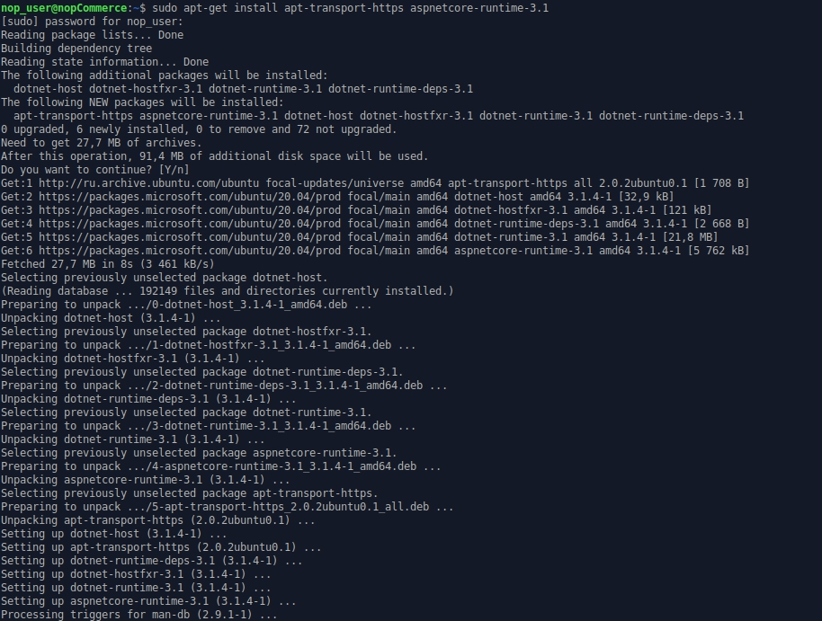
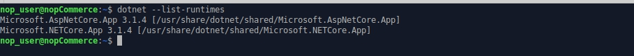
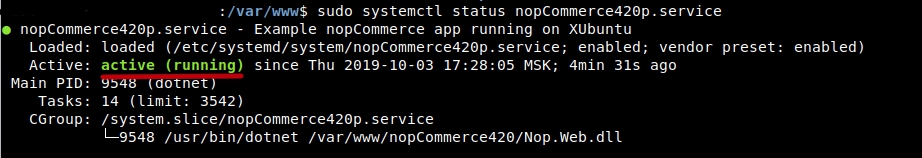

# Installing on Linux

This chapter describes how to install the nopCommerce software on Linux system on the example of XUbuntu 20.04:

1. [Install and configure software](#install-and-configure-software)
1. [Get nopCommerce](#get-nopcommerce)
1. [Create and configure the nopCommerce Web service](#create-the-nopcommerce-service)
1. [Troubleshooting](#troubleshooting)

## Install and configure software

Before installing .NET Core, we'll need to register the Microsoft key and install required dependencies. This needs to be done once per machine.

### Register Microsoft key and feed

Open a terminal and run the following commands:

`wget https://packages.microsoft.com/config/ubuntu/20.04/packages-microsoft-prod.deb -O packages-microsoft-prod.deb`

`sudo dpkg -i packages-microsoft-prod.deb`


### Install the .NET Core Runtime

Update the products available for installation, then install the .NET runtime:

`sudo apt-get update`

`sudo apt-get install apt-transport-https aspnetcore-runtime-3.1`



> [!NOTE]
> 
> If you have any error see detail information on the https://docs.microsoft.com/en-us/dotnet/core/install/linux-package-manager-ubuntu-2004#troubleshoot-the-package-manager page.

You may see all installed .Net Core runtimes by the following command:

`dotnet --list-runtimes`



### Install MySql Server

Install the MySql server 8.0 version

`sudo apt-get install mysql-server`


By default, the root password is empty, let's set it

`sudo /usr/bin/mysql_secure_installation`


> [!NOTE]
> 
> If you have some problem with configuring root password on your MySql server please read the following articles:
> https://dev.mysql.com/doc/refman/8.0/en/resetting-permissions.html and
https://stackoverflow.com/questions/41645309/mysql-error-access-denied-for-user-rootlocalhost.

### Install nginx

Install the nginx package:

`sudo apt-get install nginx`


Run the nginx service:

`sudo systemctl start nginx`

and check its status:

`sudo systemctl status nginx`


To configure nginx as a reverse proxy to forward requests to your ASP.NET Core app, modify /etc/nginx/sites-available/default. Open it in a text editor and replace the contents with the following:

```
# Default server configuration
#
server {
    listen 80 default_server;
    listen [::]:80 default_server;

    server_name   nopCommerce-430.com;

    location / {
    proxy_pass         http://localhost:5000;
    proxy_http_version 1.1;
    proxy_set_header   Upgrade $http_upgrade;
    proxy_set_header   Connection keep-alive;
    proxy_set_header   Host $host;
    proxy_cache_bypass $http_upgrade;
    proxy_set_header   X-Forwarded-For $proxy_add_x_forwarded_for;
    proxy_set_header   X-Forwarded-Proto $scheme;
    }

    # SSL configuration
    #
    # listen 443 ssl default_server;
    # listen [::]:443 ssl default_server;
    #
    # Note: You should disable gzip for SSL traffic.
    # See: https://bugs.debian.org/773332
    #
    # Read up on ssl_ciphers to ensure a secure configuration.
    # See: https://bugs.debian.org/765782
    #
    # Self signed certs generated by the ssl-cert package
    # Don't use them in a production server!
    #
    # include snippets/snakeoil.conf;
}
```

## Get nopCommerce

Create a directory

`mkdir /var/www/nopCommerce430`

Download and unpack the nopCommerce:

`cd /var/www/nopCommerce430`

`sudo wget https://github.com/nopSolutions/nopCommerce/releases/download/release-4.30/nopCommerce_4.30_NoSource_linux_x64.zip`

`sudo apt-get install unzip`

`sudo unzip nopCommerce_4.30_NoSource_linux_x64.zip`

Create couple directories to run nopCommerce:

`sudo mkdir bin`

`sudo mkdir logs`

Change the file permissions

`cd ..`

`sudo chgrp -R www-data nopCommerce430/`

`sudo chown -R www-data nopCommerce430/`

## Create the nopCommerce service

Create the /etc/systemd/system/nopCommerce430.service file with the following contents:

```
[Unit]
Description=Example nopCommerce app running on XUbuntu

[Service]
WorkingDirectory=/var/www/nopCommerce430
ExecStart=/usr/bin/dotnet /var/www/nopCommerce430/Nop.Web.dll
Restart=always
# Restart service after 10 seconds if the dotnet service crashes:
RestartSec=10
KillSignal=SIGINT
SyslogIdentifier=nopCommerce430-example
User=www-data
Environment=ASPNETCORE_ENVIRONMENT=Production
Environment=DOTNET_PRINT_TELEMETRY_MESSAGE=false

[Install]
WantedBy=multi-user.target
```

Start the service

`sudo systemctl start nopCommerce430.service`

Check the nopCommerce service status

`sudo systemctl status nopCommerce430.service`



Restart the nginx server

`sudo systemctl restart nginx`

**Now everything is ready, you can proceed to install and configure the store**

## Troubleshooting

### Gdip

*If you have a problem with loading images in the RichText Box (The type initializer for 'Gdip' threw an exception) just install the libgdiplus library*:

*`sudo apt-get install libgdiplus`*

### SSL

*If you want to use SSL on your site don't forget set to `true` the `UseHttpXForwardedProto` setting in the **appsettings.json** file*.
