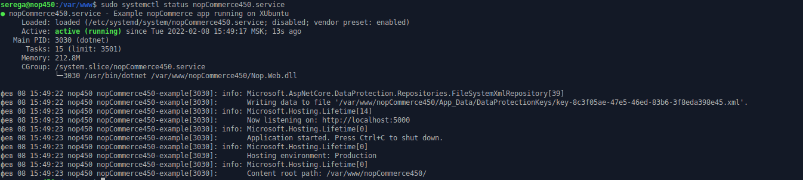

# Installing on Linux

This chapter describes how to install the nopCommerce software on Linux system on the example of *Xubuntu 20.04*:

- [Installing on Linux](#installing-on-linux)
  - [Install and configure software](#install-and-configure-software)
    - [Register Microsoft key and feed](#register-microsoft-key-and-feed)
    - [Install the .NET Core Runtime](#install-the-net-core-runtime)
    - [Install MySql Server](#install-mysql-server)
    - [Install nginx](#install-nginx)
  - [Get nopCommerce](#get-nopcommerce)
  - [Create the nopCommerce service](#create-the-nopcommerce-service)
  - [Installation process](#installation-process)
  - [Troubleshooting](#troubleshooting)
    - [Gdip](#gdip)
    - [SSL](#ssl)
  - [See also](#see-also)

## Install and configure software

Before installing .NET Core, we'll need to register the Microsoft key and install the required dependencies. This needs to be done once per machine.

### Register Microsoft key and feed

Open a terminal and run the following commands:

```cmd
wget https://packages.microsoft.com/config/ubuntu/20.04/packages-microsoft-prod.deb -O packages-microsoft-prod.deb

sudo dpkg -i packages-microsoft-prod.deb
```


### Install the .NET Core Runtime

Update the products available for installation, then install the .NET runtime:

```cmd
sudo apt-get update

sudo apt-get install -y apt-transport-https aspnetcore-runtime-7.0
```

> [!NOTE]
>
> If you have an error, see the detailed information on the [Install the .NET SDK or the .NET Runtime on Ubuntu](https://docs.microsoft.com/dotnet/core/install/linux-ubuntu) page.

You can see all installed .Net Core runtimes by the following command:

```cmd
dotnet --list-runtimes
```

### Install MySql Server

Install the MySql server 8.0 version:

```cmd
sudo apt-get install mysql-server
```


By default, the root password is empty; let's set it:

```cmd
sudo /usr/bin/mysql_secure_installation
```


> [!NOTE]
>
> If you have a problem with configuring root password on your MySql server, please read the following articles:
> [How to Reset the Root Password](https://dev.mysql.com/doc/refman/8.0/en/resetting-permissions.html) and
> [MySQL Error: 'Access denied for user 'root'@'localhost'](https://stackoverflow.com/questions/41645309/mysql-error-access-denied-for-user-rootlocalhost).

### Install nginx

Install the nginx package:

```cmd
sudo apt-get install nginx
```


Run the nginx service:

```cmd
sudo systemctl start nginx
```

and check its status:

```cmd
sudo systemctl status nginx
```


To configure nginx as a reverse proxy to forward requests to your ASP.NET Core app, modify /etc/nginx/sites-available/default. Open it in a text editor and replace the contents with the following:

```cmd
# Default server configuration
#
server {
    listen 80 default_server;
    listen [::]:80 default_server;

    server_name   nopCommerce.com;

    location / {
    proxy_pass         http://localhost:5000;
    proxy_http_version 1.1;
    proxy_set_header   Upgrade $http_upgrade;
    proxy_set_header   Connection keep-alive;
    proxy_set_header   Host $host;
    proxy_cache_bypass $http_upgrade;
    proxy_set_header   X-Forwarded-For $proxy_add_x_forwarded_for;
    proxy_set_header   X-Forwarded-Proto $scheme;
    }

    # SSL configuration
    #
    # listen 443 ssl default_server;
    # listen [::]:443 ssl default_server;
    #
    # Note: You should disable gzip for SSL traffic.
    # See: https://bugs.debian.org/773332
    #
    # Read up on ssl_ciphers to ensure a secure configuration.
    # See: https://bugs.debian.org/765782
    #
    # Self signed certs generated by the ssl-cert package
    # Don't use them in a production server!
    #
    # include snippets/snakeoil.conf;
}
```

## Get nopCommerce

Create a directory:

```cmd
mkdir /var/www/nopCommerce
```

Download and unpack nopCommerce:

```cmd
cd /var/www/nopCommerce

sudo wget https://github.com/nopSolutions/nopCommerce/releases/download/release-4.60.2/nopCommerce_4.60.2_NoSource_linux_x64.zip

sudo apt-get install unzip

sudo unzip nopCommerce_4.60.2_NoSource_linux_x64.zip
```

Create couple directories to run nopCommerce:

```cmd
sudo mkdir bin
sudo mkdir logs
```

Change the file permissions:

```cmd
cd ..
sudo chgrp -R www-data nopCommerce/
sudo chown -R www-data nopCommerce/
```

## Create the nopCommerce service

Create the */etc/systemd/system/nopCommerce.service* file with the following contents:

```cmd
[Unit]
Description=Example nopCommerce app running on Xubuntu

[Service]
WorkingDirectory=/var/www/nopCommerce
ExecStart=/usr/bin/dotnet /var/www/nopCommerce/Nop.Web.dll
Restart=always
# Restart service after 10 seconds if the dotnet service crashes:
RestartSec=10
KillSignal=SIGINT
SyslogIdentifier=nopCommerce-example
User=www-data
Environment=ASPNETCORE_ENVIRONMENT=Production
Environment=DOTNET_PRINT_TELEMETRY_MESSAGE=false

[Install]
WantedBy=multi-user.target
```

Start the service:

```cmd
sudo systemctl start nopCommerce.service
```

Check the nopCommerce service status:

```cmd
sudo systemctl status nopCommerce.service
```



Restart the nginx server:

```cmd
sudo systemctl restart nginx
```

Now that everything is ready, you can proceed to install and configure the store.

## Installation process

The further installation process for nopCommerce is the same as the installation process on Windows; you can see the instruction following [this link](xref:en/installation-and-upgrading/installing-nopcommerce/installing-on-windows#install-nopcommerce).

## Troubleshooting

### Gdip

*If you have a problem with loading images in the RichText Box (The type initializer for 'Gdip' threw an exception), just install the libgdiplus library*:

```cmd
sudo apt-get install libgdiplus
```

### SSL

*If you want to use SSL on your site, don't forget to set the `UseProxy` setting to **`true`** in the **appsettings.json** file*.

## See also

- [Running nopCommerce on Linux VPS. Part 2](https://www.nopcommerce.com/running-nopcommerce-on-linux-vps-part-2)
