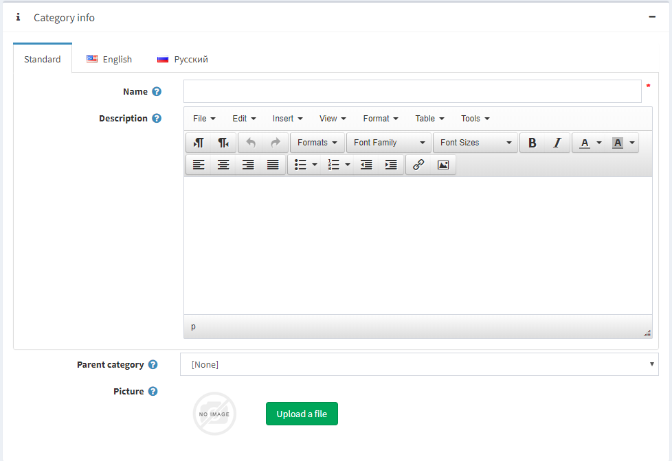

# Categories

Prior to adding new products, a store manager should create categories, to which the products will later be assigned. To manage categories, go to **Catalog → Categories.**


**Search for a category** in the Manage categories window by **entering the Category name **(or a part of the name), or among all the categories of a certain **Store**.

## Adding new category



In the **Category Info panel**, define the following category information:

- **Name** - this is how the category will be displayed in the catalog.
- **Description** - a description of the new category. Use the editor for layout and fonts.
- **Picture** - an image representing the category. Upload the image from your device.
- If this category will be a subcategory, select a **Parent category** from the Parent Category drop-down list. The new category will be placed under this category in the public store.

> [!NOTE]
> 
> For example, when you add seven products to a category and you set its page size to three. Three products per page will be displayed on this category details page in the public store, and the total amount of pages will be three.

When this option is disabled, customers will not be able to select a page size on the Category Details page and the store owner enters a certain page size. In this case, the Page size field becomes visible in the Administration area.

- **Discounts** - select discounts associated with this category. Discounts can be created in the Promotions menu. Note that only discounts with Assigned to categories type are visible here. After discounts are mapped to the category, they are applied to all products in this category.
- **Limited to customer roles** option allows showing this category only to selected customer roles. Choose the required customer roles from the list that can be created/edited on the Customer roles page of the Customers menu. If you want it to be visible to all - leave the field empty.
- **Select the Limited to stores** option to make this category limited to one or more stores. Note that this checkbox is only used when you have several stores configured. For further details refer to Multi-store support.

## Display


In the Category Display panel, define the following category information:

- Select the **Published** checkbox, to enable the category to be visible in the public store.
- Select the **Show on home page** checkbox, to display the category on the home page.
- Select the **Include in top menu** checkbox, to include the category in the top menu on the home page.
- Select the **Allow customers to select page size** checkbox, to enable customers to select a page size, i.e. the number of products displayed on the Category Details page. The page size can be selected by customers from the page sizes list entered by the store owner in the **Page size options** field.
- **Price ranges** - allow defining ranges of price by which customers can filter the products. The ranges are set in the currency that was defined in the Currencies window. Separate the ranges by a semicolon, for example, 0-999; 1000-1200; 1201 - (1201 means 1201 and over).
- **Display Order** - the order number for displaying the category. This display number is used to sort categories in the public store (ascending). The category with the display order 1 will be placed at the top of the list.

### Setting up SEO


In the **SEO tab**, define the **following details**:

**Meta keywords** - category meta keywords, which are a brief and concise list of the most important themes for the page. Meta keywords tag will look like: 

	`<meta name="keywords" content="keyword, keyword, keyword phrase, etc.">`

**Meta description** - a description of the category. The meta description tag is a brief and concise summary of your page content. The meta description tag looks, as follows 

	`<meta name="description" content="Brief description of the contents of your page">`

**Meta title** specifies the title of your Web page. It is a code which is inserted into the header of your web page:

```html
<head>
    <title> Creating Title Tags for Search Engine Optimization & Web Usability </title>
</head>
```

**Search engine friendly page name** - the name of the page used by search engines. If you leave the field blank, then the category page URL would be formed using the category name. If you enter custom-seo-page-name, then the following custom URL will be used: `http://www.yourStore.com/custom-seo-page-name`

### Adding products to certain category

**Products tab** contains a list of products related to the selected category, these products **can be filtered by category in the Catalog.** The store owner can add new products to this category. Note that you need to Save the category before you can add products.

Click **Add a new product** to find a product you want to include in this category. You can search by the product Name, by a Store, or a Product Type.


Select a product you would like to add to the category and click the Save button. The product will be displayed under the selected category.

After the product was added to the category, define the following information in the **Products panel**:

- Is featured product
- Display order

> [!NOTE]
> 
> By clicking **View**, you will be transferred to the Edit Product Details page.

Click **Save**. The new category will be displayed in the public store under its parent category.

You can click **Delete** to remove the category.

You can **Export the categories settings** to an external file for backup purposes, by clicking the Export button.

## See also

- [Adding products](xref:en/running-your-store/catalog/products/add-product-for-beginners)
- [SEO](xref:en/running-your-store/search-engine-optimization)
