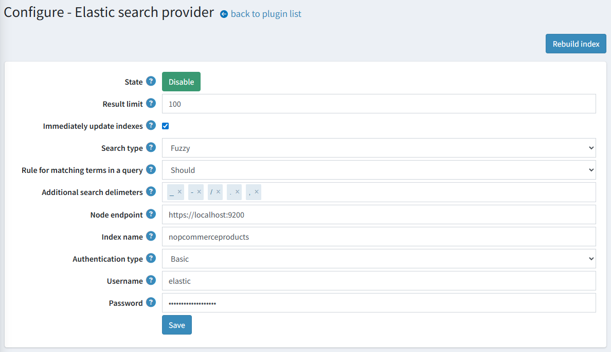

# Full-text search based on Elasticsearch

Please get the official integration with Elasticsearch [here](https://www.nopcommerce.com/full-text-search-elasticsearch?utm_source=docs.nopcommerce&utm_medium=documentation&utm_campaign=full-text-search-elasticsearch).

Elasticsearch is a search engine based on the Lucene library. It provides a distributed, multitenant-capable full-text search engine with an HTTP web interface and schema-free JSON documents.

Our integration provides a strongly-typed API and query DSL to interact with the Elasticsearch server. The plugin includes high-level operations for products, such as bulk indexing, update operations, and search.

## Available features

Here is a list of supported features:

* Automatic updating of product data on the elastic server (in real-time or on a schedule).
* Automatic matching of the available indexing language to the current store language.
* Several built-in search types:
  * Fuzzy search is used for the phrases that are spelled incorrectly. For example, if you type ‘test’ instead of ‘text’, results will still be found.
  * Wildcard search is used for matching phrase patterns instead of searching full phrases. The integration uses the `*` wildcard operator to represent word endings.
  * Exact search strictly matches the query to indexed tokens.
* Several authentication methods to access an Elasticsearch cluster.

## Plugin installation

This section describes how to integrate Elasticsearch into your store.

1. Purchase the integration at [https://www.nopcommerce.com/full-text-search-elasticsearch](https://www.nopcommerce.com/full-text-search-elasticsearch?utm_source=docs.nopcommerce&utm_medium=documentation&utm_campaign=full-text-search-elasticsearch)
1. Download the plugin archive.
1. Go to admin area > configuration > local plugins. Upload the plugin archive using the "Upload plugin or theme" plugin.
1. Scroll down through the list of plugins to find the newly installed plugin. Click on the "Install" button to install the plugin.

You can find more information about how to install plugins [here](https://docs.nopcommerce.com/getting-started/advanced-configuration/plugins-in-nopcommerce.html).

The Elasticsearch must be configured for correct work of the plugin. Find more about the Elasticsearch installation process [here](https://www.elastic.co/downloads/elasticsearch).

> [!NOTE]
> The plugin belongs to the **Search provider** group. Use the **Group** field in the search panel to filter plugins for faster navigation.

## Plugin configuration

Click the **Configure** button beside the Elastic search provider option in the list. Next, follow the steps to complete configuring the plugin:

1. Enter the Node endpoint URL that the plugin will use to connect to your Elasticsearch cluster.
1. Enter your Elasticsearch server credentials:
    * **Authentication type**. Select the authentication method that will be used to grant access to the Elasticsearch cluster.
    * **Username**. This is the username you use with the Basic authentication scheme.
    * **Password**. This is the password you use with the Basic authentication scheme.
    * **Api Key**. This is the keyword you use with the bearer authentication scheme.
1. Choose a search algorithm:
    * The "**Fuzzy**" search is based on the Levenshtein Distance (For example, searches for a "roam" term will find terms like "foam" and "roams").
    * The "**Contains**" search looks for 0 or more characters based on the wildcard searches with "*" at the end (For example, to search for "test", "tests", or "tester", you can use the "test" term).
    * The "**None**" option is based on exact matching.
1. Set up the behavior of updating the search index documents. Check the **Immediately update indexes** to immediately apply changes for the mapped product (for example, their names or descriptions were changed). Otherwise, the reindexing will be scheduled.
    > [!NOTE]
    > You may also manually click the "Rebuild index" button to start reindexing.
1. Enter the **Result limit**, if necessary. The Result limit is the maximum number of result matches that will be retrieved from the Elasticsearch server for search queries.
1. Click the **Save** button

> [!NOTE]
> To toggle the plugin state, use the "**Enable**" or "**Disable**" buttons. They are displayed depending on the current state.
