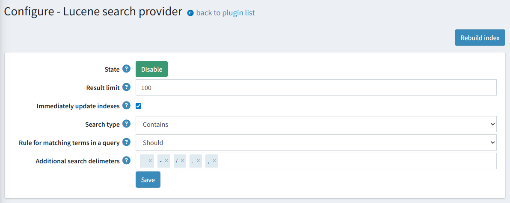

# Full-text search based on Lucene

Please get the Full-Text Search plugin based on Lucene [here](https://www.nopcommerce.com/full-text-search-lucene?utm_source=docs.nopcommerce&utm_medium=documentation&utm_campaign=full-text-search-lucene).

[Apache Lucene™](https://lucene.apache.org/) is a high-performance, full-featured search engine library written entirely in Java. It is a technology suitable for nearly any application that requires structured search, full-text search, faceting, nearest-neighbor search across high-dimensionality vectors, spell correction, or query suggestions.

Our integration uses [Lucene.Net](https://lucenenet.apache.org/) which is a port of the Lucene search library. Apache Lucene.NET is a .NET library providing powerful indexing, search features, and advanced analysis/tokenization capabilities.

## Available features

Here is a list of supported features:

* Automatic updating of product data in the stored index.
* Automatic matching of the available indexing language to the current store language.
* Several built-in search types:
  * Fuzzy search is used for the phrases that are spelled incorrectly. For example, when you type ‘test’ instead of ‘text’, results still can be found.
  * Wildcard search is used for matching phrase patterns instead of searching full phrases. The integration uses the `*` wildcard operator to represent word endings.
  * Exact search strictly matches the query to indexed tokens.

## Plugin installation

This section describes how to integrate the Lucene plugin into your store.

1. Purchase the integration at [https://www.nopcommerce.com/full-text-search-lucene](https://www.nopcommerce.com/full-text-search-lucene?utm_source=docs.nopcommerce&utm_medium=documentation&utm_campaign=full-text-search-lucene)
1. Download the plugin archive.
1. Go to admin area > configuration > local plugins.
1. Upload the plugin archive using the "Upload plugin or theme" plugin.
1. Scroll down through the list of plugins to find the newly installed plugin. Click on the "Install" button to install the plugin.

You can find more information about how to install plugins [here](https://docs.nopcommerce.com/getting-started/advanced-configuration/plugins-in-nopcommerce.html)

> [!NOTE]
> The plugin belongs to the **Search provider** group. Use the **Group** field in the search panel to filter plugins for faster navigation.

## Plugin configuration

Click the **Configure** button beside the Lucene search provider option in the list. Next, follow the steps to complete configuring the plugin:

1. Choose a search algorithm:
    * The "**Fuzzy**" search is based on the Levenshtein Distance (For example, searches for a "roam" term will find terms like "foam" and "roams").
    * The "**Contains**" search looks for 0 or more characters based on the wildcard searches with "*" at the end (For example, to search for "test", "tests", or "tester", you can use the "test" term).
    * The "**None**" option is based on exact matching.
1. Set up the behavior of updating the search index documents. Check the **Immediately update indexes** to immediately apply changes for the mapped product (for example, their names or descriptions were changed). Otherwise, the reindexing will be scheduled.
    > [!NOTE]
    > You may also manually click the "Rebuild index" button to start reindexing.
1. Enter the **Result limit**, if necessary. The Result limit is the maximum number of result matches that will be retrieved from the index for search queries.
1. Click the **Save** button

> [!NOTE]
> To toggle the plugin state, use the "**Enable**" or "**Disable**" buttons. They are displayed depending on the current state.
