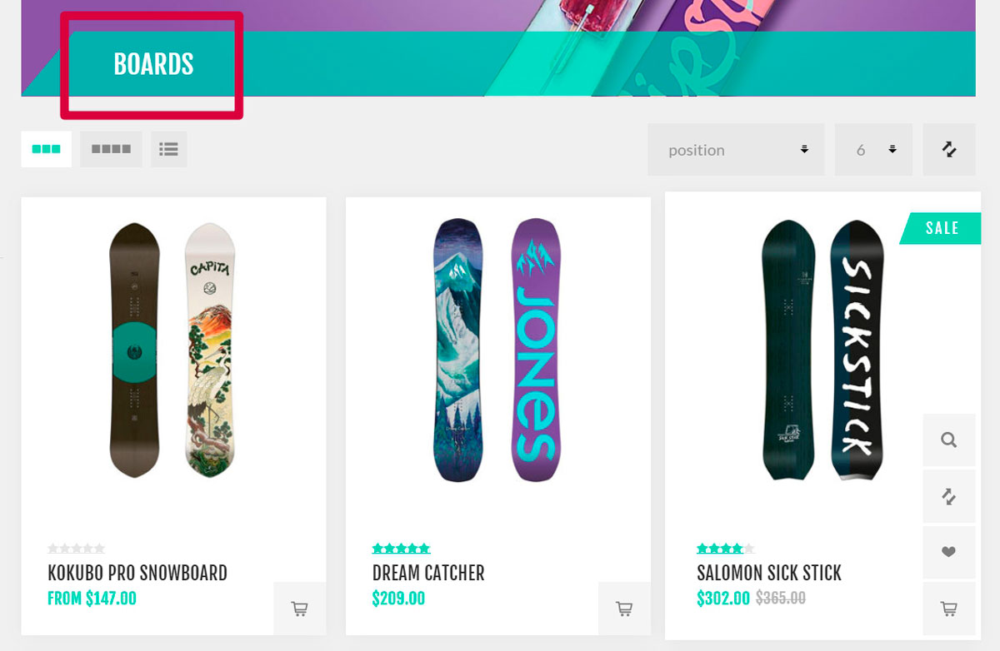
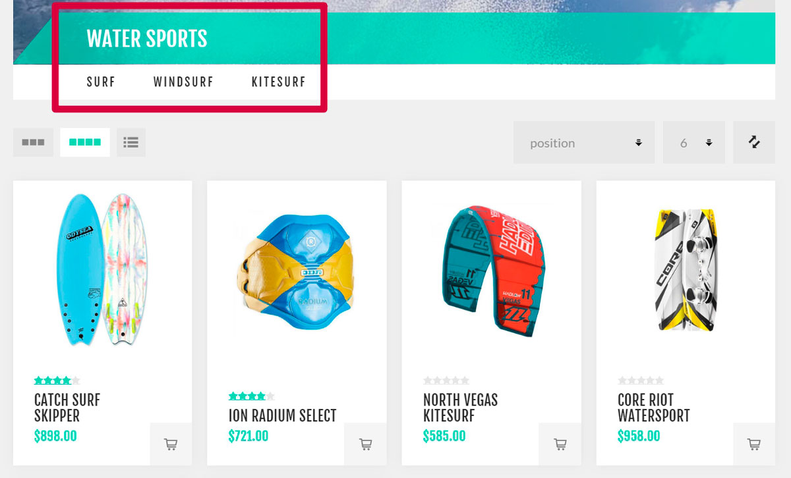
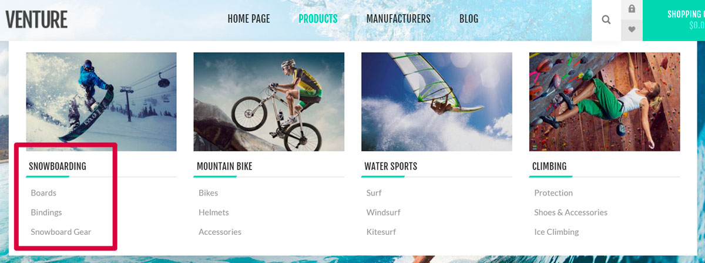
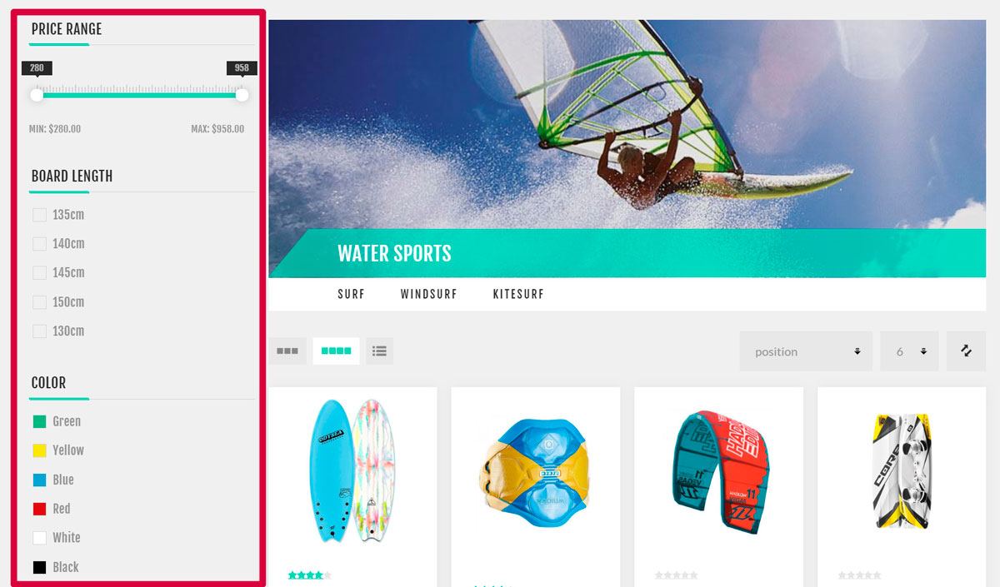
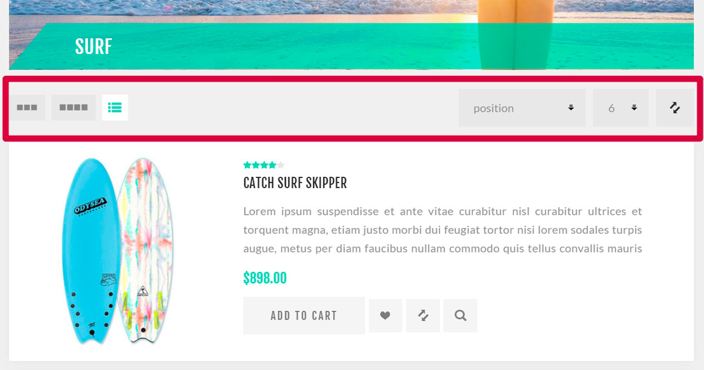

---
title: Catalog
uid: en/running-your-store/catalog/index
author: git.AndreiMaz
contributors: git.exileDev, git.dunaenko, git.IvanIvanIvanov, git.mariannk
---

# Catalog

Products is a basis of an online store, and product management is a very important part of your store management strategy. Product information helps customers decide whether they want to purchase an item or not. So make sure to have quality product content on the store, because it builds confidence in your customers that they are getting exactly what they need and expect.

Most important components of the product management in nopCommerce are adding products, manufacturers, setting up product categories to make navigation easy, adding good product descriptions and appealing pictures, listing all possible product variants, defining product tags to make a product search quick and effective.

## A catalog on the example of a live store
In the following examples we will use our demo-store based on the "Nop Venture Theme" by Nop-Templates. Please find more about this third-party theme [here](https://www.nopcommerce.com/nop-venture-theme-14-plugins-nop-templatescom).
To see the full demo store visit the [demo site](https://frontend.nopcommerce.com/?choosetheme=2). 

There are some tips which will help you to create a well-designed catalog for your customers.

### Categories

- When adding categories to your store ensure they clearly describes the products (or subcategories) they contain. As on the following example, the Boards category contains only boards:
	
	*Create categories using the **Add new** button on the **Catalog → Categories** page*.

- Use subcategories when you need to separate a general category to specific ones. It makes the search process easier for your customers. As on the example below, the Water Sports category contains the Surf, Windsurf and Kitesurf
subcategories:
	
	*Add **Parent category** on the category edit page to make it subcategory.*

- Add the most popular categories to the top menu which is visible on each page to attract more customers:
	
	*To do this use the **Include in top menu** checkbox on the category edit page.*

- Add the most interesting categories to the homepage. These categories will be first what a customer sees when visiting your store:
	
	*To do this use the **Show on home page** checkbox on the category edit page.*

- Allow your customers to search in categories using filters:
	
	*The filter functionality uses [specification attributes](xref:en/running-your-store/catalog/products/specification-attributes).*

- Allow your customers to sort products and change the display mode: 
	
	*For more information about sorting visit the [Catalog settings - Product sorting](xref:en/running-your-store/catalog/catalog-settings#product-sorting) section. Use the **Allow customers to select page size** and **Page size options** fields from the category edit page to set up the display mode.*

To learn how to create a category visit the [Categories](xref:en/running-your-store/catalog/categories) chapter.

## See also

* [Categories](xref:en/running-your-store/catalog/categories)
* [Manufacturers](xref:en/running-your-store/catalog/manufacturers)
* [Attributes](xref:en/running-your-store/catalog/products/product-attributes)
* [Products](xref:en/running-your-store/catalog/products/index)
* [Catalog settings](xref:en/running-your-store/catalog/catalog-settings)
