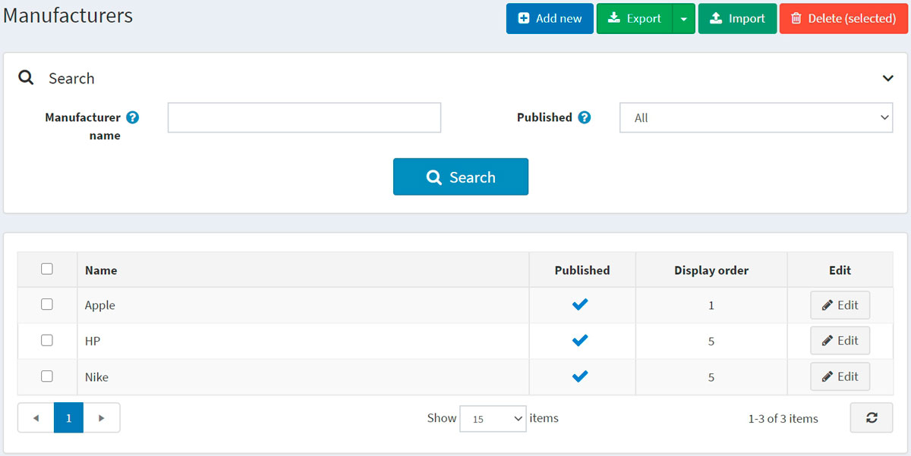
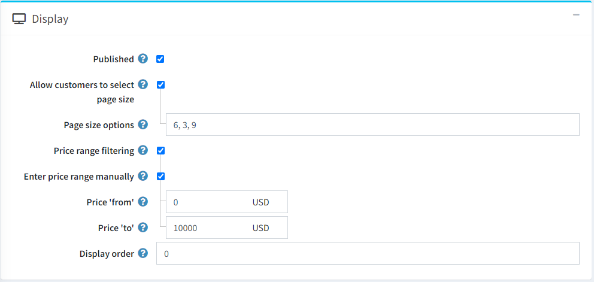
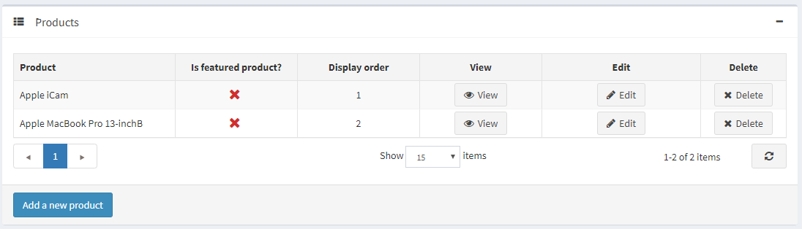

# Manufacturers

To manage manufacturers, go to **Catalog → Manufacturers**.



Search for a manufacturer in the *Search* panel by entering the **Manufacturer name** or its part, by the **Published** property or among all the manufacturers of a certain **Store** (if more than one store is enabled).

> [!NOTE]
>
> To remove manufacturers from the list, select the items to be deleted and click the **Delete (selected)** button.
> You can export the manufacturers to an external file for backup purposes by clicking the **Export** button. After clicking the **Export** button, you will see the dropdown menu enabling you to **Export to XML** or **Export to Excel**.

## Adding a new manufacturer

To add a new manufacturer, click the **Add new** button at the top of the page. The *Add a new manufacturer* window will be displayed.


This page is available in two modes: **advanced** and **basic**. Switch to the basic mode, which only displays the main fields, or use the advanced mode displaying all the available fields.

### Manufacturer info

In the *Manufacturer info* panel, define the following details:

- **Name** — this is the name of the manufacturer displayed in the catalog.
- **Description** — a description of the manufacturer. Use the editor for layout and fonts.
- **Picture** — an image representing the manufacturer. Upload the image from your device.

### Display



In the *Display* panel, define the following details:

- Select the **Published** checkbox to enable the manufacturer to be visible in the public store.
- Select the **Allow customers to select page size** checkbox to enable customers to select a page size, that is, the number of products displayed on the manufacturer details page. The page size can be selected by customers from the page size list entered by the store owner in the **Page size options** field.
  - If the previous checkbox is selected, the **Page size options** will be displayed. Enter a comma-separated list of page size options (for example, 10, 5, 15, 20). The first option is the default page size if none are selected.
  - The **Page size** option will be displayed if the **Allow customers to select page size** checkbox is clear. It sets the page size for products by this manufacturer, for example, '4' products per page.
    > [!TIP]
    >
    > For example, when you add seven products to a manufacturer and set its page size to three, three products per page will be displayed on this manufacturer details page in the public store, and the total amount of pages will be three.

- Select the **Price range filtering** checkbox if you want to enable filtering by price range.
  - If you want the price range to be entered manually, select the **Enter price range manually** checkbox.
    - If the setting above is enabled, enter the **Price 'from'**.
    - And the **Price 'to'**.
- **Display Order** — the order number for displaying the manufacturer. This display number is used to sort manufacturers in the public store (ascending). The manufacturer with the display order 1 will be placed at the top of the list.
- The **Manufacturer template** filed is visible if you have custom manufacturer templates installed on the **System → Templates** page. This template defines how this manufacturer (and its products) will be displayed.

### Mappings


In the *Mappings* panel, define the following details:

- **Discounts** — select discounts associated with this manufacturer. You can create discounts on the **Promotions → Discounts** page. Read more about discounts in the [Discounts](xref:en/running-your-store/promotional-tools/discounts) chapter.

    > [!NOTE]
    >
    > Note that only discounts of the *assigned to manufacturers* type are visible here. After discounts are mapped to the manufacturer, they will be applied to all products by this manufacturer.
    >
    > [!NOTE]
    >
    > If you want to use discounts, make sure the **Ignore discounts (sitewide)** setting is disabled in the **Configuration → Settings → Catalog settings → Performance** panel.

- In the **Limited to customer roles** field, choose the customer roles that will be able to see the manufacturer in the catalog. Leave this field empty if this option is not required, and the manufacturer can be seen by everyone.
    > [!NOTE]
    >
    > In order to use this functionality, you have to disable the following setting: **Configuration → Catalog settings → Ignore ACL rules (sitewide)**. Read more about the access control list [here](xref:en/running-your-store/customer-management/access-control-list).

- Choose the stores in the **Limited to stores** field if the manufacturer's products are sold in specific stores. Leave the field empty in case this functionality is not required.
  > [!NOTE]
  >
  > In order to use this functionality, you have to disable the following setting: **Catalog settings → Ignore "limit per store" rules (sitewide)**. Read more about multi-store functionality [here](xref:en/getting-started/advanced-configuration/multi-store).

### SEO


In the *SEO* panel, define the following details:

- **Search engine friendly page name** — the page name used by search engines. If you leave the field blank, then the manufacturer page URL will be formed using the manufacturer name. If you enter custom-seo-page-name, then the following custom URL will be used: `http://www.yourStore.com/custom-seo-page-name`.

- **Meta title** specifies the title of the webpage. It is a code inserted into the header of your webpage:

    ```html
    <head>
        <title> Creating Title Tags for Search Engine Optimization & Web Usability </title>
    </head>
    ```

- **Meta keywords** — manufacturer meta keywords, which represent a brief and concise list of the most important themes for the page. Meta keywords tag looks like: `<meta name="keywords" content="keyword, keyword, keyword phrase, etc.">`

- **Meta description** — a description of the manufacturer. A meta description tag is a brief and concise summary of the page content. A meta description tag looks like: `<meta name="description" content="Brief description of the contents of your page">`

Click the **Save and continue edit** button to proceed to add products to the manufacturer.

### Products

The *Products* panel contains a list of products related to the selected manufacturer; these products can be filtered by the manufacturer in the catalog. The store owner can add new products to the manufacturer. Note that you need to save the manufacturer before you can add products.

Click **Add a new product** to find a product you want to add to this manufacturer. You can search by the **Product name**, **Category**, **Vendor**, **Store**, **Product type**, and **Manufacturer**.


Select products you would like to add to the manufacturer and click the **Save** button. The product will be displayed under the selected manufacturer.



After the product has been added to the manufacturer, define the following information in the *Products* table by clicking the **Edit** button beside the product:

- **Is featured product**.
- **Display order**.

> [!NOTE]
>
> By clicking **View**, you will be redirected to the *Edit product details* page.

Click **Save**.

## Importing manufacturers

If you do not want to add all the manufacturers to your catalog manually, you can use the import option.

> [!NOTE]
>
> Before you start importing, you should download a table template for import in Excel format. For accurate and correct import of your manufacturers, it's crucial to name all the columns in the table properly (exactly as in the downloaded table).

It is not mandatory to fill all the table fields. The manufacturer will be created based on the filled fields.

Import requires a lot of memory resources. That's why it's not recommended to import more than 500–1000 records at once. If you have more records, it's better to split them into multiple Excel files and import them separately.

## See also

- [Adding products](xref:en/running-your-store/catalog/products/add-products)
- [SEO](xref:en/running-your-store/search-engine-optimization)

## Tutorials

- [Managing manufacturers in nopCommerce](https://www.youtube.com/watch?v=NnWD9-zi8s4&feature=youtu.be)
