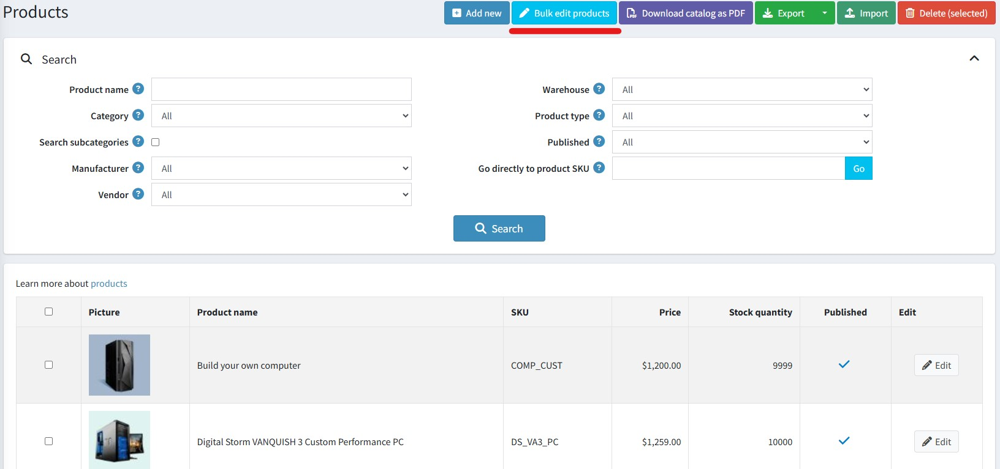
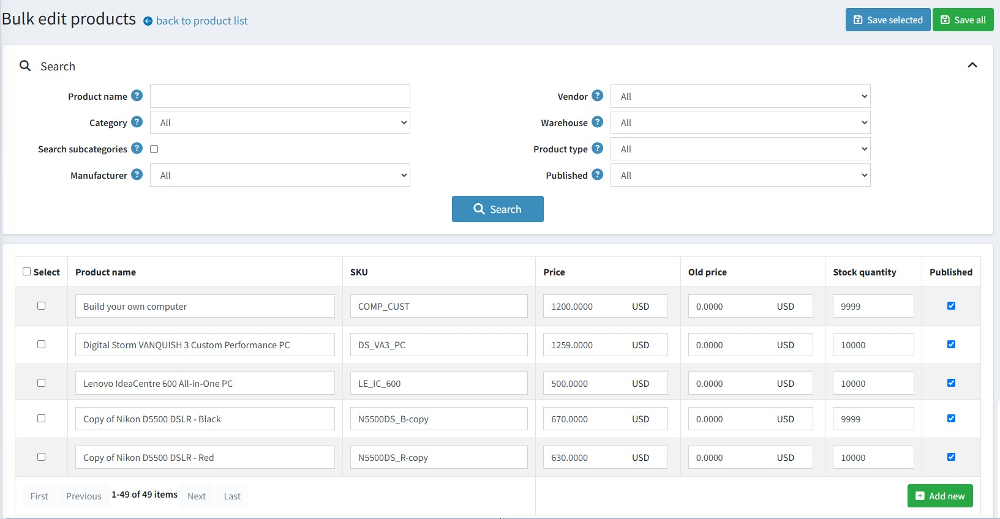

# Bulk edit products

To bulk edit products, go to **Products → Bulk edit products**. The bulk edit products page lists all current products.

Usually, when you want to edit a product you go to the edit page of that product. It doesn’t matter with a small change but will become complicated and time-consuming when you need to modify a bunch of products.

The bulk product editing feature provides a simple and convenient way to bulk edit a portion of product information. The list of fields available for editing consists of:

- Product name
- SKU
- Price
- Old price
- Stock quantity
- Published

There is a '**Save selected**' button and a '**Save all**' button in the top right hand corner of the page. Once clicked, any new values entered will be saved to the database.

You can also add products by clicking the '**Add new**' button at the end of the table.
