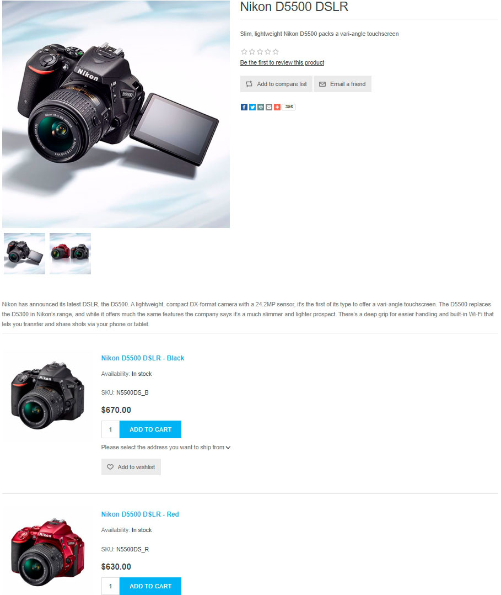

# Grouped products (variants)

Grouped products, or products with variants, are a convenient tool to sell a product that has various supplementary items or attribute sets. Various combinations of such a product can be sold as separate products, and the price may vary.

In nopCommerce, grouped products look like a single product details page displaying all the possible options. It is a convenient and SEO-friendly tool to sell complex products.

> [!TIP]
>
> For example, a base product, such as a camera body, can be grouped with various sets of lenses. Another use case of a grouped product is selling a type of product with various attribute sets. For example, chocolate with various flavors. In this case, a customer can easily see the main product and all its options on the same page.

## Adding a new grouped product

To create a grouped product, go to **Catalog → Products**. There are several steps to follow:

  > [!TIP]
  >
  > Learn how to fill in the product fields [here](xref:en/running-your-store/catalog/products/add-products).

1. Create several products with a *simple* product type. These are the variants of the main product. Use the **Visible individually** checkbox to define whether you want them to be visible separately in catalog and search results or only shown on the product page of the main product.
1. Create a **Grouped (product with variants)** product and assign these simple products you created in the previous step in the **Associated products (variants)** panel:

    

> [!NOTE]
>
> - In the public store, a customer sees a separate **Add to cart** button for each associated product on the *grouped* product details page.
> - A *simple* product can only be associated with one *grouped* product.
> - *Grouped* products are **not orderable directly**. However, *simple* products are associated with them. For example, a customer cannot order the Creative Sound Card product directly. Instead, they must order an OEM or Retail version of the Creative Sound Card. In this case, the *grouped* product is the Creative Sound Card, and there are two associated *simple* products for this *grouped* product: OEM and Retail, each with potentially different prices.

## Tutorials

- [Understanding grouped products in nopCommerce](https://www.youtube.com/watch?v=B1UdxXf_jmE)
- [Creating Bundled products in nopCommerce](https://www.youtube.com/watch?v=sf9jP6KFcko)
