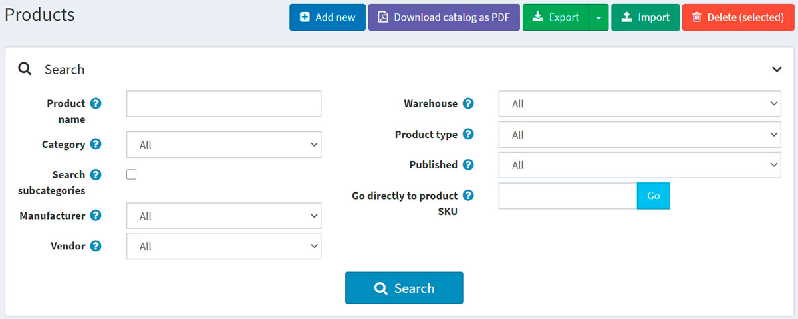
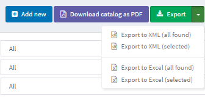

# Import/export products

nopCommerce supports importing from Excel format and exporting products in XML or Excel. You can download products from your catalog in PDF.
You can find these options in **Catalog → Products** on the main page, top left.

## Exporting products

 You can export products in XML or Excel formats by clicking the **Export** button. After clicking the **Export** button, you will see the dropdown menu enabling you to **Export to XML (all found)** or **Export to XML (selected)** and **Export to Excel (all found)** or **Export to Excel (selected)**.

 If you don't need to download all the products, use the *Search* panel to find the required products or/and checkboxes to select the needed products. A file with the products you have chosen will be downloaded. The file will consist of all the products' characteristics from product editing page panels (Product info, SEO, Pictures, and more).

> [!NOTE]
>
> If you use product attributes, an exported Excel table will be grouped by rows. To view attribute details, click + next to your product in the table.
> 

## Importing products

If you do not want to add all the products to your catalog manually, you can use the import option.

> [!NOTE]
>
> Before you start importing, you should download a table template for import in Excel format, as it was described in the [exporting products](#exporting-products) section. For accurate and correct import of your products, it's crucial to name all the columns in the table properly (exactly as in the downloaded table).

It is not mandatory to fill all the table fields. The product will be created based on the filled fields.

Imported products are distinguished by SKU. If the SKU already exists, then its corresponding product will be updated.

Import requires a lot of memory resources. That's why it's not recommended to import more than 500–1000 records at once. If you have more records, it's better to split them into multiple Excel files and import them separately.

### Example

For example, we want to add Dancing shoes to our catalog. Let's create a new row in the table:

Then click **Import**, choose the file, and click the **Import from Excel** button. Then check if you have a new product in the catalog.

## Importing products with images hosted on external resources

Sometimes it is necessary to import products with images that are hosted on external resources. nopCommerce supports such a scenario. However, this option is disabled by default for security purposes. You can enable it on the **"Catalog settings"** page in the administration area. Just enable the **"Export/import products. Allow download images"** setting.

There is an address validation code provided by the .NET platform in this image loading method. This mechanism doesn't always correctly determine the correctness of addresses despite their full compliance with the [RFC3986](https://datatracker.ietf.org/doc/html/rfc3986) specification. Our recommendation is to avoid using special characters, such as **^** or **~**, in URLs. So please ensure that all specified URLs contain Latin chars only.

## Importing product with categories and manufacturers

The task of importing categories and manufacturers is specific because a product can belong to multiple categories or manufacturers. Each new value in this cell must be separated by the **;** character. Please avoid using spaces for formatting even though they should be ignored by the algorithm (for example, 1;2;3 is better than 1; 2; 3).

The **Categories** and **Manufacturers** columns can contain both the identifiers of the corresponding objects and their names (you can use one approach or mix both options at your discretion). If you want to import categories by name, you may specify the name only or the entire category name hierarchy. In this case, the parent category will be separated from the child category by the **>>** symbols. For example, “Computers >> Desktops;”

Importing categories and manufacturers by name is case sensitive, that is, “**T**est category/manufacturer **n**ame” is not the same as “**t**est category/manufacturer **N**ame”

## Setting up import/export

The following section describes import/export settings: [Export/import](xref:en/running-your-store/catalog/catalog-settings#exportimport).

## See also

* [Adding products](xref:en/running-your-store/catalog/products/add-products)
