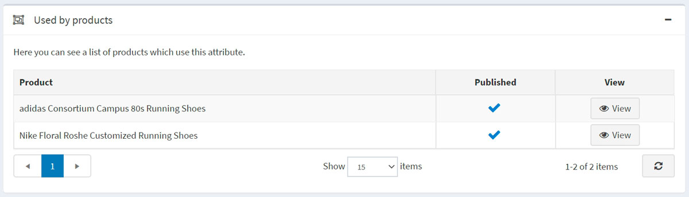

# Product attributes

Product attributes are variations of a product (such as color, size).

A user can create various combinations of attributes. For example, a product can be in various sizes and colors. Thus, a user would create two attributes and their values, for example, "size" (S, M, L) and "color" (red, blue, white) and then set up groups according to the availability of the products.

In nopCommerce, product attributes are used in **inventory tracking** and can also cause a **price difference**.

To define product attributes, go to **Catalog → Attributes → Product attributes**.

> [!NOTE]
>
> By default, there are no product attributes precreated in nopCommerce.

## Adding product attributes

Click **Add new** to add an attribute.

In the *Add a new product attribute* window, fill the **Name** and **Description** fields.

Click **Save and continue edit** to proceed to the *Predefined values* editing panel.

> [!TIP]
>
> [YouTube tutorial: Adding a product with color attributes](https://youtu.be/QihipwQ61YU)

## Adding predefined values

In the *Predefined values* panel, click **Add a new value**, and the *Add a new value window* will be opened:

In the *Add a new value* window, define:

- The attribute **Name**.
- The **Price adjustment** applied when choosing this attribute value. For example, '10' to add 10 dollars. Or 10% if **Price adjustment. Use percentage** is selected.
- **Price adjustment. Use percentage** checkbox allows for determining percentage price adjustment instead of an absolute value.
- The **Weight adjustment** applied when choosing this attribute value.
- The **Cost** attribute value is the cost of all components that make up this value. This may be either the purchase price if the components are bought from third-party suppliers or the combined cost of materials and manufacturing processes if the component is made in-house.
- Whether the value **Is pre-selected** for a customer.
- The **Display order** in an attribute list.

After filling the fields, click **Save**.

> [!TIP]
>
> It's not necessary to create attribute values when adding the product attribute; you can create them later when applying a certain product attribute to the product.
> Once the attributes and values are set, they can be grouped and managed in the *Product attributes* panel on the product edit page.
>
> [!NOTE]
>
> Some store owners prefer to highlight products differentiated by attributes and create a separate product with each specific attribute (for example, separately listed blue T-shirts and red T-shirts). In this case, we recommend creating a grouped product (shirts, as in the example) in order for all the variations to be displayed on the same page once the grouped product is being viewed by a customer. Read more about [grouped products](xref:en/running-your-store/catalog/products/grouped-products-variants).
>
> [!WARNING]
>
> Adding new or updating existing "Predefined values" does not affect products that already have the attribute.

## Used by products panel

In the *Used by products* panel, you can choose which products use this attribute:

## See also

- [Adding products](xref:en/running-your-store/catalog/products/add-products)
- [Grouped product](xref:en/running-your-store/catalog/products/grouped-products-variants)

## Tutorials

- [Overview of conditional product attributes](https://www.youtube.com/watch?v=eIdHVcEdos8&t=55s)
