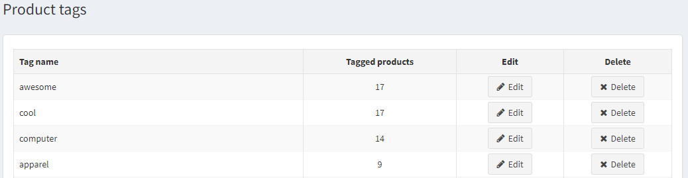

# Product tags

**Product tags** are keywords for product identification. They are used to sort the products by a certain feature and to enable a specific, narrow product search.

> [!NOTE]
> 
> **For example**, if you sell apparel, and you want to create tags for T-shirts, it can be “t-shirt”, “cotton”, “polo”, etc.

To edit product tags that are displayed in a public store, go to **Catalog → Product tags.**

On the Product tags page, you can see how many products have a **certain tag**, and edit the tag by clicking the **Edit** button beside it.

## Adding product tags

You can **add tags** on the Edit product details page when adding or editing a product.

Enter tags separating them by comma. Once the tags are created, they can be used for other products as well. The more products are associated with a particular tag, the larger it will look in the **Popular Tags** area, displayed in the sidebar of the Catalog page:

## See also

* [Product categories](xref:en/user-guide/running/product-management/categories)
* [Adding products](xref:en/user-guide/running/product-management/products/adding-products/index)
