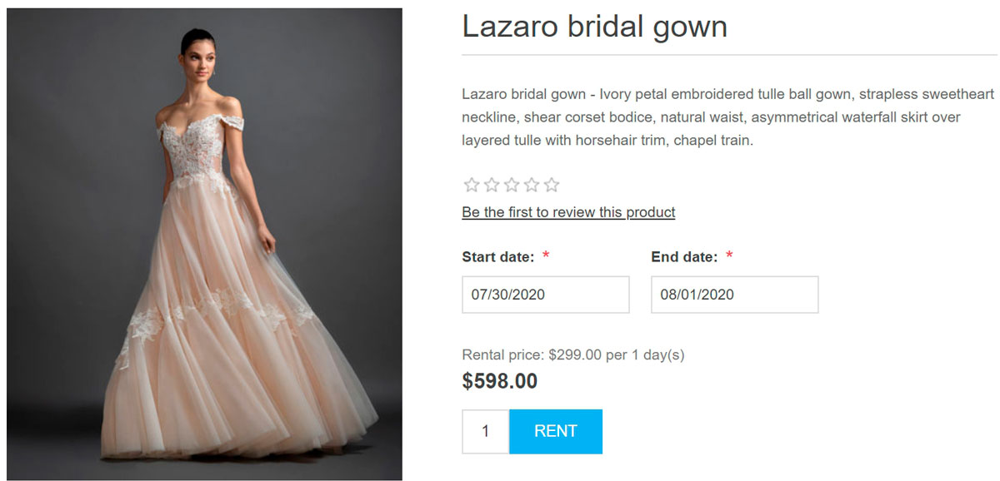
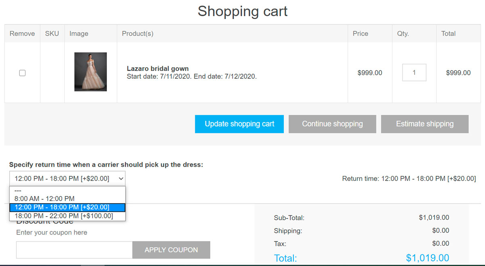

---
title: Rental products
uid: en/running-your-store/catalog/products/rental-products
author: git.AndreiMaz
contributors: git.DmitriyKulagin, git.exileDev, git.dunaenko, git.IvanIvanIvanov, git.mariannk
---

# Rental products

The rental products functionality is useful when you want to create a website allowing customers to book rooms and hotels. This feature can also be used for a website that offers such clothes as wedding dresses, camping equipment, children's toys, and more for rent.

## Example

Let's say you wish to create a website providing wedding dresses for rent.

Which functionality will be useful in this case?

- One of the most important features is to allow customers to choose the *rent period*. In nopCommerce, it is allowed to choose the start date and end date, as on the screenshot below:
 

- nopCommerce also allows the store administrator to choose the *rental period* and *rental period length*. For example, you want to give a wedding dress for rent for 3 days minimum. In this case, a customer will see the following on the product details page:
 

- Use *checkout attributes* to allow customers to specify the return time when a carrier should pick up the dress:
 
 Read more about checkout attributes [here](xref:en/running-your-store/order-management/checkout-attributes).

If you have already learned how to set up a [common product](xref:en/running-your-store/catalog/products/add-products), learn how to make this product rental in the section below.

## Set up a rental product

To create a rental product, go to **Catalog → Products**. Click **Add new**, fill in the common product fields, and select the corresponding checkbox in the *Rental* panel.

Define the following details:

- **Rental period length** is a rental cycle length, minimum billing period. Price is specified for this period.
- **Rental period** in *Days*, *Weeks*, *Months* or *Years*. It defines the time units of the rental period.

When buying rental products, customers have to specify the rental period in the public store. The amount to be paid is calculated automatically.

## Tutorials

- [Managing rental products](https://www.youtube.com/watch?v=tOaC6hOILZY&list=PLnL_aDfmRHwsbhj621A-RFb1KnzeFxYz4&index=24)
