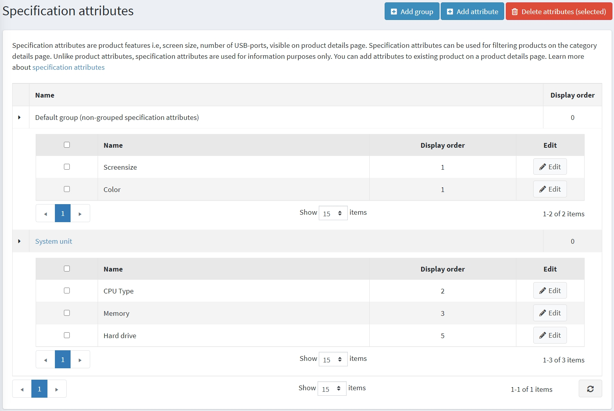

# Specification attributes

Specification attributes are similar to [product attributes](xref:en/running-your-store/catalog/products/product-attributes), however, they are only used for information purposes (visible on the product details page) and for filtering products on the category details page. They don't define a product price as well as can't be used for the inventory tracking.

> [!NOTE]
> 
> By default, there are no specification attributes pre-created in nopCommerce.

To see and edit a list of specification attributes, go to **Catalog → Attributes → Specification attributes**.

On this page you can delete specification attributes by selecting them and then clicking the **Delete(selected)** button.

## Create a specification attribute

Click **Add new** to add a new attribute. The *Add a new specification attribute* window is displayed, as follows:

In the *Attribute info* panel, enter:
- The **Name** of the specification attribute.
- The **Display order** number.

Click **Save and continue edit** to proceed to the *Options* editing panel. The following screenshot shows the already added options:

## Create a new option

Click the **Add a new option** button in the *Options* panel to create a new specification attribute option. The *Add a new option* window will be displayed, as follows:

Define the following option settings:
- The **Name** of the specification attribute option.
- Tick the **Specify color** checkbox to choose color to be used instead of an option text name (it'll be displayed as a "color square").
    - Choose the **RGB color** which will be displayed to customers.
- The **Display order** number.

Click **Save** to save the changes.

## Used by products

If you applied the specification attribute to products you can see the list of these products in the *Used by products* panel:

## See also

- [Adding products](xref:en/running-your-store/catalog/products/add-products)
- [Product attributes](xref:en/running-your-store/catalog/products/product-attributes)
- [YouTube tutorial: Managing Specification Attributes](https://www.youtube.com/watch?v=YmD_vHqWzQw&index=11&list=PLnL_aDfmRHwsbhj621A-RFb1KnzeFxYz4)
