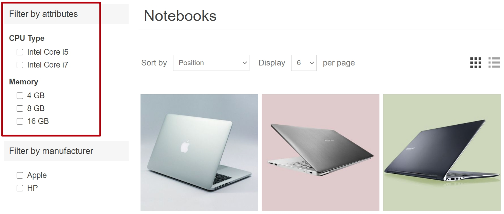

# Specification attributes

Specification attributes are similar to [product attributes](xref:en/running-your-store/catalog/products/product-attributes); however, they are only used for information (visible on the product details page) and for filtering products on the category details page. They don't define product price and can't be used for inventory tracking.

## Example

Let's say you are running an online computer store. What helps a customer to make a decision?

- Provide a customer with comprehensive and descriptive information about your products. Although you fill the short and full descriptions of a certain computer, allow the customer to see the product's characteristics reflecting its most important details:

  

  This table can be displayed on the product details page if you select the **Show on product page** field when [adding a specification attribute to a product](xref:en/running-your-store/catalog/products/add-products#specification-attributes).

- Allow your customers to search computers using the filter functionality. Let's say we can search in your store by CPU type and memory. Then, the category page will look as follows:

  

  Select the **Allow filtering** field when [adding a specification attribute to a product](xref:en/running-your-store/catalog/products/add-products#specification-attributes) to allow filtering by this attribute for a certain product.

- Include the "Compare products" functionality in your store. This feature uses specification attributes as well. For your computer store, the "Compare products" page will look as follows:
  
  

  To enable the "Compare products" functionality, go to **Configuration → Settings → Catalog settings**. In the *Compare products* panel, select the **'Compare products' enabled** checkbox.

The next section describes how to create specification attributes. Note that after creating a list of specification attributes, you will need to add the specification attributes to the products one by one. Learn how to add specification attributes to products in the [Add products - Specification attributes](xref:en/running-your-store/catalog/products/add-products#specification-attributes) section.

## Create a specification attribute group

> [!NOTE]
>
> All specification attributes that don't belong to any group are in the *Default group (non-grouped specification attributes)*.

To view and edit a list of specification attributes and their groups, go to **Catalog → Attributes → Specification attributes**.

Click **Add group** to add a new group. The *Add a new specification attribute group* window will be displayed as follows:

In the *Attribute group info* panel, enter:

- The **Name** of the specification attribute group.
- The **Display order** number.

Then save the changes.

## Create a specification attribute

> [!NOTE]
>
> By default, there are no specification attributes precreated in nopCommerce.

To view and edit a list of specification attributes, go to **Catalog → Attributes → Specification attributes**.

On this page, you can delete specification attributes by selecting them and then clicking the **Delete(selected)** button.

Click **Add attribute** to add a new attribute. The *Add a new specification attribute* window will be displayed as follows:

In the *Attribute info* panel, enter:

- The **Name** of the specification attribute.
- The **Display order** number.

Click **Save and continue edit** to proceed to the *Options* editing panel.

### Add a new option

Click the **Add a new option** button in the *Options* panel to create a new specification attribute option. The *Add a new option* window will be displayed as follows:

Define the following option settings:

- The **Name** of the specification attribute option.
- Select the **Specify color** checkbox to choose the color to be used instead of the option's text name (it will be displayed as a "color square").
  - Choose the **RGB color** that will be displayed to customers.
- The **Display order** number.

Click **Save** to save the option details.

The following screenshot shows already added options:

### Used by products

If you have applied the specification attribute to products, you can see the list of these products in the *Used by products* panel:

## See also

- [Adding products](xref:en/running-your-store/catalog/products/add-products)
- [Product attributes](xref:en/running-your-store/catalog/products/product-attributes)
- [YouTube tutorial: Managing Specification Attributes](https://www.youtube.com/watch?v=YmD_vHqWzQw&index=11&list=PLnL_aDfmRHwsbhj621A-RFb1KnzeFxYz4)
