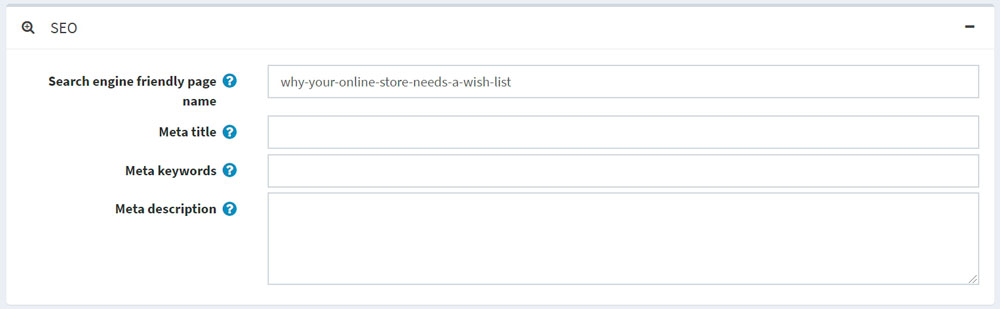
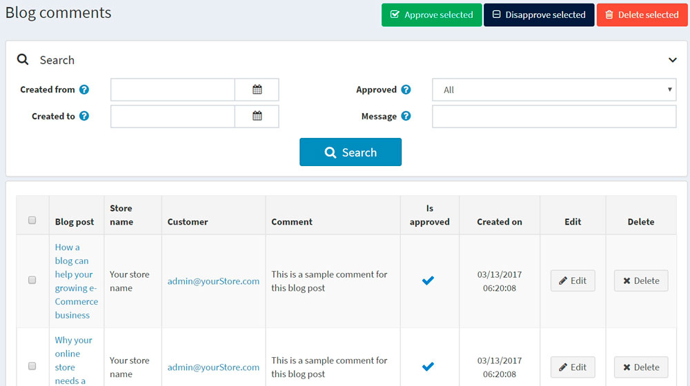

# Blog

A blog is a great way to connect with your existing customers, keeping them informed about the latest product offerings or educating them, and to find new customers.

To manage blog posts, go to **Content management → Blog posts**.

## Add a new blog post

Click **Add new** and fill in the information about the new blog post.

### Info

In the *Info* panel, define the following blog post details:

* If more than one language is enabled, from the **Language** dropdown list, select the language of this blog post. Customers will only see blog posts in their selected language.
* Enter the **Title** of this blog post.
* Enter the **Body** text of this blog post.
* You can specify the **Body overview** if you want only a part of the text to be visible on the main blog page where all blog posts are listed.
* Enter **Tags** to be displayed on the blog page in the public store. Tags are keywords that this blog post can also be identified by. Enter a comma-separated list of the tags associated with this blog post. The more blog posts are associated with a particular tag, the larger size it has in the "Popular tags" area displayed on the sidebar on the blog page.
   

* Select the **Allow comments** checkbox to enable customers to add comments to this blog post.
* Select the **Include in sitemap** checkbox to include the blog post in the sitemap.
* Enter the **Start date** and **End date** for displaying this blog post in Coordinated Universal Time (UTC).

 > [!NOTE]
 >
 > You can leave these fields empty if you do not want to define the blog post's start and end dates.

* Choose the stores in the **Limited to stores** field to enable this blog post for specific stores only. Leave the field empty in case this functionality is not required.
  > [!NOTE]
  >
 > In order to use this functionality, you have to disable the following setting: **Catalog settings → Ignore "limit per store" rules (sitewide)**. Read more about multi-store functionality [here](xref:en/getting-started/advanced-configuration/multi-store).

While editing an existing blog post or after clicking the **Save and continue edit** button for a new one, you can click the **Preview** button in the top right to see how the blog post will appear on the site.

### SEO

In the *SEO* panel, define the following blog post details:

* Define the **Search engine friendly page name**. For example, enter "the-best-news" to make your URL `http://yourStore.com/the-best-news`. Leave this field empty to generate it automatically based on the title of the blog post.
* Override the page title in the **Meta title** field (the default title is the title of the blog post).
* Enter **Meta keywords** to be added to the blog post's header. They represent a brief and concise list of the most important themes on the page.
* Enter **Meta description** to be added to the blog post's header. The meta description tag is a brief and concise summary of the page content.

## Manage blog comments

To manage blog comments, select **Content management → Blog comments**.

Use the **Approve selected** button to approve the selected comments and **Disapprove selected** to disapprove ones.
You can also edit or delete a blog comment. If deleted, the comment will be removed from the system.

## Blog settings

You can manage blog settings in **Configuration → Settings → Blog settings**. This page is available in 2 modes: *advanced* and *basic*.

This page enables multi-store configuration; it means that the same settings can be defined for all stores or differ from store to store. If you want to manage settings for a certain store, choose its name from the multi-store configuration dropdown list and select all the checkboxes needed on the left to set custom values for them. For further details, refer to [Multi-store](xref:en/getting-started/advanced-configuration/multi-store).

### Common

Define the following *Common* settings:

* Select the **Blog enabled** checkbox to enable the blog functionality in your store.
* In the **Posts page size** field, set the number of posts per page.
* In the **Number of tags (cloud)** field, enter the number of tags that appear in the tag cloud.
* Select the **Display blog RSS feed link in the browser address bar** checkbox to show the blog RSS feed link in the browser address bar.

### Blog comments

Define the following *Blog comments* settings:

* Select the **Allow guests to leave comments** checkbox to enable nonregistered users to add comments to the blog.
* Select the **Blog comments must be approved** checkbox if blog comments must be approved by the administrator.
* Select the **Notify about new blog comments** checkbox to notify the store owner about new blog comments.
* Select the **Blog comments per store** checkbox to display blog comments written in the current store only.

Click **Save**.

> [!NOTE]
>
> You can enable CAPTCHA for blog comments for security purposes. For more information, proceed to the [CAPTCHA](xref:en/getting-started/advanced-configuration/security-settings#captcha) section.
