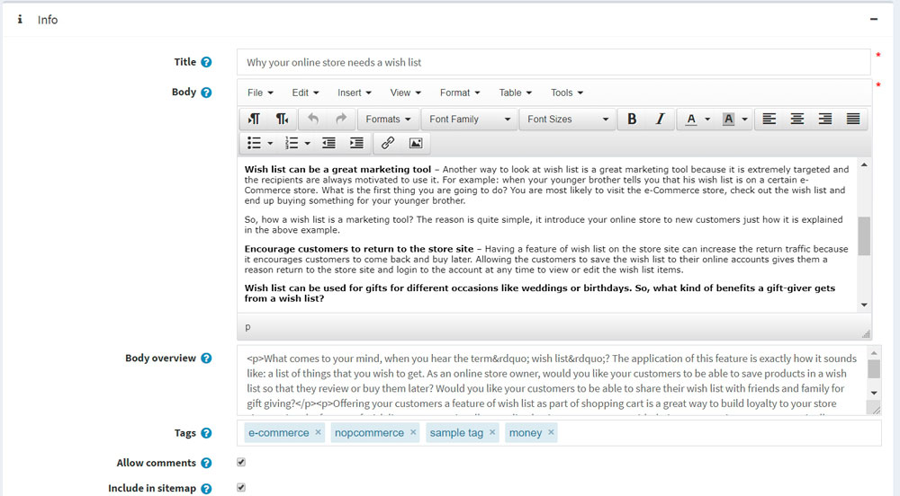
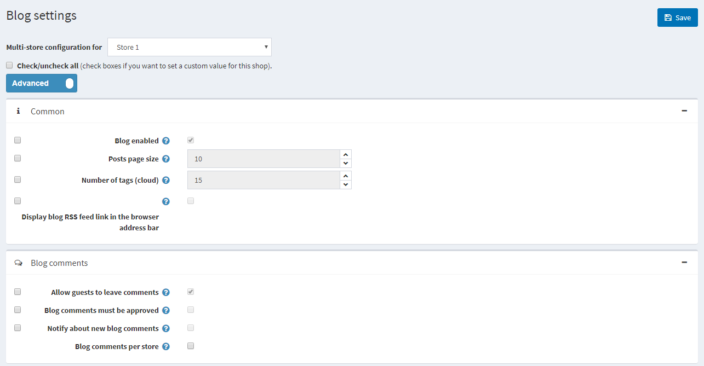

# Blog

A Blog is a great way to connect with your existing customers, keeping them informed about latest product offerings or educating them, as well as to  find new customers.

## Adding new blog posts

To manage blog posts go to **Content management → Blog posts**.

Click **Add new** and fill the information about a new blog post.

Define new blog post details:
* If more than one language is enabled, from the **Language** dropdown list, select the language of this blog post. Customers will only see blog posts for their selected language.
* Enter the **Title** of this blog post.
* Enter the **Body** text of this blog post.
* You can specify the **Body overview** if you want only part of the whole text to be visible on the main blog page.
* Enter **Tags** to be displayed on the Blog page in the public store. The more blog posts are associated with a particular tag, the larger size it has in the Popular Tags area, displayed in the sidebar on the blog page.

   

* Select the **Allow comments** checkbox, to enable customers to add comments to your blog post.
* Select the **Include in sitemap** checkbox, to include the blog post in the sitemap.
* Enter **Start date** and **End date** for displaying this blog post in Coordinated Universal Time (UTC).

 > [!NOTE]
 > 
 > You can leave these fields empty if you do not want to define blog post start and end dates.

* Select the **Limited to stores** checkbox, to enable defining the stores where the blog post will be available.

While editing an existing blog or after clicking **Save and Continue Edit** button for a new one, you can click on **Preview** button to see how the blog will appear on the site.

## Setting up SEO for blog posts

To set up SEO for the blog post go to **SEO** panel:

- Enter **Meta keywords** to be added to the blog post header.
- Enter **Meta description** to be added to the blog post header.
- Override the page title in the **Meta title** field (the default title is the title of the blog post).
- Define the **Search engine friendly page name**. For example, enter "the-best-news" to make your URL `http://yourStore.com/the-best-news`. Leave this field empty to generate it automatically based on the title of the blog post.

## Managing blog comments

To manage blog comments select **Content management → Blog comments**.

Here you can edit or delete a blog comment. If delete this comment will be removed from the system.

## Blog settings

You can manage blog settings in **Configuration → Settings → Blog settings**. This page is available in 2 modes: *advanced* and *basic*.

Define the **following settings**:

* Select the **Blog enabled** checkbox, to enable the blog.
* In the **Posts page size** field, set the number of posts per page.
* In the **Number of tags** (cloud) field, enter the number of tags (cloud) that appear in the tag cloud.
* Select the **Display blog RSS feed link in the browser address bar** checkbox, to show the blog RSS feed link in the  browser address bar.
* Select the **Allow guests to leave comments** checkbox, to enable non-registered users to add comments to the blog.
* Select the **Blog comments must be approved** checkbox if blog comments must be approved by administrator.
* Select the **Notify about new blog comments** checkbox, to notify the store owner about new blog comments.
* Select the **Blog comments per store** checkbox, to display blog comments written in the current store only.

Click **Save**.

This page enables *multi-store configuration*, it means that the same settings can be defined for all stores, or differ from store to store. If you want to manage settings for a certain store, choose its name from **Multi-store configuration** drop-down list and tick all needed checkboxes at the left side to set custom value for them.

 
