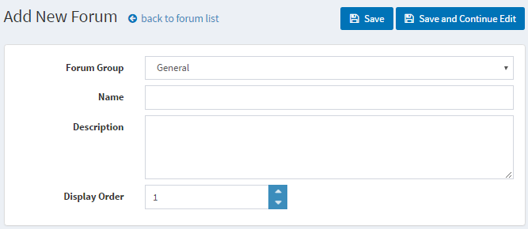
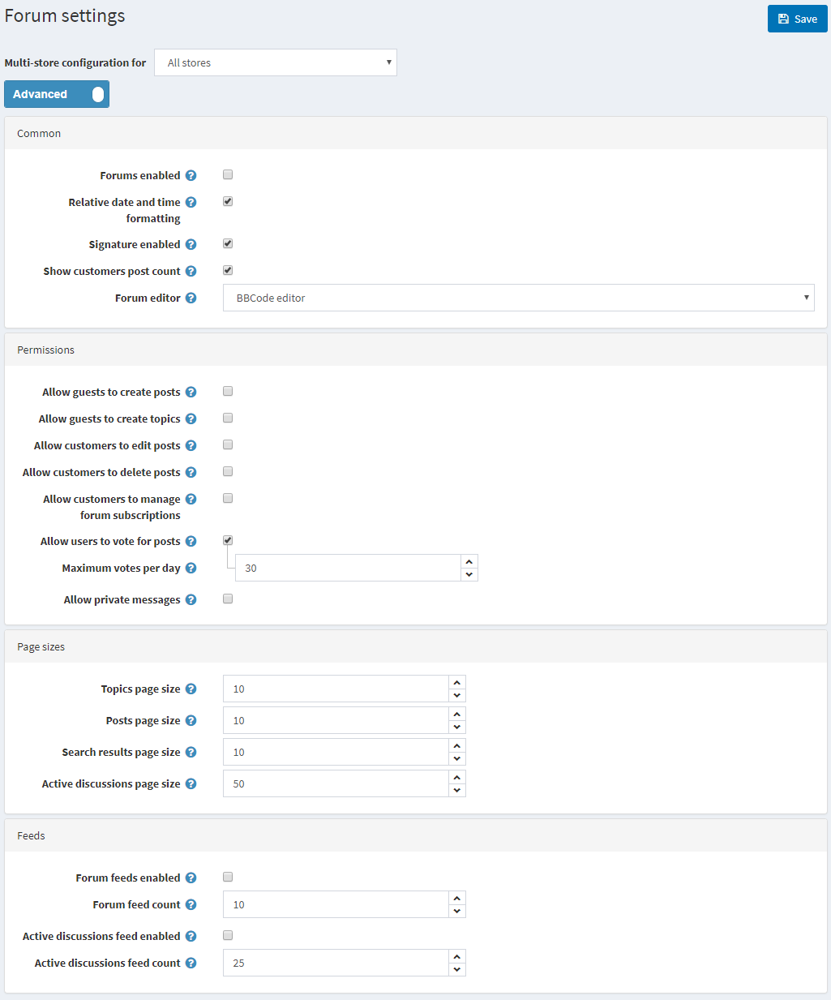

# Forums

A forum is an online discussion site where people can hold conversations in the form of posted messages. Depending on the access level of a user or the forum set-up, a posted message might need to be approved by a moderator before it becomes visible. A forum may contain a number of subforums, with each having several topics.

> [!NOTE]
> 
> in nopCommerce forums are disabled by default. To enable forums, go to Configuration → Settings → Forum Settings. Ensure that Forums enabled is checked. The Forums link should be displayed in the menu in the public store.

To manage forum groups and forums (inside forum groups) go to **Content management → Forums**.

## Adding new forum group

Click the **Add New Forum Group** button.

- Define a new forum group **Name**
- In the **Display order** field, enter the display order of the forum group. A value of 1 represents the top of the list
- Click **Save**

## Adding new forum

- From the **Forum group** dropdown list, select the required forum group
- Enter the **Name** of the new forum
- Enter a **Description** for the new forum
- Select the **Display order** for the forum group. A value of 1 represents the top of the list
- Click **Save**

To view an example of how forums should work go to <http://www.nopcommerce.com/boards/>

## Tutorials

- [Managing forums in nopCommerce](https://www.youtube.com/watch?v=wW2QvC4WA_8)

# Forum settings

To access forum settings go to **Configuration → Settings → Forum Settings**. This page is available in 2 modes: **advanced** and **basic**.

Define following **forum settings**:

- **Enable forums** by checking Forums Enabled checkbox
- Select the **Relative date and time formatting** checkbox to enable relative date and time (e.g. 2 hours ago, 1 day ago)
- You can give an opportunity to specify customers signatures by checking **Signature enabled**
- Select the **Show customers post count** checkbox to enable showing the number of posts created by the customer
- From the **Forum Editor** dropdown list, select the forum editor type to use:
  - Simple Textbox
  - BBCode Editor
- Allow guests to **create posts and topics** by ticking the corresponding checkboxes
- Allow customers to **edit and delete posts** by ticking the corresponding checkboxes
- Allow customers to **manage forum subscriptions** by ticking the corresponding checkbox
- Select the** Allow users to vote for posts** checkbox to enable voting
- The **Maximum votes per day** field sets a number of votes each user can do per day
- Enable private messages by checking **Allow private messages** checkbox
- Set the **size of Topics page, Posts page, Search results, Active discussions page** (e.g. 5 topics per page)

  > [!NOTE]
  > 
  > it is not recommended to change the forum editor type in the production environment

- Select the **Forum feeds enabled** checkbox to enable RSS feeds for each forum
- In the **Forum feed count** field set the number of topics to be included in each feed
- Select the **Active discussions feed** enabled checkbox, to enable RSS feeds for active discussion topics
- In the **Active discussions feed count** field set the number of discussions to be included in Active Discussions feed

This page enables **multi-store configuration**, it means that the same settings can be defined for all stores, or differ from store to store. If you want to manage settings for a certain store, choose its name from Multi-store configuration drop-down list and tick all needed checkboxes at the left side to set custom value for them.

To change a setting for a certain store, tick a checkbox on the left side of it. All other settings remain the same as for all stores.
