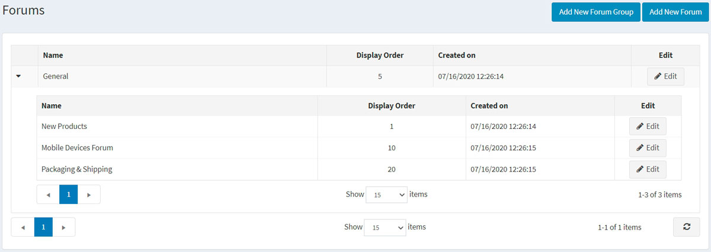
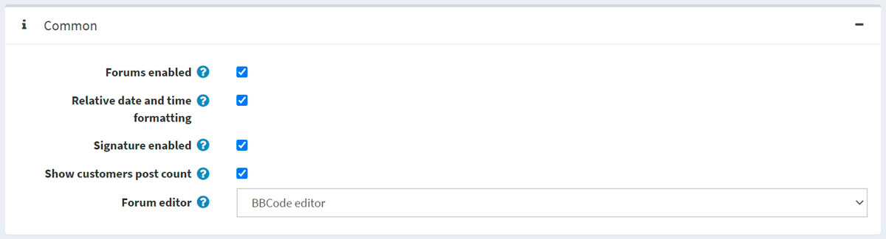
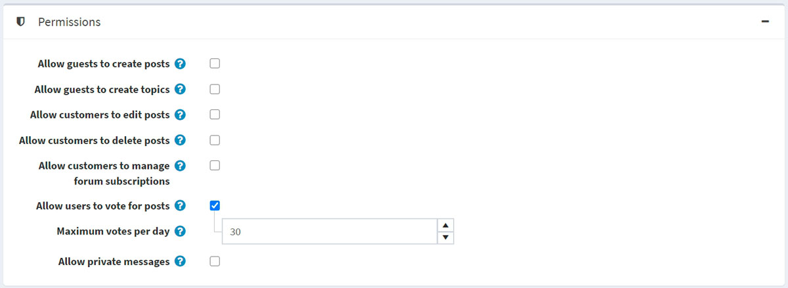
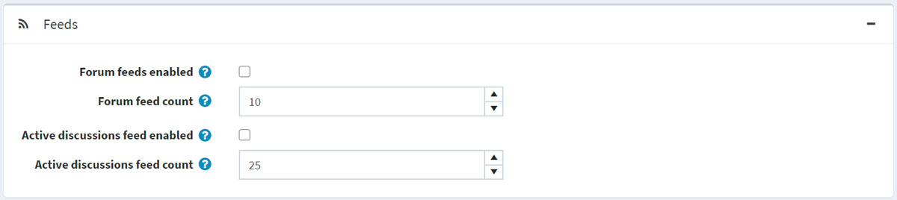

# Forums

A forum is an online discussion site where people can hold conversations in the form of posted messages. A forum may contain a number of subforums, with each having several topics.

> [!NOTE]
> 
> In nopCommerce, forums are disabled by default. To enable forums, go to **Configuration → Settings → Forum settings** and tick the **Forums enabled** checkbox. The "Forums" link should be displayed in the menu in the public store (top menu or footer in the default theme).

To manage forum groups and forums (inside forum groups) go to **Content management → Forums**.

## Add a new forum group

Click the **Add new forum group** button.

- Define a new forum group **Name**.
- In the **Display order** field, enter the display order of the forum group. A value of 1 represents the top of the list

Click **Save**.

## Add a new forum

- From the **Forum group** dropdown list, select the required forum group.
- Enter the **Name** of the new forum.
- Enter the **Description** of the new forum.
- Select the **Display order** for the forum group. A value of 1 represents the top of the list

Click **Save**.

To view an example of how forums should work go to <http://www.nopcommerce.com/boards/>.

## Forum settings

To access forum settings go to **Configuration → Settings → Forum settings**. This page is available in 2 modes: *advanced* and *basic*.

This page enables multi-store configuration, it means that the same settings can be defined for all stores, or differ from store to store. If you want to manage settings for a certain store, choose its name from multi-store configuration drop-down list and tick all needed checkboxes at the left side to set custom value for them. For further details refer to [Multi-store](xref:en/getting-started/advanced-configuration/multi-store).

### Common

Define following forum settings in the *Common* panel:
- Enable forums by checking the **Forums enabled** checkbox.
- Select the **Relative date and time formatting** checkbox to enable relative date and time (e.g. 2 hours ago, 1 day ago).
- You can give an opportunity to specify customers signatures by checking **Signature enabled**.
- Select the **Show customers post count** checkbox to enable showing the number of posts created by a customer.
- From the **Forum editor** dropdown list, select the forum editor type to use:
  - Simple textbox.
  - BBCode editor.
  > [!NOTE]
  > 
  > It is not recommended to change the forum editor type in the production environment.

### Permissions

Define following forum settings in the *Permissions* panel:
- **Allow guests to create posts**.
- **Allow guests to create topics**.
- **Allow customers to edit posts**.
- **Allow customers to delete posts**.
- **Allow customers to manage forum subscriptions**.
- Tick the **Allow users to vote for posts** checkbox to enable voting.
  - The **Maximum votes per day** field sets a number of votes each user can do per day if the previous setting is enabled.
- Enable private messages by checking **Allow private messages** checkbox. If enabled the following two settings will be visible:
  - Tick the **Show alert for PM** checkbox to enable the alert popup if new private messages were received.
  - Tick the **Notify about private messages** if a customer should be notified by email about new private messages.

### Page sizes

Define following forum settings in the *Page sizes* panel:
- **Topics page size** - the page size for topics in forums e.g. '10' topics per page.
- **Posts page size** - the page size for posts in topics e.g. '10' posts per page.
- **Search results page size** - the page size for search results e.g. '10' results per page.
- **Active discussions page size** - the page size for active discussions page e.g. '10' results per page.

### Feeds

Define following forum settings in the *Feeds* panel:
- Select the **Forum feeds enabled** checkbox to enable RSS feeds for each forum.
- In the **Forum feed count** field set the number of topics to be included in each feed.
- Select the **Active discussions feed enabled** checkbox, to enable RSS feeds for active discussion topics.
- In the **Active discussions feed count** field set the number of discussions to be included in "Active discussions" feed.

## Tutorials

- [Managing forums in nopCommerce](https://www.youtube.com/watch?v=wW2QvC4WA_8)