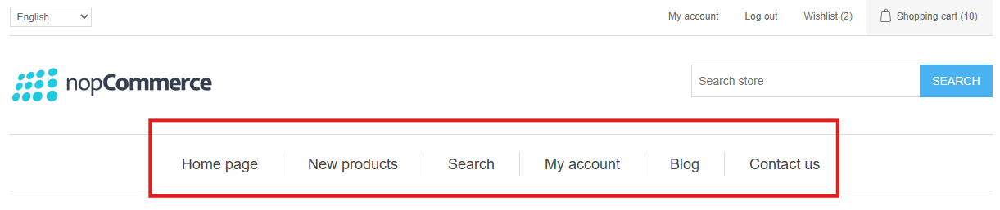
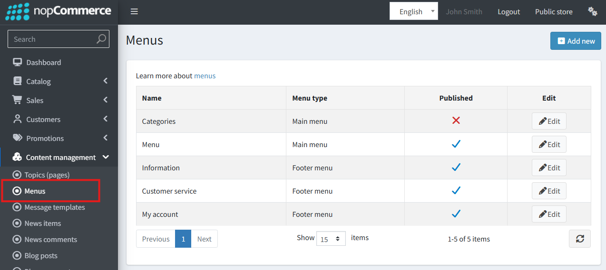
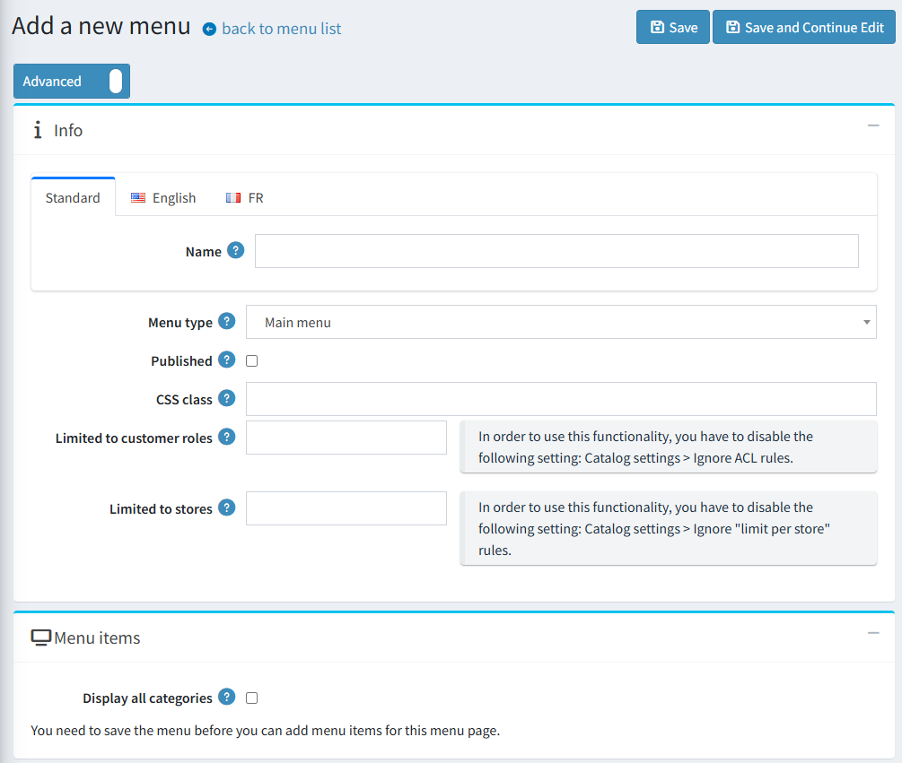
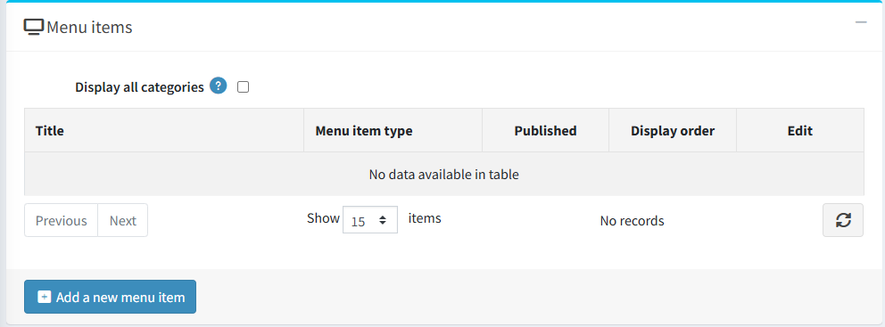
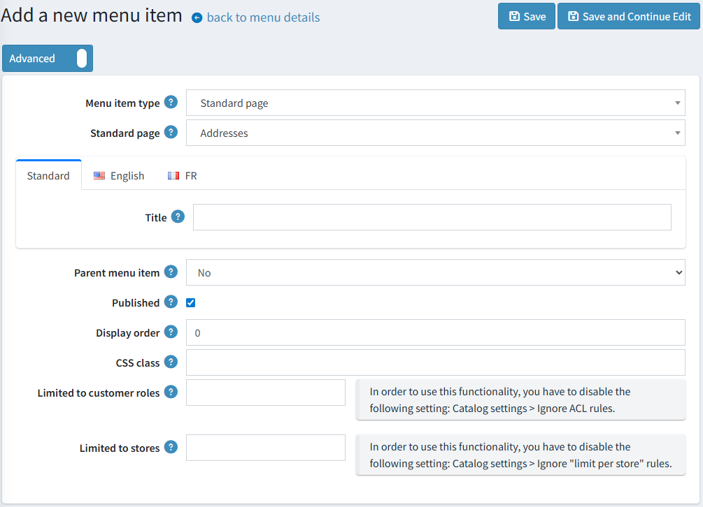
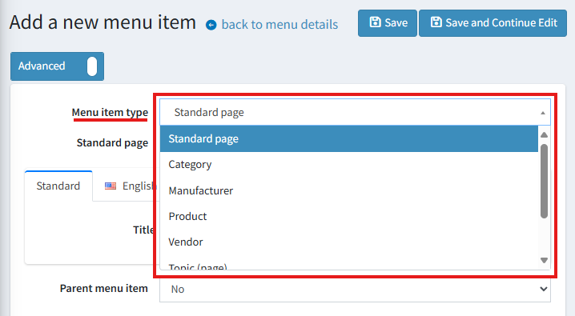
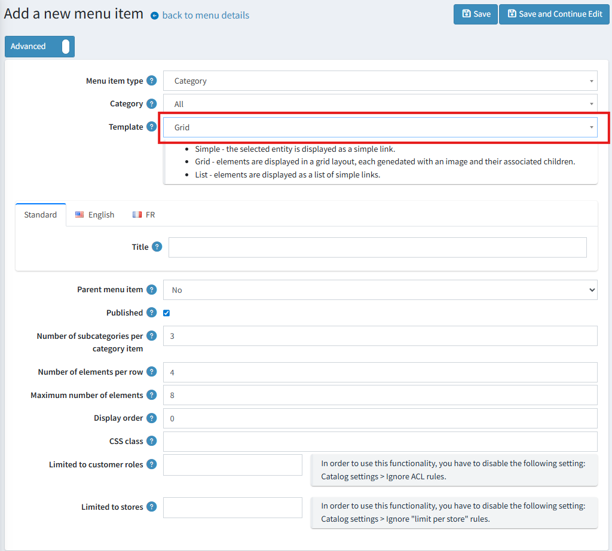

# Mega Menu

Starting with version 4.90, the main menu and the footer navigation can be fully customized by the administrator in the admin panel.

## Accessing Menu Management

To manage menus, navigate to **Content management -> Menus**.
From this page, you can either edit an existing menu or create a new one.

## Creating and Managing Menus

When creating a new menu, you must specify its location using the **Menu type**:

- **Main menu**: The primary navigation bar.
- **Footer**: The navigation links in the site's footer.

> [!WARNING]
>
> While you can create multiple `Main menu` instances, only one will be displayed on the storefront at any given time, determined by its availability and creation order.

The **'Display all categories'** setting automatically generates top-level menu items based on your store's categories and their sub-categories. If this checkbox is enabled, these category links will appear before any manually created menu items.

After a menu is successfully created, you can begin adding items to it.

## Adding and Configuring Menu Items

The following parameters are available when creating or editing a menu item.

> [!WARNING]
>
> For menus with the `Footer` type, the **'Parent menu item'** property is unavailable, as footer navigation supports only a single level with no nesting.

### Menu Item Type

This parameter determines the behavior and available settings for the menu item.

- **Standard page**: Links to a predefined system page with a pre-configured route.
- **Category**:
  - Display all categories (in a grid or list layout).
    - Display a single category (as a grid, list, or simple link).
- **Manufacturer**:
  - Display all manufacturers (in a grid or list layout).
  - Link to the "All manufacturers" page.
  - Link to a specific manufacturer's page.
- **Product**: Links directly to a selected product page.
- **Vendor**:
  - Display all vendors (in a grid or list layout).
  - Link to the "All vendors" page.
  - Link to a specific vendor's page.
- **Topic (page)**: Links to a selected topic page.
- **Custom link**: A simple link where you manually specify the Text and URL.
- **Text without link**: Displays non-clickable text. This is useful for parent-level items that serve as headers and do not need to link anywhere.

### Additional Settings for Grid/List Layouts

For menu items that use a grid or list template (e.g., displaying all categories), the following options are available:

- **Number of elements per row (grid)**: Sets the maximum number of items to display in a single row of the grid.
- **Number of subcategories per category item (grid)**: Sets the maximum number of sub-category links to display within each grid tile.
- **Maximum number of elements**: Sets the total maximum number of child items to display.

