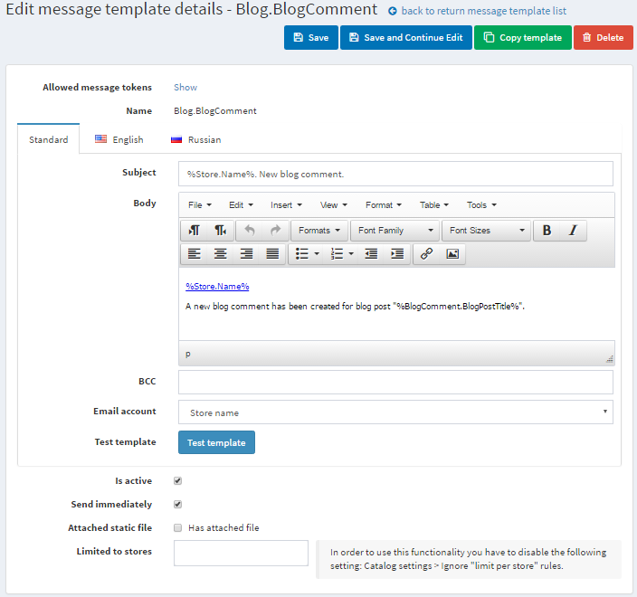

# Message templates

Message templates define the layout, content, and formatting of automated messages sent from your store. They are called transactional emails because each one is associated with a specific type of transaction.

There are several message templates available in nopCommerce by default to notify users about order statuses and so on. To access message templates go to **Content management → Message templates**.

To search for message templates that were used in a certain store, select a name of the store from the list.

## Editing message templates

Find the message template you want to edit and click **Edit**.

Select the required **language tab**.

> [!TIP]
> 
> By default, only English language is used in the system. You can manage languages in Configuration → Language

Edit **message details as follows**:

- Edit the **Subject** of the message. You can include tokens in the subject. You can see the list with all the tokens allowed at the top of the page.
- Edit **Body** of the message.
- In the BCC field, enter the blind copy recipients of this e-mail message if needed.
- From the **Email account** dropdown list, select the email account used to send this message template.

> [!TIP]
> 
> Emails accounts are configured in Configuration → Email Accounts.

- Select the **Is Active** option to indicate this message should be sent.
- Select the **Attached static** file checkbox, to upload a file which will be attached to each sent email.
- Select the **Limited to Stores** box, as follows and choose the desired store from the dropdown list.
- Click Save.

> [!NOTE]
> 
> To create a full copy of the message template, click Copy template. This is useful if you have several stores configured and want to create distinct templates for each of your stores.

## See also

- [Email accounts](xref:en/user-guide/configuring/system/email-accounts)
- [Languages](xref:en/user-guide/configuring/setting-up/main-store/languages)

## Tutorials

- [Adding conditions in message templates](https://www.youtube.com/watch?v=5chrb1yH1v4&feature=youtu.be)
