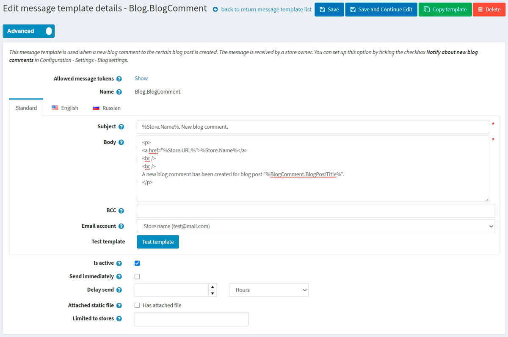
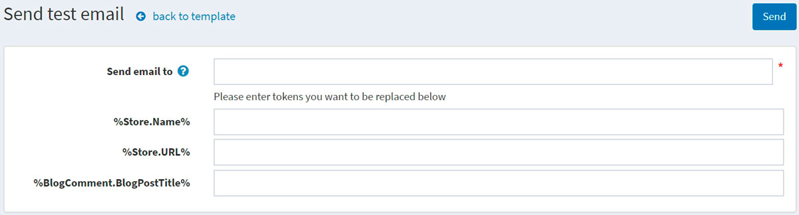

# Message templates

Message templates define the layout, content, and formatting of automated messages sent from your store. They are called transactional emails because each one is associated with a specific type of transaction.

There are several message templates available in nopCommerce by default to notify users about order statuses and so on. To access message templates go to **Content management → Message templates**.

To search for message templates that were used in a certain store, select a name of the store from the list.

## Edit a message template

Find the message template you want to edit and click **Edit**. The *Edit message template details* window is displayed, as follows:

If you have more than one language installed select the required **language tab**.

> [!TIP]
> 
> By default, only English language is used in the system. You can manage languages in **Configuration → Language**. Read more about languages in nopCommerce in the [Localization](xref:en/getting-started/advanced-configuration/localization) section.

Edit the message template details as follows:
- Edit the **Subject** of the message. You can include tokens in the subject. You can see the list with all the tokens allowed at the top of the page.
- Edit the **Body** of the message.
- In the **BCC** field, enter the blind copy recipients of this email message if needed.
- From the **Email account** dropdown list, select the email account used to send this message template.
- You can test this message template by clicking the **Test template** button. When clicked the *Send test email* is displayed, as follows:
	
	Enter your email in the **Send email to** field, fill the tokens with some test values then click the **Send** button.
	
> [!TIP]
> 
> Email accounts are configured in **Configuration → Email accounts**. Read more about it in the [Emails accounts](xref:en/getting-started/email-accounts) section.

- Select the **Is active** option to indicate this message should be sent.
- Tick the **Send immediately** checkbox if you want this email to sent immediately.
	- If the previous checkbox is unticked the **Delay send** field is displayed.
- Select the **Attached static** file checkbox, to upload a file which will be attached to each sent email.
- Choose the stores in the **Limited to stores** field if the category is sold in specific stores. Leave the field empty in case this functionality is not required.
  > [!NOTE]
  >
	> In order to use this functionality, you have to disable the following setting: **Catalog settings → Ignore "limit per store" rules (sitewide)**. Read more about multi-store functionality [here](xref:en/getting-started/advanced-configuration/multi-store).

Click **Save**.

> [!NOTE]
> 
> To create a full copy of the message template, click **Copy template** in the top right. This is useful if you have several stores configured and want to create distinct templates for each of your stores.

## See also

- [Email accounts](xref:en/getting-started/email-accounts)
- [Languages](xref:en/getting-started/advanced-configuration/localization)

## Tutorials

- [Adding conditions in message templates](https://www.youtube.com/watch?v=5chrb1yH1v4&feature=youtu.be)
