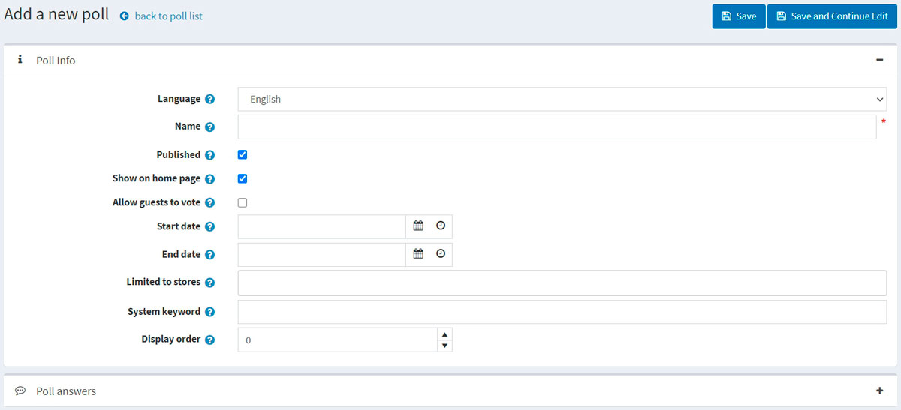
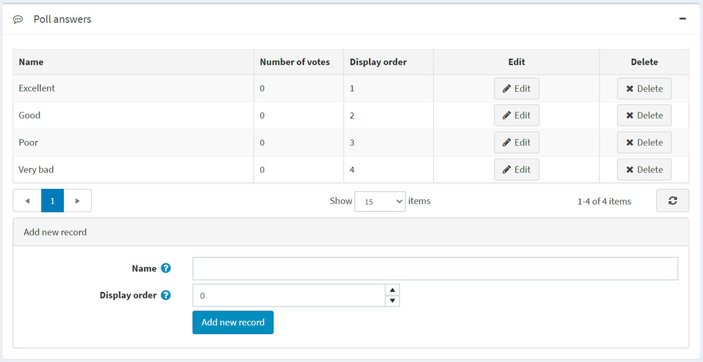

# Polls

Polls functionality in nopCommerce allows you to make your e-commerce site more interactive. There are many ways you can use polls for an e-commerce site. One popular way is to use them as a short customer satisfaction survey. People like being asked for feedback, and this is a good opportunity to see how you are doing as an online merchant.

The poll on the home page of the Default Clean nopCommerce theme looks like:

To view all the polls and add new ones, go to **Content management → Polls**.

To search for polls that were used in a certain store, select the store name from the list.

## Adding polls

To add a new poll, click the **Add new** button in the top right.

### Poll info

Define the following details for the new poll:

- If more than one language is enabled, from the **Language** dropdown list, select the language of this poll. Customers will only see polls in their selected language.
- Enter the descriptive **Name** of this poll. This is the text the customers will see. For example, "What do you think about our store?"
- Select the **Published** checkbox to make this poll active.
- Select the **Show polls on home page** checkbox if you want to show the poll on the home page.
- Select the **Allow guests to vote** checkbox to enable nonregistered users to vote in the poll.
- Enter the **Start date** and **End date** in Coordinated Universal Time (UTC).
  > [!NOTE]
  >
  > You can leave these fields empty if you do not want to define the poll's start and end dates.

- Choose the stores in the **Limited to stores** field to enable this poll for specific stores only. Leave the field empty in case this functionality is not required.
  > [!NOTE]
  >
 > In order to use this functionality, you have to disable the following setting: **Catalog settings → Ignore "limit per store" rules (sitewide)**. Read more about multi-store functionality [here](xref:en/getting-started/advanced-configuration/multi-store).

- In the **System keyword** field, you can specify where the poll will be displayed. For example, LeftColumnPoll.
- Enter the **Display order** of the poll. A value of 1 represents the top of the list.

Click **Save and continue edit** to proceed to the *Poll answers* panel.

### Poll answers

Fill in the following poll answer info:

- The **Name** that will be displayed to a customer.
- The **Display order**. A value of 1 represents the top of the list.

Then click the **Add new record** button to save the answer.

The complete list of answers can look as follows:

You can then **Edit** records and **Delete** them if required.

## Tutorials

- [Managing polls in nopCommerce](https://www.youtube.com/watch?v=RJP45cUhuZQ)
