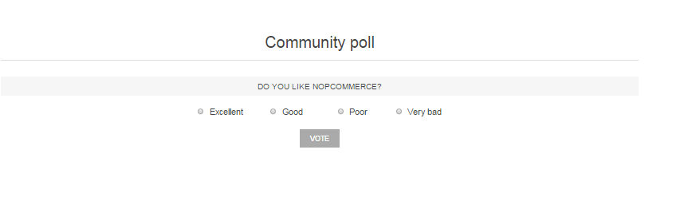

# Polls

You can use **Polls functionality** in nopCommerce to make your e-commerce site more interactive. There are many ways you can use polls for an e-commerce site. One popular way is to use them as a short customer satisfaction survey. People like being asked for a feedback and this is a good opportunity to see how you are doing as an online merchant.

To view all the polls and add new ones go to **Content management → Polls**

To search for polls that were used in a certain store, select a name of the store from the list.

## Adding polls

Click **Add new**

Define the **following details for the new poll**:

- Enter the descriptive **Name** of this poll. This is the text the customers will see. *For example, What do you think of our store?*
- In a **System keyword**, you can specify where the poll will be displayed. *For example, if you enter LeftColumnPoll your poll will be displayed like that:*

  

  > [!NOTE]
  > 
  > if you use clear default nopCommerce theme the polls will be displayed in the left column by default. In case you use another theme please check these details from the theme provider.

- Select the **Published** checkbox to make  this poll active
- If you want to **Show polls on home page** select the corresponding checkbox
- Select the **Allow guests to vote** checkbox, to enable unregistered guests to vote for the poll
- Enter the **Display order** of the poll. A value of 1 represents the top of the list
- Select **Start and End dates** in Coordinated Universal Time (UTC). If you don't want to specify them just leave the  - fields empty
- **Select the Limited to stores** option to make this poll limited to one or more stores.

> [!NOTE]
> 
> You can leave these fields empty if you do not want to define poll start and end dates

To add poll answers go to **Poll answers tab**:

- Click **Add new** record to enter a new poll answer and then click **Update**. You can then **Edit** records, if required and **Delete** them.
- Click **Save**

## Tutorials

- [Managing polls in nopCommerce](https://www.youtube.com/watch?v=RJP45cUhuZQ)
